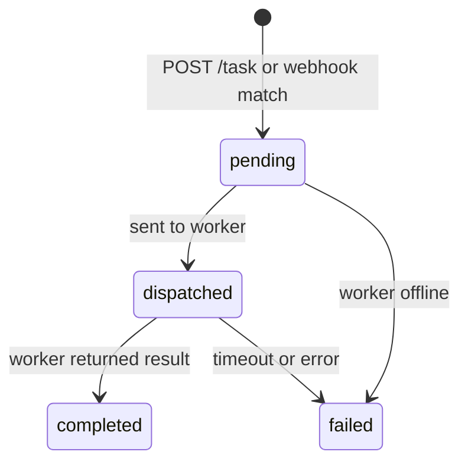

# API Reference

All endpoints are served by `mecha serve`. Authentication via `Authorization: Bearer <key>` or `X-API-Key: <key>` header when `--api-key` is set.

## Health

```
GET /health
```

Returns server status. Exempt from API key auth.

```json
{"status": "ok"}
```

## Tasks

### Create Task

```
POST /task
```

```json
{
  "prompt": "Review this code for security issues",
  "worker": "claude-reviewer"
}
```

- `prompt` (required) — the task prompt
- `worker` (optional) — worker name. If omitted, auto-selects first online worker (round-robin)

Response `202 Accepted`:
```json
{
  "id": "a1b2c3d4e5f6g7h8",
  "worker_name": "claude-reviewer",
  "prompt": "Review this code...",
  "state": "pending",
  "created_at": "2026-03-30T12:00:00Z"
}
```

### Get Task

```
GET /task/{id}
```

Response `200`:
```json
{
  "id": "a1b2c3d4e5f6g7h8",
  "worker_name": "claude-reviewer",
  "state": "completed",
  "result": "{\"output\":\"LGTM\",\"metadata\":{...}}",
  "created_at": "2026-03-30T12:00:00Z",
  "dispatched_at": "2026-03-30T12:00:01Z",
  "completed_at": "2026-03-30T12:00:05Z"
}
```

### List Tasks

```
GET /tasks
GET /tasks?state=pending
GET /tasks?state=completed
```

Returns array of tasks, newest first. Filter by state: `pending`, `dispatched`, `completed`, `failed`.

## Workers

### List Workers

```
GET /workers
```

Returns all registered workers with current state.

## Webhooks

### Receive Webhook

```
POST /webhook/{source}
```

Receives webhooks from external sources (e.g., GitHub). Exempt from API key auth — uses source-specific authentication (HMAC for GitHub).

See [Events](./events) for webhook setup.

## Events

### List Events

```
GET /events
GET /events?state=received
```

Returns events, newest first. Filter by state: `received`, `matched`, `dispatched`, `completed`, `failed`, `skipped`.

### Get Event

```
GET /event/{id}
```

Returns event details including payload, matched worker, and linked task.

## Task States



## Error Responses

All errors return JSON:

```json
{"error": "description of the error"}
```

| Status | Meaning |
|--------|---------|
| 400 | Bad request (missing prompt, invalid JSON) |
| 401 | Unauthorized (missing/wrong API key) |
| 404 | Not found (unknown task, event, or source) |
| 429 | Too many requests (task queue full) |
| 500 | Internal error |
| 503 | Service unavailable (no online workers) |
