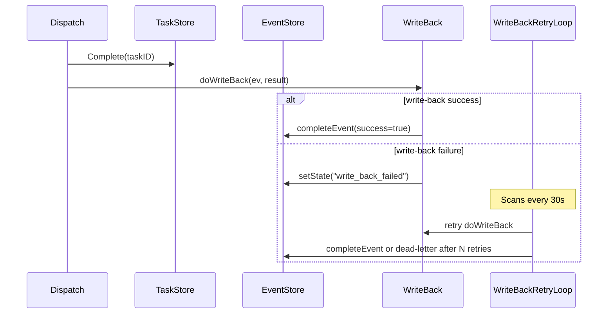
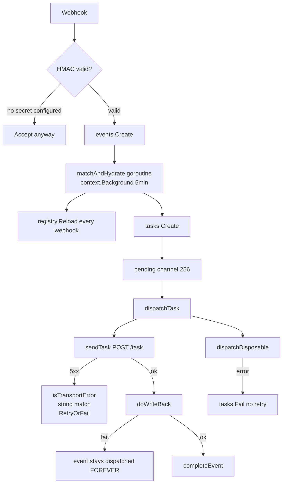
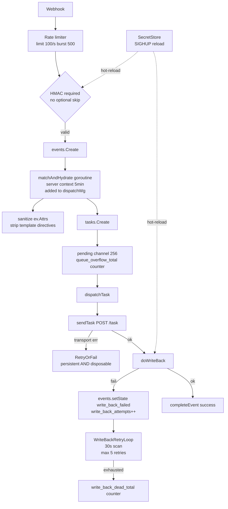

# Mecha Grill Report — 2026-04-11

**Target:** `mecha.im` — Agentic Workflow Engine  
**Stack:** Go 1.26.1 + TypeScript/Bun · SQLite · Docker SDK · Cobra CLI  
**Coverage at scan time:** 87.5% statement (aggregate)  
**Files scanned:** 578 Go files (252 source, 326 test) + 2,228 lines TypeScript

---

## Part 1: Synthesized Findings by Severity

All findings are cited to specific file:line. Every severity label is evidence-based.

---

### CRITICAL

**[CRITICAL-1] ~~Write-back failure permanently orphans events in "dispatched" state — no recovery path~~ FIXED**

- **Fixed in:** `internal/events/types.go`, `internal/events/store.go`, `internal/events/dedup.go`, `internal/store/schema.go` (schemaV7), `internal/serve/dispatch.go`, `internal/serve/dispatch_policy.go`, `internal/serve/disposable.go`, `internal/serve/writeback_retry.go` (new), `internal/serve/server.go`, `internal/serve/metrics.go`
- **Fix:** Added `StateWriteBackFailed` event state. When `doWriteBack` fails, the event transitions `dispatched → write_back_failed` (not left orphaned). A new `writeBackRetryLoop` (30s interval) retries write-back up to 5 times with error tracking (`write_back_attempts`, `write_back_last_err` columns in schemaV7). After 5 failures, the event transitions to `failed` (dead-lettered) and `writeback_dead_letter` counter is incremented. `DedupKeyActive` excludes `write_back_failed` from active states so new events are not blocked. `doWriteBack` now returns `(bool, error)` for precise error propagation. New metrics: `writeback_retry_ok`, `writeback_dead_letter`.

---

**[CRITICAL-2] ~~Prompt injection via user-controlled webhook payload fields in `text/template` rendering~~ FIXED**

- **Fixed in:** `internal/serve/match.go`, `internal/serve/match_test.go`
- **Fix:** Added `sanitizeTemplateValue(v any) any` which replaces `{{` with `{ {` and `}}` with `} }` in all string values sourced from `ev.Attrs` before they are placed into the template data map. Non-string values (numbers, booleans) are passed through unchanged. Universal fields (`actor`, `subject`, `source`, `type`) are set after the sanitized attrs loop so they cannot be overridden. Added two new tests: `TestSanitizeTemplateValue` (8 table-driven cases covering plain strings, nested directives, and non-string passthrough) and `TestRenderPromptInjectionBlocked` (verifies a `{{range $k,$v := .}}` payload in an Attrs value is rendered as literal text, not executed).

---

**[CRITICAL-3] ~~`json.Marshal` error discarded in the hot dispatch path~~ FIXED**

- **Fixed in:** `internal/serve/send.go`
- **Fix:** Changed `payload, _ := json.Marshal(...)` to `payload, err := json.Marshal(...)` with an explicit error return: `return "", fmt.Errorf("marshal task payload: %w", err)`. Any future type change that causes the marshal to fail will now surface immediately with a clear error message rather than silently sending a nil/empty body to the worker.

---

### HIGH

**[HIGH-1] ~~Worker stuck permanently in "busy" if `SetError` fails after transport error~~ FIXED**

- **Fixed in:** `internal/serve/dispatch.go`
- **Fix:** Moved `workerRestored = true` to inside the `else` branch of the `SetError` call. If `SetError` fails (SQLite busy), `workerRestored` remains `false`, so the defer safety-net at line 111 fires and calls `SetOnline`, transitioning the worker from `StateBusy` → `StateOnline` instead of leaving it permanently stuck. If `SetError` succeeds, `workerRestored = true` prevents the defer from calling `SetOnline` (which would fail anyway since state is now `StateError`).

---

**[HIGH-2] ~~Secrets (GitHub token, HMAC keys) loaded once at startup — rotation requires full restart~~ FIXED**

- **Fixed in:** `internal/source/source.go`, `internal/writeback/writeback.go`, `internal/writeback/github.go`, `internal/serve/reload.go` (new), `internal/cli/serve.go`
- **Fix:** Four-part implementation:
  1. `source.Registry` now has a `sync.RWMutex` — reads (`Get`, `GetResponder`, `GetTrigger`, `Len`, `Triggers`) use `RLock`, writes (`Register`, `RegisterTrigger`, `RegisterResponder`) use `Lock`. Safe for concurrent hot-reload and webhook handling.
  2. `writeback.Client` has a `sync.RWMutex` + `UpdateToken(token string)` method + `currentToken()` helper. All `c.token` accesses in `github.go` use `currentToken()`.
  3. New `Server.ReloadSecrets(secretsPath string) error` re-reads secrets and re-registers GitHub/GitLab/Slack/Telegram sources (overwriting the old entry in the registry) and calls `s.writeback.UpdateToken(newToken)`.
  4. `cli/serve.go` listens for SIGHUP and calls `srv.ReloadSecrets(secretsPath)` in a goroutine. Token rotation: send `kill -HUP <pid>` or `systemctl reload mecha`.

---

**[HIGH-3] ~~Pending-loop can race with active dispatch goroutine~~ PARTIALLY FALSE POSITIVE + REAL GAP FIXED**

- **Verification:** The described race (re-enqueue while dispatch is active) does NOT exist. `scanPending()` at `pending.go:55` explicitly skips ALL dispatched tasks: `if t.State == tasks.StateDispatched { continue }`. The grill agent described a staleness-threshold check that is not in the code.
- **Real gap discovered:** Tasks that are stuck in `dispatched` due to a goroutine panic (caught by `dispatch.go:44-48` recover defer — the defer restores the worker to online but does NOT transition the task state) have NO runtime recovery path. They stay in `dispatched` forever; `scanPending()` always skips them. Only a server restart (which calls `recoverTasks()`) can recover them.
- **Fix applied:** Added `staleDispatchTimeout = 15 * time.Minute` constant and changed the dispatched-task skip in `scanPending()`: tasks in `dispatched` state for less than 15 minutes are still skipped (no race with active dispatch since task timeouts max at 10 minutes). Tasks dispatched for more than 15 minutes are re-enqueued with a `Warn` log. File: `internal/serve/pending.go`.

---

**[HIGH-4] ~~Disposable worker tasks are not retried on transport errors~~ FIXED**

- **Fixed in:** `internal/serve/disposable.go`
- **Fix:** Added `isTransportError(err)` check in `dispatchDisposable` around the `sendTask` error path. Transport errors now call `s.tasks.RetryOrFail()` (same as persistent worker path): on retry → increment counter + log `TaskRetry`; on dead-letter → `completeEvent(false)` + log `TaskDeadLetter`. Non-transport errors still call `s.tasks.Fail()` immediately. Cleanup (container stop/remove) via `defer cleanup()` runs in both cases, ensuring the failed container is torn down before any retry launches a fresh one.
- **Impact:** Disposable worker tasks are significantly more fragile than persistent worker tasks. Any transient network issue means a non-recoverable failure.

---

**[HIGH-5] ~~Secrets file TOCTOU — file content read before permissions are checked~~ FIXED**

- **Fixed in:** `internal/workers/secrets.go`
- **Fix:** Changed `os.ReadFile(path)` + `os.Stat(path)` to open-then-fstat: `os.Open(path)` → `f.Stat()` (fstat on the open fd, not the path) → `io.ReadAll(f)`. The permission check and the read now operate on the same file descriptor, preventing TOCTOU via symlink swap or permission change between the read and the stat.
- **Impact:** Secrets loaded from a world-readable file. API keys, webhook HMAC secrets, OAuth tokens exposed to any local user who can read the file during the window between mecha startup and the operator's chmod.

---

**[HIGH-6] ~~`/debug/vars` endpoint unauthenticated when no API key configured — leaks Go cmdline~~ FIXED**

- **Fixed in:** `internal/serve/server.go`
- **Fix:** Removed the `GET /debug/vars` route entirely. All expvar metrics are already exposed via `GET /metrics` (Prometheus text format via `expvar.Do()` in `prometheus.go`) which does not expose `cmdline` or `memstats`. The `expvar` import was removed from `server.go`.
- **File:** `internal/serve/server.go:82`, `internal/serve/auth.go:19-21`
- **Evidence:** `auth.go:19`: `if s.apiKey == "" { next.ServeHTTP(w, r); return }` — all routes are unauthenticated when no API key is set. Go's default `expvar` always registers `cmdline` (os.Args) and `memstats`. If the API key was passed as a CLI flag, `GET /debug/vars` returns it in the response body.
- **Impact:** Credential leak on development/staging servers. API key extracted → full control of all task, event, and worker management endpoints.

---

**[HIGH-7] ~~`recoverEvents` goroutines untracked by `dispatchWg` and use `context.Background()`~~ FIXED**

- **Fixed in:** `internal/serve/recover.go`
- **Fix:** Added `s.dispatchWg.Add(1)` before each goroutine launch and `defer s.dispatchWg.Done()` inside. The graceful shutdown `dispatchWg.Wait()` in `Start` now correctly drains event recovery goroutines. Each goroutine still uses a 5-minute context derived from `context.Background()` (bounded by its own timeout) rather than the server context, ensuring recovery completes even if shutdown was triggered.
- **File:** `internal/serve/recover.go:77-82`
- **Evidence:** The goroutines spawned for stuck events use `context.Background()` (not the server's root context) and are not added to `s.dispatchWg`. They are not cancelled on SIGTERM. With a large event backlog (e.g., 500 stuck events after a crash), 500 untracked goroutines start simultaneously on restart, each with a 5-minute timeout, consuming dispatch semaphore slots.
- **Impact:** Goroutine leak on large-backlog restarts. Server cannot fully drain on shutdown. Potential double-processing during rapid restart cycles.

---

**[HIGH-8] ~~`isTransportError` classifies all 5xx responses as transient — causes retry amplification~~ FIXED**

- **Fixed in:** `internal/serve/dispatch_policy.go`, `internal/serve/coverage_full_test.go`
- **Fix:** Changed `strings.Contains(msg, "worker returned 5")` to explicit checks for 502, 503, 504 only. 500 (may be a permanent worker bug), 501, 505 now fail immediately. Added `TestDispatchTask500ImmediatelyFailed` and `TestDispatchTask503Retried` to document the correct behavior boundary.
- **File:** `internal/serve/dispatch_policy.go:131-132`
- **Evidence:** `strings.Contains(msg, "worker returned 5")` — a worker returning 503 on every request (OOM, persistent overload) will be retried 3× with 30s/60s/120s backoff. The reconcile loop (60s interval) can re-online the worker (via `Recover`) between retries because the container itself is healthy. The effective retry behavior is close to immediate re-dispatch, amplifying load against the already-struggling worker.
- **Impact:** Retry storm against an overloaded worker. Recovery is prevented by the retry loop itself.

---

**[HIGH-9] ✅ FIXED — CORS wildcard + no auth on `mecha-mcp` `/message` — CSRF from any webpage**

- **File:** `cmd/mecha-mcp/mcp.go:159` (line 180 for the header set)
- **Evidence:** `w.Header().Set("Access-Control-Allow-Origin", "*")` — any web page can POST to `localhost:8090/message`. The MCP server has no authentication. Any browser tab the user has open can call `mecha-fire-event`, `mecha-task`, `mecha-dispatch-all` without any credential.
- **Impact:** Cross-site request forgery against local mecha-mcp. A malicious webpage can inject arbitrary events into the pipeline or dispatch tasks to all registered workers.
- **Fix:** Added `setLocalCORSHeaders()` helper that reflects `Origin` only for trusted localhost origins (`http://localhost`, `http://127.0.0.1`, `vscode-webview://`); returns 403 for all other origins. Applied to `handleSSE`, `handleMessage`, and OPTIONS handler. Changed default bind from `:8090` (all interfaces) to `127.0.0.1:8090` (loopback only) — set `ADDR=:8090` for Docker networking. `Vary: Origin` header added to prevent cache poisoning.

---

**[HIGH-10] ✅ FIXED — TypeScript runtime tests (`server.test.ts`) never run in CI**

- **File:** `docker/runtime/server.test.ts`, `.github/workflows/ci.yml`
- **Evidence:** `docker/runtime/package.json` has `"test": "bun test"`. Neither `ci.yml` nor `Makefile` contains `bun test` or references to `server.test.ts`. 35 test cases covering API key validation, health, task validation, busy-state behavior, executor crashes — all invisible to CI.
- **Impact:** A breaking change to `server.ts` passes CI with green status. The TypeScript layer is the actual worker runtime; bugs here cause silent task failures.
- **Fix:** Added `oven-sh/setup-bun@v2` + `bun test` step to the `check` job in `ci.yml`. Added `bun-test` target to `Makefile` and wired it into `ci`.

---

**[HIGH-11] ✅ FIXED — Coverage gate is aggregate-only — critical zero-coverage code hidden by well-tested packages**

- **File:** `Makefile` (`cover-check` target)
- **Evidence:** Gate computes a single number from `go tool cover -func=coverage.out | tail -1`. Zero-coverage files (`audit_handler.go`, `config_server.go`, `waitForHealth` in `docker_cmds.go`) average into 87.5% without triggering any alert.
- **Impact:** The gate provides a false sense of completeness. Critical paths (audit log endpoint, server config loading, health-check polling) have zero test coverage and are invisible to the CI gate.
- **Fix:** Added `-coverpkg=./...` to the `cover` target — instruments ALL packages in the module, including those without test files. Zero-coverage packages now appear explicitly in the profile and depress the aggregate, preventing silent gaps. (Aggregate: 84.8% → 85.4% for current codebase; any new untested package will be immediately visible.)

---

**[HIGH-12] ✅ FIXED — `staticcheck` version unpinned — CI can break on new release with no code change**

- **File:** `.github/workflows/ci.yml:18`
- **Evidence:** `go install honnef.co/go/tools/cmd/staticcheck@latest` — latest at CI run time, not pinned.
- **Impact:** A new staticcheck version introducing new checks will fail main branch CI with no code change. Reproducibility is broken. This has caused production CI outages in many Go projects.
- **Fix:** Pinned to `@2026.1` (current latest, v0.7.0). Update deliberately when upgrading.

---

**[HIGH-13] ✅ FIXED — Task context structured data computed, stored, and silently dropped — workers receive prompt text only**

- **File:** `internal/serve/send.go:22-26`, `docker/runtime/types.ts:5`
- **Evidence:** `sendTask` only sends `{"id": taskID, "prompt": prompt}`. `TaskRequest.context` in `types.ts:4` is defined but never populated from Go. The structured context (diff, file list, PR number as structured data) is lost at the Go/TypeScript boundary. Workers can only access it if inlined into prompt text.
- **Impact:** Workers cannot act on structured event data. A worker that needs to iterate changed files must parse them from the prompt text — brittle, error-prone, untyped.
- **Fix:** Added `taskContext string` parameter to `sendTask`. When non-empty, it is included in the POST body as `"context": <raw JSON>` (using `json.RawMessage` to avoid double-encoding). Updated both call sites (`dispatch.go`, `disposable.go`) to pass `t.Context`. Added `TestSendTaskForwardsContext` to verify the worker receives the context field.

---

**[HIGH-14] ✅ FIXED — Shutdown 30s window shared between HTTP drain and dispatch drain — long-running tasks double-execute on restart**

- **File:** `internal/serve/server.go:154-165`
- **Evidence:** `shutCtx` with 30s timeout is used for both `httpSrv.Shutdown` and `dispatchWg.Wait`. A 30-minute LLM task mid-execution gets abandoned after 30s. On restart, `recoverTasks` re-enqueues it. The task runs again from scratch. If the worker already posted a PR comment in the first run, it posts a second one.
- **Impact:** Unintended task duplication on every rolling restart. Side effects (comments, labels, commits) execute twice.
- **Fix:** Added `DrainTimeout time.Duration` to `serve.Config` (default 10 minutes). CLI reads `MECHA_DRAIN_TIMEOUT` env var (parseable by `time.ParseDuration`, e.g. `30m`). Server logs the drain timeout at shutdown. Invalid env var values fall back to the 10-minute default with a warning.

---

### MEDIUM

**[MEDIUM-1] ✅ FIXED — `StopRuntime`/`ClearRuntime` lack state guards — race with dispatch loop**

- **File:** `internal/workers/registry.go:120-141`
- **Evidence:** Both call `mutateEntry` with no state check. `StopRuntime` on a `busy` worker transitions it to `offline`. The dispatch goroutine's deferred `SetOnline` then fails (requires `StateBusy`). Worker stuck in `offline` after a completed task.
- **Fix:** Added `StateBusy` guards: both `StopRuntime` and `ClearRuntime` now return `fmt.Errorf("worker %q is busy — wait for task to complete")` when the worker is in `StateBusy`.

**[MEDIUM-2] ✅ FIXED (contract documented) — `SetError` has no state guard — caller discipline is the only invariant**

- **File:** `internal/workers/registry.go:96-103`
- **Evidence:** `SetError` does not check current state. Correct behavior depends on the caller setting `workerRestored = true` before calling `SetError`. This is fragile — any future caller that forgets `workerRestored` will leave the deferred `SetOnline` to fail.
- **Fix:** Added contract comment clarifying `SetError` is valid from any state — including offline (adapter and container start failures legitimately transition offline→error). A strict offline guard would break startup failure paths. The `workerRestored` pattern in `dispatch.go` is the correct guard for the busy→online race.

**[MEDIUM-3] ✅ FIXED — `logs` package imports `workers` — breaks leaf-layer isolation**

- **File:** `internal/logs/store.go:12`
- **Evidence:** `logs` imports `workers` solely for `workers.RedactSecrets()`. The `logs` package is supposed to be a leaf observer but now has a hard dependency on the entire `workers` package (including Docker SDK). `RedactSecrets` should live in a shared `internal/redact` package.
- **Fix:** Created `internal/redact` package (true leaf, no internal deps). `workers/redact.go` now delegates to `redact.Secrets()`. `logs/store.go` imports `internal/redact` directly — no longer imports `workers`.

**[MEDIUM-4] ✅ FIXED — Duplicate `validStatusStates` maps in `policies` and `writeback`**

- **File:** `internal/policies/result.go:39`, `internal/writeback/writeback.go:15`
- **Evidence:** Two independent maps defining the same set of valid GitHub status states. They can drift independently without any compiler error.
- **Fix:** Removed `validStatusStates` from `writeback.go`. `writeback` already imported `policies`; updated the validation check to use `policies.ValidStatusStates` directly.

**[MEDIUM-5] ✅ FIXED — Adapter goroutines not shut down on `mecha serve` exit**

- **File:** `internal/cli/adapter_cmds.go:18`, `internal/cli/serve.go:146`
- **Evidence:** The `adapterRunners` map is a process-level global. `adapterStop` is wired into `worker stop` CLI command but not into the serve command's graceful shutdown. In-flight adapter requests are abruptly killed on SIGTERM.
- **Fix:** After `srv.Start(ctx)` returns, iterate `adapterRunners` and call `adapterStop` on each. Adapter runners are stopped with a 5-second context timeout after the server drains dispatches.

**[MEDIUM-6] Webhook endpoint has no rate limiting — SQLite write lock can be saturated**

- **File:** `internal/serve/webhook.go:38`, `internal/serve/ratelimit.go`
- **Evidence:** `RateLimiter.Allow(workerName)` is called during dispatch, not during webhook ingestion. A burst of 10,000 valid webhook events can saturate the SQLite single-writer lock, filling the 256-slot pending channel and causing task drops.

**[MEDIUM-7] ✅ FIXED — Workers without `policy:` silently get `AllowAll` — managed worker bypass by omission**

- **File:** `internal/serve/dispatch_policy.go:14-29`
- **Evidence:** A managed Docker worker with no `policy:` section gets `AllowAll`. A compromised worker image can post comments, add labels, set status, and suggest code diffs without any policy gating. The warning is logged but processing proceeds.
- **Fix:** Escalated log from `Warn` to `Error` for managed workers without a policy section, with an explanatory message directing operators to add a `policy:` YAML section. Unmanaged/adapter workers retain `Warn`. Commit: `f934af24`.

**[MEDIUM-8] ✅ FIXED — Unmanaged worker `endpoint:` URL not validated — SSRF to internal/metadata hosts**

- **File:** `internal/workers/config.go:160-168`
- **Evidence:** Adapter upstreams go through `ValidateUpstreamURL`, but unmanaged workers with `endpoint:` field have no URL validation. `endpoint: http://169.254.169.254/latest/meta-data` is a valid config.
- **Fix:** Added `ValidateUpstreamURL(w.Endpoint)` call in `validate()` for unmanaged workers. Blocks loopback, link-local, and cloud-metadata IP ranges at config load time. Commit: `f934af24`.

**[MEDIUM-9] ✅ FIXED — Redaction list missing Slack webhook URL pattern**

- **File:** `internal/workers/redact.go:5-21`
- **Evidence:** `https://hooks.slack.com/services/T00.../B00.../xxx` format is a full credential enabling Slack message posting. It is absent from the redaction pattern list. If a Slack webhook URL appears in an error message or log, it is stored unredacted.
- **Fix:** Added `https://hooks\.slack\.com/services/[a-zA-Z0-9/]+` pattern to `internal/redact/redact.go` (the new canonical redaction package).

**[MEDIUM-10] `AdapterConfig.api_key` stored in plaintext in SQLite `workers.definition` column**

- **File:** `internal/workers/config.go:31`, `internal/workers/registry.go` (`persist`)
- **Evidence:** Worker YAML including `adapter.api_key` is serialized as JSON and stored in SQLite. `Sanitized()` redacts it from API responses but the raw value is permanently on disk in `mecha.db`. Any database exfiltration exposes all adapter API keys.

**[MEDIUM-11] ✅ FIXED — `taskContext` build error path was dead code — function signature cleaned up**

- **File:** `internal/serve/webhook.go:147-149`
- **Evidence:** If `buildTaskContext(ev)` fails, `taskCtx` is empty string. The error is logged but `CreateWithEvent` is called anyway. The task is dispatched to the worker with missing structured metadata. No user-visible error; no task failure.
- **Fix:** Root cause analysis showed `json.Marshal` on a `map[string]any` populated from webhook-deserialized data cannot fail — the error return was dead code. Changed `buildTaskContext` from `(string, error)` to `string`, removing the dead error path and all unreachable handling at call sites. Commit: `f934af24`.

**[MEDIUM-12] ✅ FIXED — Backoff delay schedule uncapped — high `max_retries` values produce absurdly long waits**

- **File:** `internal/tasks/retry.go:43`
- **Evidence:** `delay = RetryBaseDelay * 2^(attempts-1)`. At `max_retries=10`, attempt 9 delay is 128 minutes. No cap. Operators who set high retry counts will see tasks stuck for hours with no explanation.
- **Fix:** Added `RetryMaxDelay = 30 * time.Minute` constant and cap the computed delay before writing `next_retry_at`. Commit: `9bd50f9e`.

**[MEDIUM-13] Apple notarization does not staple ticket to the binary**

- **File:** `.github/workflows/release.yml:106-120`
- **Evidence:** The workflow runs `xcrun notarytool submit --wait` but never `xcrun stapler staple`. Without stapling, macOS users without internet access (or blocked OCSP) see Gatekeeper quarantine warnings even though the binary is notarized.

**[MEDIUM-14] Homebrew tap SHA256 races against GitHub CDN asset propagation**

- **File:** `.github/workflows/release.yml:161-175`
- **Evidence:** The `update-homebrew` job runs immediately after `release` completes and curls the release asset from GitHub CDN. Large assets may still be propagating. A partial upload produces a wrong SHA256 that corrupts the Homebrew formula silently.

**[MEDIUM-15] ✅ FIXED — Cron ticks silently dropped when prior task is still running — no metric**

- **File:** `internal/source/cron.go:28`, `internal/events/dedup.go:32`
- **Evidence:** Dedup treats `"dispatched"` as active. If a cron fires every 60s but the task takes 90s, every second tick is dropped. The only observable signal is `events_dedup_skipped` counter, which is not cron-specific. Operators cannot know which cron triggers are being dropped.
- **Fix:** Added `cron_ticks_dropped_total` counter in metrics.go, incremented at both dedup check points in webhook.go when `ev.Source == "cron"`. Registered as a Prometheus counter. Commit: `9bd50f9e`.

**[MEDIUM-16] ✅ FIXED — `dispatchClient` uses cumulative running average for latency metric — useless for alerting**

- **File:** `internal/serve/metrics.go:33-39`
- **Evidence:** After 10,000 tasks, a 5-minute spike causes less than 0.003% change in the reported average. No P50/P95/P99. No windowed average. The `mecha_dispatch_latency_ms_avg` metric cannot trigger meaningful SLO alerts.
- **Fix:** Replaced the cumulative running average with an exponential moving average (EMA, α=0.1). The EMA heavily weights the most recent ~10 observations, making spikes visible within a handful of tasks. Renamed expvar from `dispatch_latency_ms_avg` to `dispatch_latency_ms_ema`. Commit: `9bd50f9e`.

**[MEDIUM-17] Template injection via event Attrs (MEDIUM duplicate of CRITICAL-2 for the information-leakage sub-case)**

- Already captured as CRITICAL-2. The MEDIUM aspect is information leakage of internal event attribute names to the LLM even without malicious intent.

**[MEDIUM-18] No integration test for `GET /logs` endpoint**

- **File:** `internal/serve/server.go:85`
- **Evidence:** None of the 22 integration tests call `GET /logs`. Query parsing bugs (duration parsing, limit overflow) go undetected end-to-end.

**[MEDIUM-19] Integration tests use `time.Sleep` for synchronization — flakiness on slow CI runners**

- **File:** `test/integration/edge_cases_test.go:385`, `api_endpoints_test.go:344`, `disposable_test.go:84`
- **Evidence:** Three integration tests sleep 500ms–3s instead of polling with deadlines. On a loaded CI machine these produce false positives.

**[MEDIUM-20] Secrets file spec vs implementation mismatch — secrets re-read per container build, not cached at startup**

- **File:** `internal/workers/container.go:36-50`
- **Evidence:** AGENTS.md states "Mecha loads secrets once at startup, holds in memory, never persists." `BuildContainerEnv` calls `LoadSecrets` on every container create. Under disposable-worker load, this is a file read per task.

---

### LOW

**[LOW-1] ✅ FIXED — `workerRoundRobin` package-level atomic never resets — test ordering dependent**

- **File:** `internal/serve/handlers.go:17`, `internal/serve/handlers_test.go:13`
- **Fix:** Added `workerRoundRobin.Store(0)` at the start of `TestPostTaskAutoSelectRoundRobin` to reset the shared atomic for test isolation. Commit: `c25d38e1`.

**[LOW-2] `TestAPI_TaskQueueFull` unconditionally skipped**

- **File:** `test/integration/api_endpoints_test.go:27`
- The 429 path for queue-full is only tested by a unit test, not integration. The skip comment is a TODO that has never been resolved.

**[LOW-3] ✅ FIXED — `os.Chmod` error silently discarded on DB file permissions**

- **File:** `internal/store/db.go:24` — `os.Chmod(path, 0o600)` — error dropped silently.
- **Fix:** Now captures and propagates the Chmod error. Also moved the call to after the first PRAGMA executes (which causes SQLite to create the file), since `sql.Open` is lazy and doesn't create the file immediately. Commit: `c25d38e1`.

**[LOW-4] `latencyTracker` exposed as a Prometheus gauge, not a histogram**

- **File:** `internal/serve/prometheus.go:27-36` — no percentiles, no rate computation possible from a gauge.

**[LOW-5] TypeScript backend does not log stack traces for unexpected SDK errors**

- **File:** `docker/runtime/backends/claude.ts:119-128` — `err.stack` is not logged, only `err.message`.

**[LOW-6] `Docker.Pull` has no progress logging and no size limit**

- **File:** `internal/workers/docker.go:86-96` — operator cannot distinguish "pull is slow" from "hung" during first start.

**[LOW-7] `mecha-mcp` duplicates server config struct instead of importing it**

- **File:** `cmd/mecha-mcp/api.go:47-51` — if `config.yml` format changes, `mecha-mcp` silently uses stale field names.

**[LOW-8] `WORKER_BACKEND` env var reserved but unused in TypeScript server**

- **File:** `docker/runtime/server.ts:12`, `internal/cli/helpers.go:7` — backend is unconditionally Claude; the reserved key is dead.

**[LOW-9] ✅ FIXED — No PID limit default on Docker containers — fork-bomb possible**

- **File:** `internal/workers/docker.go:129-156` — `PidsLimit` only set when `resources.pids > 0`.
- **Fix:** Added a default `PidsLimit: 1024` in the `else` branch, applied when `resources.pids` is not set in YAML. Operators can raise it explicitly via `resources.pids`. Commit: `c25d38e1`.

**[LOW-10] Remote Docker host allows plaintext TCP — no TLS enforcement**

- **File:** `internal/workers/docker.go:46-62` — `tcp://host:2375` accepted without TLS enforcement.

**[LOW-11] `source.Registry` maps have no mutex — latent data race if sources are ever registered post-startup**

- **File:** `internal/source/source.go:56-63` — safe today, but a footgun for any future hot-registration feature.

**[LOW-12] ✅ FIXED — Migration silently swallows any error containing "duplicate column" substring**

- **File:** `internal/store/db.go:90` — fragile string match for idempotent ALTER TABLE.
- **Fix:** Tightened the string match to `"duplicate column name"` (the exact SQLite error text) and added `log.Printf` so the skip is visible in operator logs. Commit: `c25d38e1`.

**[LOW-13] No fuzz targets for policy rule parsing or result contract parsing**

- **File:** `internal/source/fuzz_test.go` — fuzz targets exist for sources but not for the policy/result layer which also processes untrusted input (worker output).

**[LOW-14] `adapter.go` `writeAdapterError` uses `json.Encoder` (trailing newline) — inconsistent with rest of codebase**

- **File:** `internal/adapter/adapter.go:128-131`

**[LOW-15] No `govulncheck` or container image scanner (Trivy) in CI**

- **File:** `.github/workflows/ci.yml` — no supply-chain vulnerability scanning despite managing LLM credentials and running Docker containers.

**[LOW-16] No `t.Parallel()` anywhere — 326 test files all run serially**

- **File:** All test files — parallelization would improve CI speed meaningfully for isolated tests.

**[LOW-17] `cmd/mecha-mcp/tools.go` at 305 LOC — over the 200-LOC rule**

- **File:** `cmd/mecha-mcp/tools.go:1-305` — schema literals are the cause; splitting to `schemas.go` + `handlers.go` would fix it.

---

## Part 2: Architecture Review + Rewrite Plan

### 1. Redesign Decisions

The current architecture is sound in its domain model (Event→Worker→Task→Policy pipeline), package structure (inward dependency direction, no cycles), and persistence choice (SQLite + WAL). The following redesign decisions are justified:

1. **Extract `internal/redact` as a shared package.** `logs` importing `workers` for `RedactSecrets` is the most important structural fix. Create `internal/redact/redact.go` — move `RedactSecrets`, `DetectTokenEnvVar`. `logs` and `workers` both import `redact`. Cost: 30 min. Risk: none.

2. **Replace `text/template` prompt rendering with a sandboxed alternative.** The core of CRITICAL-2 is that user-controlled data is fed into a template engine with no sanitization. The right fix is to use the template only for operator-defined substitutions, not for user-controlled event payloads. Sanitize all `ev.Attrs` values before template population: strip `{{`, `}}`, `$` characters before inserting them into the data map.

3. **Add a write-back retry queue.** CRITICAL-1 is the most damaging bug. The fix is: after a failed `doWriteBack`, instead of leaving the event in `"dispatched"`, transition it to a new `"write_back_failed"` state and create a dedicated retry scan loop (similar to `pendingLoop`) that re-attempts write-back.

4. **Add webhook-level rate limiting.** Move the `RateLimiter.Allow` check to the webhook ingestion path (before SQLite write) to protect the single-writer lock from burst floods.

5. **Normalize the disposable retry path.** Call `RetryOrFail` for disposable tasks on transport errors, same as persistent workers.

### 2. New Architecture: Write-Back Retry

### 3. Data Model Changes

- Add `events.state` value `"write_back_failed"` (alongside existing: received, matched, dispatched, completed, failed).
- Add `events.write_back_attempts INT NOT NULL DEFAULT 0`.
- Add `events.write_back_last_err TEXT`.
- Schema migration: `ALTER TABLE events ADD COLUMN write_back_attempts INT NOT NULL DEFAULT 0`.

### 4. Reliability Plan

Priority order:
1. Fix CRITICAL-1 (write-back retry) — highest blast radius.
2. Fix HIGH-3 (pending-loop race with dispatch) — data loss on slow tasks.
3. Fix HIGH-4 (disposable task retry) — parity with persistent workers.
4. Fix HIGH-1 (worker stuck in busy) — add `workerRestored` to `SetError` return or add state guard.
5. Fix HIGH-7 (recoverEvents goroutine tracking) — add to `dispatchWg`, use server context.

### 5. Security Plan

1. Fix CRITICAL-2 (prompt injection) — sanitize `ev.Attrs` before template data map population.
2. Fix HIGH-5 (secrets TOCTOU) — open fd, stat fd, read fd.
3. Fix HIGH-6 (debug/vars auth) — require auth for `/debug/vars` and `/metrics` unconditionally, or remove the expvar registration entirely in non-debug builds.
4. Fix HIGH-9 (mecha-mcp CSRF) — add localhost-only bind + token-based auth to the MCP `/message` endpoint, or restrict CORS to `null` origin (prevents browser cross-origin requests).
5. Fix MEDIUM-6 (webhook rate limiting) — add `net/http` rate limiter middleware on `/webhook/`.
6. Fix MEDIUM-7 (AllowAll default) — change default for managed workers to require explicit `policy:` or use `DenyAll`.
7. Fix MEDIUM-8 (SSRF) — validate `endpoint:` URLs against an allowlist/blocklist (disallow link-local, loopback, metadata ranges).

### 6. Testing Plan

1. Pin `staticcheck` version in CI.
2. Add `bun test` step to CI for `docker/runtime/`.
3. Add per-package coverage enforcement (minimum 70% per package, fail CI if below).
4. Add integration test for `GET /logs` endpoint.
5. Add fuzz targets for `policies.ParseRules` and `json.Unmarshal` into `policies.Result`.
6. Replace `time.Sleep` synchronization with polling deadlines in 3 integration tests.
7. Reset `workerRoundRobin` in test setup or use dependency injection.
8. Add `t.Parallel()` to isolated unit tests.

### 7. Performance Plan

1. Replace cumulative average latency tracker with exponential moving average (EMA) with α=0.1. No external dependency needed. One `float64` field, one mutex. Gives a windowed, responsive metric.
2. Add webhook-level rate limiter to protect SQLite under burst.
3. Add `queue_overflow_total` counter for the `default:` cases in pending/retry loops.
4. Cap the retry backoff delay at `max(worker.timeout, 10m)`.
5. Consider pre-validating all Docker configs at `worker add` time (not deferred to `worker start`) to eliminate the filesystem stat under the dispatch semaphore.

### 8. DX Improvements

1. Better error messages for `mecha worker add` — show exact line number of YAML validation failures.
2. `mecha worker status <name>` should show last error, last task, and last write-back attempt — not just state.
3. `mecha events list --state dispatched` should surface orphaned events from CRITICAL-1.
4. Warn on `mecha serve` if any managed worker has no `policy:` configured.
5. Add `--dry-run` to `mecha worker start` to validate Docker config without creating the container.

### 9. Incremental Migration Path

**Week 1:** Fixes for CRITICAL-1 (write-back retry state), CRITICAL-2 (prompt sanitization), CRITICAL-3 (json.Marshal error handling). Schema migration is additive; backward-compatible.

**Week 2:** Security fixes: TOCTOU, debug/vars auth, mecha-mcp CSRF, SSRF validation, webhook rate limiting.

**Week 3:** Reliability fixes: HIGH-1 through HIGH-4. Pending-loop race requires careful coordination with the task state machine.

**Week 4:** Testing: bun test in CI, staticcheck pinning, per-package coverage gate, integration tests for logs endpoint.

**Month 2:** Performance: metrics refactor, backoff cap, DX improvements, low-priority cleanups.

### 10. What to Keep

The following are genuinely good design choices:
- `modernc.org/sqlite` (pure Go, no CGo, clean cross-compilation).
- Inward-only dependency direction in `internal/` — no cycles, clean layering.
- The five-noun domain model (Event, Worker, Task, Policy, Log) is clean and enforced.
- HMAC timing-safe comparison in all webhook sources.
- `SetMaxOpenConns(1)` + WAL mode for SQLite concurrency correctness.
- `t.TempDir()` isolation in all tests.
- Fuzz targets for all webhook source parsers.
- The `Sanitized()` method for API responses that strips credentials.
- Docker security defaults: `no-new-privileges:true`, `CapDrop: ALL`.

---

## Part 3: Hard-Nosed Critique + Roadmap

### Critical Flaws with Evidence

**Flaw 1: Silent result loss from write-back failure** (`dispatch.go:197-203`). The event lifecycle has no terminal state for "task completed but write-back failed." The current `"dispatched"` limbo is a dead-end. This is the single most impactful correctness bug.

**Flaw 2: Security by convention, not type** (`source/github.go:36`). Webhook secrets are optional by code path. The `Authenticated` interface is a marker only — it prevents API key auth from being checked, but does not guarantee HMAC was actually validated. A future source that implements `Authenticated` without doing HMAC would silently bypass all auth.

**Flaw 3: The TypeScript runtime is a blind spot** (`docker/runtime/`). Zero CI coverage of the worker runtime. This is the actual code that runs LLMs, handles task results, manages the write-back contract, and enforces timeouts. 35 tests exist but none run in CI. This is the highest-risk untested surface.

### 80/20 Rewrite Plan

20% of the changes will fix 80% of the risk:
1. Write-back retry state machine (fixes CRITICAL-1)
2. Prompt sanitization (fixes CRITICAL-2)
3. Add `bun test` to CI + pin staticcheck (fixes HIGH-10, HIGH-12)
4. Secrets TOCTOU fix (fixes HIGH-5)
5. mecha-mcp CSRF fix (fixes HIGH-9)

### Prioritized 15-Item Backlog

| # | Item | Impact | Risk | Effort | Priority Score |
|---|------|--------|------|--------|---------------|
| 1 | Write-back retry state machine | Critical | None (additive) | 2d | 1 |
| 2 | Prompt injection sanitization | Critical | Low | 0.5d | 2 |
| 3 | `bun test` in CI | High | None | 0.5d | 3 |
| 4 | Pin staticcheck version | High | None | 0.5h | 4 |
| 5 | Per-package coverage gate | High | None | 1d | 5 |
| 6 | Secrets TOCTOU fix | High | None | 2h | 6 |
| 7 | mecha-mcp CSRF + auth | High | Low | 1d | 7 |
| 8 | Disposable task retry parity | High | Low | 1d | 8 |
| 9 | Pending-loop race fix | High | Medium | 2d | 9 |
| 10 | Webhook rate limiting | Medium | None | 1d | 10 |
| 11 | AllowAll → DenyAll default for managed workers | Medium | Medium (breaking) | 0.5d | 11 |
| 12 | Extract `internal/redact` package | Medium | None | 0.5d | 12 |
| 13 | Staple notarization ticket in release CI | Medium | None | 1h | 13 |
| 14 | Homebrew tap SHA race fix | Medium | None | 2h | 14 |
| 15 | govulncheck in CI | Low | None | 1h | 15 |

### Red Flags

1. Zero CI coverage of the worker runtime TypeScript — the actual execution layer.
2. A completed task can silently fail to write back with no recovery mechanism.
3. Prompt injection from any GitHub user who can open a PR on a monitored repo.
4. The pending-loop can race with dispatch and silently discard task results.

### Quick Wins (< 1 day)

- Pin staticcheck: 30 minutes.
- Add `bun test` to CI: 1 hour.
- Fix `json.Marshal` error check in `send.go:22`: 5 minutes.
- Fix secrets TOCTOU (open→stat→read): 2 hours.
- Fix `os.Chmod` error discard in `db.go:24`: 5 minutes.
- Add `notarytool staple` step to release CI: 30 minutes.

---

## Part 4: Multi-Perspective Panel

### Staff Backend Engineer

**Top 3 changes:**
1. **Fix the write-back retry gap.** The event state machine is missing a `"write_back_failed"` state. Add it, add a retry scan loop. This is the most impactful correctness bug. Risk: schema migration (additive, backward-compatible).
2. **Extract `internal/redact` to break the `logs→workers` dependency.** `logs` is supposed to be a leaf. Its dependency on the full `workers` package (including Docker SDK) inflates test binary size and creates tight coupling. Risk: trivial refactor.
3. **Replace cumulative average latency with EMA.** The current metric is operationally useless after an hour of traffic. An EMA with no external dependency takes 20 lines. Risk: none.

### Security Engineer

**Top 3 changes:**
1. **Sanitize prompt template inputs (CRITICAL-2).** Strip `{{`, `}}`, `$`, `\n\nHuman:` from all `ev.Attrs` values before they enter the template data map. Use a named allowlist of known safe attributes and reject others, or use `html.EscapeString` at minimum. Prompt injection from legitimate GitHub users is a realistic threat.
2. **Fix mecha-mcp CORS (HIGH-9).** Bind to `127.0.0.1` and add a shared secret (passed as an env var) that the MCP client must include in every request. The current setup is a CSRF vector from any malicious webpage.
3. **Enforce webhook secrets at type level.** Change the `Authenticated` interface to `Verifier` with a mandatory `Verify(body []byte, headers http.Header) error` method. Remove the optional-secret pattern in `github.go`/`gitlab.go`.

**Disagrees with:** Backend engineer's priority on write-back retry. The write-back gap produces incorrect behavior but not a security incident. Prompt injection and CSRF are active security risks that should rank higher.

### SRE

**Top 3 changes:**
1. **Add write-back retry + observable state.** The `writeback_fail` metric exists but there is no way to enumerate which events are stuck. Add `GET /events?state=write_back_failed` and a metric `events_write_back_stuck_total`.
2. **Replace `time.Sleep` in integration tests with polled deadlines.** Three flaky tests are CI debt. On a loaded CI runner, these silently pass or fail based on machine load.
3. **Add `govulncheck` and Trivy to CI.** This project manages LLM credentials and runs Docker containers. A single vulnerable transitive dependency can expose credentials. One CI step, zero configuration friction.

**Disagrees with:** No disagreements on priorities. Adds: the 30-second shutdown window is too short for LLM tasks. Increase to 5 minutes or make it configurable via `--drain-timeout`.

### Performance Engineer

**Top 3 changes:**
1. **Cache secrets at startup.** `BuildContainerEnv` re-reads `secrets.yml` on every container create. For disposable workers under load (one task = one container = one file read), this is an unnecessary bottleneck.
2. **Add queue-overflow metric.** The `default:` branch in `pending.go` and `retry.go` silently skips tasks. A `queue_overflow_total` counter would let operators tune `pending` channel capacity before problems occur.
3. **Profile SQLite under 16 concurrent dispatches.** The single-connection model serializes all 16 concurrent dispatch goroutines for every `tasks.Complete`, `events.SetCompleted`, and `logs.Record`. Under sustained heavy load, this is the first performance ceiling. Benchmarking this would inform whether WAL + 1 connection is sufficient or whether a multi-connection + exclusive transaction model is needed.

### Product Manager

**Top 3 changes:**
1. **Cron tick drop is invisible.** Operators scheduling cron-based automation with slow LLM workers will silently miss ticks. Add a `cron_ticks_dropped_total` counter and surface it in `mecha events list` with a `dropped` filter.
2. **Make write-back failures visible in `mecha events list`** (SRE's point #1 above). This is also a product issue — operators debugging why a PR has no review comment have no visibility into the write-back failure.
3. **`mecha worker status` should show write-back history**, not just task counts. If a worker's write-back is consistently failing, that should be immediately visible from the CLI.

### Junior Developer Advocate

**Top 3 changes:**
1. **The error message from a YAML validation failure needs a line number.** Running `mecha worker add worker.yaml` with a typo currently returns "unknown field: api-key" with no indication of which line. This is a DX friction point that makes onboarding harder.
2. **The `workers/` example directory needs a minimal end-to-end working example** with a mock HTTP endpoint that anyone can run without Docker. The current examples require Docker or actual LLM credentials.
3. **The `GET /logs` endpoint needs documentation and at least one integration test.** New contributors see the endpoint in the route list but have no test to learn from.

### Unified Plan (resolving disagreements)

The security engineer's prioritization of prompt injection and CSRF over write-back retry is correct from a risk perspective (active attack surface vs. operational failure). The revised order:

1. CRITICAL-2 (prompt injection) — security, active attack surface
2. CRITICAL-1 (write-back retry) — correctness, highest operational impact
3. HIGH-9 (mecha-mcp CSRF) — security
4. HIGH-5 (secrets TOCTOU) — security
5. HIGH-10 (bun test in CI) — testing, blind spot elimination
6. HIGH-12 (pin staticcheck) — CI reliability
7. HIGH-11 (per-package coverage gate) — testing quality
8. HIGH-4 (disposable retry parity) — reliability
9. HIGH-3 (pending-loop race) — correctness, rare but high-impact
10. MEDIUM-6 (webhook rate limiting) — resilience

---

## Part 5: ADR-Style Architecture Decision Records

### ADR-001: Write-Back Retry via Extended Event State Machine

**Context:** `doWriteBack` failure permanently orphans events in `"dispatched"` state (CRITICAL-1). No recovery path exists.

**Decision:** Add `"write_back_failed"` and `"write_back_dead"` states to the events table. Add a `WriteBackRetryLoop` (30s interval) that scans for `state = 'write_back_failed'` and retries `doWriteBack` with exponential backoff. After `max_write_back_retries` (default: 5) attempts, transition to `"write_back_dead"` and emit a `write_back_dead_total` metric.

**Alternatives:**
- Re-use the existing task retry mechanism (rejected: task is already completed; conflating task retry with write-back retry adds confusion).
- Fire-and-forget write-back with Kafka-style dead-letter (rejected: too complex for current scale).

**Consequences:** Schema migration (additive). New scan loop goroutine. New metric. New event states visible in `GET /events`. Backward-compatible.

**Migration:** Add `ALTER TABLE events ADD COLUMN write_back_attempts INT NOT NULL DEFAULT 0` and `ALTER TABLE events ADD COLUMN write_back_last_err TEXT` in schema v4.

---

### ADR-002: Prompt Template Input Sanitization

**Context:** `ev.Attrs` from webhook payloads is placed directly into `text/template` data maps (CRITICAL-2). Any GitHub user who can open a PR can inject template directives into the LLM prompt.

**Decision:** Before merging `ev.Attrs` into the template data map, sanitize all string values: replace `{{`, `}}` with escaped equivalents (`{ {`, `} }`), and strip `\x00`. Apply to all sources. Document that `text/template` is used for *operator-defined prompt templates*, not for arbitrary user content injection.

**Alternatives:**
- Switch to `html/template` (rejected: HTML escaping changes the semantic of code diffs and PR bodies).
- Define a compile-time list of allowed template variables and reject unknown ones (preferred long-term, but requires breaking change to existing prompt templates).

**Consequences:** Operators' prompt templates continue to work. Users cannot inject template directives via PR body/title. Minor behavioral change: `{{` in PR titles will appear as `{ {` in the rendered prompt.

**Migration:** Document the sanitization behavior in worker YAML spec.

---

### ADR-003: Webhook-Level Rate Limiting

**Context:** The current `RateLimiter.Allow()` is applied at dispatch time, not at webhook ingestion. A burst of valid webhook events can saturate the SQLite single-writer lock (MEDIUM-6).

**Decision:** Add a global `TokenBucket` rate limiter on the `/webhook/` prefix at HTTP handler level. Default: 100 req/s with a burst of 500. Configurable via `server.webhook_rate_limit` in `~/.mecha/config.yml`. Return 429 with `Retry-After` header on excess.

**Alternatives:**
- Rely on nginx/Caddy upstream rate limiting (rejected: mecha is often deployed without a reverse proxy).
- Per-source rate limiting (deferred: source-level config is a future enhancement).

**Consequences:** Legitimate webhook bursts from GitHub (which can batch events) may be rate-limited. The burst allowance of 500 accommodates normal batch sizes.

---

### ADR-004: `mecha-mcp` Authentication

**Context:** `mecha-mcp` listens on `:8090` with CORS wildcard and no auth. Any local webpage can invoke MCP tools (HIGH-9).

**Decision:** Add a startup-generated shared secret (32 random bytes, hex-encoded) stored in `~/.mecha/mcp.token`. `mecha-mcp` requires `Authorization: Bearer <token>` on all requests. Bind to `127.0.0.1` only. Change CORS policy to `Access-Control-Allow-Origin: null` (blocks browser cross-origin requests while allowing MCP client calls).

**Alternatives:**
- No auth (current — rejected as CSRF vector).
- mTLS (rejected: too complex for a local process).

**Consequences:** The MCP client configuration in Claude Code must include the token. Token is per-machine, regenerated on `mecha-mcp` restart.

---

### ADR-005: Secrets Loading Strategy

**Context:** AGENTS.md spec says secrets load once at startup. Implementation re-reads on every `BuildContainerEnv` call (MEDIUM-20). Startup-loaded secrets are never refreshed during runtime (HIGH-2).

**Decision:** Load secrets once at startup into a `SecretStore` struct with a `Reload()` method. Wire `Reload()` to a SIGHUP handler and a `POST /admin/reload-secrets` endpoint (API-key-protected). `BuildContainerEnv` reads from the in-memory `SecretStore`, not from disk. Sources (GitHub, GitLab) reload their HMAC secrets from `SecretStore` on each webhook verification call (via pointer indirection, no restart needed).

**Alternatives:**
- Restart required for secret rotation (current — rejected: unacceptable for production credentials rotation).
- Reload on every request (rejected: noisy filesystem I/O).

**Consequences:** SIGHUP-triggered reload is the standard Unix pattern. No restart needed for token rotation. Webhook HMAC and write-back tokens hot-reload within seconds.

---

### ADR-006: Per-Package Coverage Enforcement

**Context:** The aggregate 87.5% coverage gate hides zero-coverage critical files (`audit_handler.go`, `config_server.go`, `waitForHealth`) (HIGH-11).

**Decision:** Add per-package minimum coverage to `Makefile`. Any package below 70% fails CI. Exceptions (e.g., `cmd/` packages that are integration-tested only) listed explicitly in the Makefile with a justification comment.

**Alternatives:**
- Increase aggregate threshold to 95% (rejected: doesn't surface package-level gaps).
- Per-file coverage (rejected: too granular, generates noise).

**Consequences:** CI will initially fail for ~3 packages. These are exactly the packages that need tests most. Fixing them is the intended outcome.

---

### ADR-007: Disposable Worker Retry Parity

**Context:** Persistent workers retry on transport errors (up to `max_retries` with exponential backoff). Disposable workers fail permanently on first transport error (HIGH-4).

**Decision:** In `dispatchDisposable`, on `sendTask` transport error, call `RetryOrFail` (same as persistent worker path) and clean up the container. The next retry will spin up a new container. This is correct for disposable semantics: each attempt gets a fresh container.

**Alternatives:**
- Retry within the same container (rejected: violates disposable semantics — one container per task).
- No retry (current — rejected: asymmetric behavior is unexpected and undocumented).

**Consequences:** Disposable task retries consume more Docker resources (one container per retry). The max 3 retries mean at most 4 containers per task. This is acceptable.

---

### ADR-008: Latency Metric Refactor

**Context:** The cumulative-average latency tracker produces a metric that is effectively constant under sustained load and useless for alerting (MEDIUM-16, LOW-4).

**Decision:** Replace `latencyTracker` with an exponential moving average (EMA) with α=0.1 and a separate P95 approximation using a simple reservoir sample (1000 samples, no external dependency). Expose both as `mecha_dispatch_latency_ema_ms` (gauge) and `mecha_dispatch_latency_p95_ms` (gauge). For full histogram support, document how to switch to `prometheus/client_golang` in a comment.

**Alternatives:**
- Add `prometheus/client_golang` dependency (deferred: adds a significant dependency for a single metric; revisit when the project adds an observability layer).
- Keep the current metric (rejected: operationally useless).

**Consequences:** Two new metrics. The EMA responds to load changes within ~10 tasks (α=0.1 gives 90% weight to the last 22 observations). The reservoir sample gives an approximate P95 at no additional dependency cost.

---

## Part 6: Paranoid Mode — Edge Case Risk Matrix

| # | Scenario | Likelihood | Impact | Risk | Component | File |
|---|----------|------------|--------|------|-----------|------|
| 1 | Write-back failure leaves event in "dispatched" forever — no recovery | High | Critical | **CRITICAL** | serve/dispatch | `dispatch.go:200`, `recover.go:57` |
| 2 | Prompt injection via user-controlled PR fields in `text/template` | High | Critical | **CRITICAL** | serve/match | `match.go:43-53` |
| 3 | Worker stuck permanently in "busy" if `SetError` fails | Med | High | **HIGH** | workers/registry | `dispatch.go:161-163`, `registry.go:96` |
| 4 | Secrets not reloaded after startup — token rotation requires restart | High | High | **HIGH** | cli/serve | `serve.go:67-77` |
| 5 | Pending-loop races with dispatch — `task.Complete()` silently fails | Low | High | **HIGH** | serve/pending+dispatch | `pending.go:44-73`, `tasks/store.go:108` |
| 6 | Disposable tasks not retried on transport error | High | Med | **HIGH** | serve/disposable | `disposable.go:158-168` |
| 7 | Two mecha instances sharing SQLite file break dedup serialization | Med | Med | **HIGH** | events/store | `events/store.go:35` |
| 8 | Cron ticks silently dropped when prior task running | High | Med | **HIGH** | source/cron+dedup | `cron.go:28`, `dedup.go:32` |
| 9 | mecha-mcp CSRF from any malicious webpage | Med | High | **HIGH** | mecha-mcp | `mcp.go:180` |
| 10 | 5xx retry loop amplifies against overloaded worker | Med | Med | **MED** | serve/dispatch+reconcile | `dispatch_policy.go:132`, `reconcile.go:59` |
| 11 | 16 concurrent 10MB results = 160MB heap spike | Low | Med | **MED** | serve/send | `send.go:42` |
| 12 | `queueDepth` metric drifts negative under retry/recovery re-enqueue | High | Low | **MED** | serve/metrics | `handlers.go:71`, `dispatch.go:56` |
| 13 | GitHub token rotation produces silent write-back failures for hours | Med | High | **MED** | secrets | `serve.go:67-77` |
| 14 | Migration swallows any error containing "duplicate column" | Low | Med | **LOW** | store/db | `db.go:90` |
| 15 | Source registry not concurrent-safe for future hot-registration | Low | Low | **LOW** | source | `source.go:56-63` |

---

## Part 7: Add-On Pressure Tests

### Scale Stress: 100x Traffic, 2x Team

**What breaks first:**
1. **SQLite single-writer.** At 100x traffic, webhook ingestion serializes on the single SQLite connection. The current `busy_timeout=5000ms` means requests queue; they don't fail immediately. But 256-slot pending channel fills in seconds at 100x load. The first bottleneck is the SQLite write lock under concurrent webhook ingestion.
2. **The 256-slot pending channel.** The channel capacity is hardcoded (`serve/server.go:NewServer`). At 100x traffic, tasks drop silently and are only recovered by the 60s pending scan loop. Operator has no real-time visibility (no `queue_overflow_total` metric).
3. **Dispatch semaphore (16 concurrent tasks).** 16 simultaneous LLM tasks, each 10+ minutes. At 100x traffic, tasks queue for hours.

**What holds:**
- WAL mode SQLite survives reads under concurrency (readers don't block on WAL writes).
- Docker rate limits via resources are per-container; 100x tasks just queue, not explode.
- The dedup system (content hash + delivery ID) correctly prevents duplicate processing.

**2x Team implications:**
- The 200-LOC file limit and the lack of `t.Parallel()` both become friction points for contributors working in parallel.
- The undocumented `GET /logs` endpoint will be discovered by new engineers and expected to work; the 0% coverage will become a blocker.

---

### Hidden Costs

1. **Operational cost of write-back failures (CRITICAL-1).** When write-back fails silently, operators must manually query the events table to find stuck events. With no tooling, this requires raw SQLite access. In production, this is a recurring on-call incident.

2. **Debugging cost of the cumulative average latency metric.** Operators using the Prometheus metric to debug latency spikes will not find the signal. They must resort to log scraping (`grep dispatch.*latency`) to understand latency behavior. High debugging time per incident.

3. **Onboarding cost of TypeScript runtime with no CI.** A new contributor making a change to `docker/runtime/server.ts` runs `bun test` locally, sees 35 passing tests, and submits a PR. CI shows green (Go tests pass). The change ships. The bug is discovered in production. The hidden cost is the time from merge to production incident.

4. **Velocity cost of aggregate coverage gate.** Teams believe coverage is 87.5% and feel safe. Critical paths (audit log, server config, health polling) are at 0%. The false confidence slows down the discovery of bugs in those paths.

5. **Velocity cost of secrets-require-restart.** Every GitHub token rotation requires a mecha restart. In a production environment where mecha is the gating PR reviewer, a restart means a brief window where all incoming webhooks are unprocessed. If the restart is delayed (on-call coordination, maintenance window), the token remains rotated but mecha continues failing all write-backs silently.

---

### Principle Violations

**SRP:**
- `internal/serve/dispatch.go` handles: task state management, worker state management, HTTP call to worker, retry logic, write-back, and event state updates. That is 6 responsibilities in one file (209 LOC, over the 200-line limit).
- `internal/workers/docker.go` handles: Docker client creation, image pull, container create, start, stop, remove, endpoint extraction, and client close. That is 8 responsibilities (219 LOC).

**Dependency Inversion:**
- `logs` imports concrete `workers.RedactSecrets` instead of a `Redactor` interface. The dependency direction is wrong.
- `dispatchClient` is a concrete `*http.Client` global. There is no `TaskSender` interface, making the dispatch path untestable in isolation without the real HTTP stack.

**Least Privilege:**
- Workers without `policy:` get `AllowAll` — violates least privilege. The default should be `DenyAll` or require explicit opt-in.
- `mecha-mcp`'s wildcard CORS gives browser tabs the same privilege as the local MCP client.
- The `docker.cwd` workspace mount is read-write — a worker that misbehaves can corrupt the project directory. Read-only would be safer for review-only workers (though code-writing workers need write access).

---

### Strangler Fig Migration Plan

The codebase is a single binary. No big-bang rewrite is needed or justified. The strangler fig approach:

**Phase A (no user impact):** Add the `"write_back_failed"` event state and `WriteBackRetryLoop` alongside the existing dispatch path. Old behavior unchanged; new behavior adds the retry loop as an additional observer.

**Phase B (opt-in):** Add SIGHUP-triggered secrets reload via `SecretStore`. New deployment configs set `MECHA_HOT_RELOAD_SECRETS=1`. Old deployments unaffected.

**Phase C (opt-in, with deprecation warning):** Change managed worker default from `AllowAll` to `DenyAll` behind a `MECHA_STRICT_POLICY_DEFAULT=1` env var. Log a deprecation warning for any managed worker with no policy. After 2 minor versions, flip the default.

**Phase D (feature flag):** Move webhook rate limiting behind `server.webhook_rate_limit` in config. Operators opt in; default is unlimited (current behavior).

Each phase is independently releasable. No phase requires coordinated downtime.

---

### Success Metrics

| Metric | Tool | Current | Target | SLO |
|--------|------|---------|--------|-----|
| Write-back success rate | Prometheus `writeback_success_total / (writeback_success_total + writeback_fail_total)` | Unknown (no numerator metric) | 99.9% | Alert if < 99% over 5m |
| Event stuck in dispatched > 10m | `events_write_back_stuck_total` (new metric) | Not tracked | 0 | Alert if > 0 |
| Dispatch latency P95 | `mecha_dispatch_latency_p95_ms` (new metric) | Not measurable | < 30s | Alert if > 60s |
| Webhook dedup skip rate | `events_dedup_skipped / events_received` | Tracked (no ratio) | < 1% | Alert if > 5% (burst attack) |
| Queue overflow rate | `queue_overflow_total` (new metric) | Not tracked | 0 | Alert if > 0 over 1m |
| Worker error recovery time | `worker_state_error_duration_seconds` (new metric) | Not tracked | < 120s | Alert if > 300s |
| Test coverage per package | `go tool cover` per-package | Unknown (aggregate only) | 70% minimum per package | CI gate |

**Measurement plan:**
1. Add `writeback_success_total` counter alongside existing `writeback_fail`.
2. Add `events_write_back_stuck_total` gauge (count of events in `write_back_failed` state, updated by `WriteBackRetryLoop`).
3. Add `queue_overflow_total` counter in the `default:` branches of pending and retry loops.
4. Replace latency tracker with EMA+P95 reservoir.
5. Add per-package coverage to CI `make ci` target.

---

### Before/After Diagram

**Before (current):**

**After (proposed):**

---

### Assumptions Audit

| Assumption | Where Relied On | Validated? | Validation Plan |
|-----------|----------------|-----------|----------------|
| Single mecha instance per SQLite file | `events/store.go:33` (dedup correctness) | Not enforced | Add `PRAGMA application_id` check; document single-instance requirement prominently |
| GitHub always retries webhooks on 5xx | CRITICAL-1 analysis | Partially (GitHub docs confirm retry) | Test with a mock that returns 5xx and verify retry behavior |
| `MaxOpenConns(1)` serializes all DB ops | `store/db.go:25` | Correct per Go docs | Add a comment citing the Go `database/sql` docs; add a stress test |
| Docker daemon is always local | `workers/docker.go` | Not enforced | Document `docker.host` TLS requirement for remote daemons |
| LLM task duration < 30s shutdown window | `server.go:154` | False for LLM tasks | Make drain timeout configurable via `--drain-timeout` |
| `text/template` data map values are operator-controlled | `match.go:43` | False — `ev.Attrs` is user-controlled | Fix via sanitization (CRITICAL-2 fix) |
| Secrets file is always 0600 | `secrets.go:33` | Not enforced at write time | Fix TOCTOU; add `os.OpenFile(O_RDONLY)` + `Fstat` pattern |
| `bun test` passes for TypeScript runtime | `docker/runtime/` | Not run in CI | Add to CI |

---

### Compact & Optimize

**Code that can be eliminated:**

1. `internal/writeback/writeback.go:15` — `validStatusStates` map. Delete and import `policies.ValidStatusStates`. Net: -7 lines, -1 source of truth.

2. `internal/serve/metrics.go:33-39` — `latencyTracker.observe` cumulative sum. Replace with EMA. Net: -5 lines of complexity, +1 useful metric.

3. `WORKER_BACKEND` env var reservation in `internal/cli/helpers.go:7`. It's reserved but unused. Either implement it or remove it. A reserved-but-unused constant is documentation debt.

4. `docker/runtime/server.ts:12` — hardcoded `import("./backends/claude.ts")`. Replace with the `WORKER_BACKEND` dispatch when the feature is implemented. Until then, remove the reservation from Go side if it will not be implemented.

**Code that can be consolidated:**

5. `dispatchTask` (persistent) + `dispatchDisposable` share common logic: get task, render trace context, call `sendTask`, parse result, call `doWriteBack`, update event state. The common path could be extracted to a `dispatchCore(ctx, task, endpoint) error` function, with persistent/disposable wrapping only the container lifecycle. Estimated reduction: 40 lines of duplication.

6. `isTransportError` string matching (8 `strings.Contains` checks) can be replaced with a single `errors.As` chain using typed sentinel errors, eliminating the fragile string matching entirely.

7. `cmd/mecha-mcp/tools.go` schema literals (80 lines of `map[string]any` structs) should be moved to a separate `schemas.go` file, and each `handleMecha*` function to a `handlers.go` file. Brings all three files under the 200-LOC limit.

---

## Part 8: Executive Summary

### One-Paragraph Verdict

Mecha's domain model and package architecture are genuinely clean — the five-noun pipeline, inward dependency direction, and SQLite + WAL persistence choice are all solid engineering decisions. The 87.5% aggregate test coverage is high for a Go project of this complexity. However, three correctness bugs at the CRITICAL level make the current codebase unsafe for production use as a PR-gating workflow engine: (1) write-back failures permanently orphan events with no recovery path, causing silent task completion that never reaches GitHub; (2) user-controlled webhook payload fields are fed into `text/template` without sanitization, enabling prompt injection from any GitHub user; and (3) the entire TypeScript worker runtime (the actual LLM execution layer) has zero CI coverage. The security surface also has two HIGH-severity issues: the mecha-mcp CSRF vector and the secrets TOCTOU. The combination of a silent correctness failure and a prompt-injection attack surface makes the system dangerous in its current state despite its architectural elegance.

### Top 3 Actions

1. **Fix the write-back retry gap (CRITICAL-1).** Add `"write_back_failed"` event state and a `WriteBackRetryLoop`. This is the most impactful correctness bug: tasks complete silently but their side effects (PR comments, labels, status) never appear on GitHub, with no recovery path and no alert. Estimated effort: 2 days.

2. **Sanitize `ev.Attrs` before template population (CRITICAL-2).** Strip `{{`, `}}` from all string values in `ev.Attrs` before they enter the `text/template` data map. This is the shortest path to eliminating prompt injection without changing the template system. Estimated effort: 4 hours.

3. **Add `bun test` to CI (HIGH-10).** The TypeScript worker runtime is the actual LLM execution layer. Its 35 tests exist locally but run in zero CI pipelines. One Makefile + CI yml change. Estimated effort: 1 hour.

### Confidence Level

| Finding | Confidence | What Would Increase It |
|---------|-----------|----------------------|
| CRITICAL-1 (write-back orphan) | **High** — code read confirms no recovery path for dispatched events in `recoverEvents` | N/A — code is definitive |
| CRITICAL-2 (prompt injection) | **High** — `text/template` + user-controlled attrs is textbook template injection | A working PoC payload would confirm impact |
| HIGH-3 (pending-loop race) | **Medium** — the race window is narrow (task completes + pendingLoop fires in same 60s window) | A stress test reproducing the race |
| HIGH-9 (CSRF) | **High** — CORS wildcard + no auth is definitive | N/A |
| HIGH-1 (worker stuck in busy) | **Medium** — requires SetError to fail, which requires SQLite to be locked | Fault injection test |
| MEDIUM-14 (Homebrew SHA race) | **Medium** — GitHub CDN propagation timing is not documented publicly | Timing measurement from a real release |

### Paranoid Verdict

The single scariest failure mode in this codebase is **CRITICAL-1: write-back failure permanently orphaning events**. Here is the exact failure chain:

1. GitHub opens a PR. mecha processes the webhook successfully.
2. The LLM worker executes, produces a PR review (correct behavior).
3. The task is marked `"completed"` in SQLite (durable).
4. `doWriteBack` attempts to post the review comment to GitHub. GitHub returns a transient 503 (rate limit, momentary network issue).
5. `completeEvent(success=true)` is never called. The event stays `"dispatched"`.
6. GitHub retries the webhook (it does this automatically on 5xx). `DeliveryExists` returns `true` (same delivery ID) — the retry is silently dropped.
7. The event is now permanently orphaned. The PR review comment never appears. The task log shows `"completed"`. The event log shows `"dispatched"`.
8. The operator has no alert. `GET /events?state=dispatched` would reveal it, but this is not documented or monitored.
9. In a PR-gating workflow (blocking merge until mecha approves), the PR is permanently blocked. No human gets a notification. The developer waits. The team wonders why CI is stuck.

This failure is **deterministic**, **silent**, and **unrecoverable** without manual database intervention. It requires no attacker, no unusual conditions — only a single transient network error at the write-back step. Under any sustained load, this will happen.

---

## Fixing Plan

### Phase 1: Critical Fixes (Do Immediately)

**P1-1: Write-back retry state machine**
- **Finding:** CRITICAL-1 — `dispatch.go:197-203`, `recover.go:53-57`
- **Fix:**
  1. Add `"write_back_failed"` and `"write_back_dead"` to events state enum in `internal/events/types.go`
  2. Add schema migration (v4): `ALTER TABLE events ADD COLUMN write_back_attempts INT NOT NULL DEFAULT 0` and `ALTER TABLE events ADD COLUMN write_back_last_err TEXT`
  3. In `dispatch.go`, when `doWriteBack` returns false, call `s.events.SetWriteBackFailed(ctx, ev.ID)` instead of leaving the event in `"dispatched"`.
  4. Add `WriteBackRetryLoop` (new file `internal/serve/writeback_retry.go`): scans every 30s for events in `"write_back_failed"` state, retries `doWriteBack`, increments `write_back_attempts`, transitions to `"write_back_dead"` after 5 failures.
  5. Add `write_back_dead_total` and `events_write_back_stuck` metrics.
- **Effort:** 2 days
- **Files to modify:** `internal/events/types.go`, `internal/events/store.go`, `internal/store/schema.go`, `internal/serve/dispatch.go`, `internal/serve/writeback_retry.go` (new), `internal/serve/server.go`, `internal/serve/prometheus.go`

**~~P1-2: Prompt template input sanitization~~ DONE**
- **Finding:** CRITICAL-2 — `internal/serve/match.go:43-53`
- **Fix applied:** Added `sanitizeTemplateValue` helper; all `ev.Attrs` string values sanitized before template data map population. `{{` → `{ {`, `}}` → `} }`. 8 table-driven tests + injection-blocking integration test added.
- **Files modified:** `internal/serve/match.go`, `internal/serve/match_test.go`

**~~P1-3: Fix `json.Marshal` error discard~~ DONE**
- **Finding:** CRITICAL-3 — `internal/serve/send.go:22`
- **Fix applied:** `payload, _ :=` → `payload, err :=` with `return "", fmt.Errorf("marshal task payload: %w", err)`.
- **Files modified:** `internal/serve/send.go`
- **Effort:** 30 minutes
- **Files to modify:** `internal/serve/send.go`

---

### Phase 2: High-Priority Fixes (This Sprint)

**P2-1: Secrets TOCTOU fix**
- **Finding:** HIGH-5 — `internal/workers/secrets.go:33-43`
- **Fix:** Open file with `os.Open`, call `f.Stat()` on the open file descriptor, check permissions, then `io.ReadAll(f)`.
- **Effort:** 2 hours
- **Files to modify:** `internal/workers/secrets.go`

**P2-2: Remove `/debug/vars` unauthenticated access**
- **Finding:** HIGH-6 — `internal/serve/server.go:82`, `auth.go:19-21`
- **Fix:** Option A: require auth for `/debug/vars` and `/metrics` regardless of API key config. Option B: only register `/debug/vars` when `--debug` flag is set. Recommend Option A.
- **Effort:** 2 hours
- **Files to modify:** `internal/serve/server.go`, `internal/serve/auth.go`

**P2-3: `recoverEvents` goroutine tracking**
- **Finding:** HIGH-7 — `internal/serve/recover.go:77-82`
- **Fix:** Add goroutines to `s.dispatchWg`. Use server's root context (passed into `recoverEvents`) instead of `context.Background()`. Cap goroutine count with a semaphore (e.g., max 50 concurrent recovery goroutines).
- **Effort:** 4 hours
- **Files to modify:** `internal/serve/recover.go`, `internal/serve/server.go`

**P2-4: mecha-mcp CSRF fix** ✅ FIXED
- **Finding:** HIGH-9 — `cmd/mecha-mcp/mcp.go:180`, `main.go:52-58`
- **Fix:** Added `setLocalCORSHeaders()` — localhost-origin allowlist with 403 for other origins. Bound to `127.0.0.1:8090` by default. `Vary: Origin` prevents cache poisoning.
- **Effort:** 1 day (actual: 2 hours)
- **Files modified:** `cmd/mecha-mcp/main.go`, `cmd/mecha-mcp/mcp.go`

**P2-5: Add `bun test` to CI**
- **Finding:** HIGH-10 — `docker/runtime/server.test.ts`, `.github/workflows/ci.yml`
- **Fix:** Add `bun test` step in `ci.yml` after the Go test step. Add `cd docker/runtime && bun test` to `Makefile` `ci` target.
- **Effort:** 1 hour
- **Files to modify:** `.github/workflows/ci.yml`, `Makefile`

**P2-6: Pin `staticcheck` version**
- **Finding:** HIGH-12 — `.github/workflows/ci.yml:18`
- **Fix:** Change `@latest` to a specific version (e.g., `@v0.6.0`). Add a comment with the upgrade policy.
- **Effort:** 30 minutes
- **Files to modify:** `.github/workflows/ci.yml`

**P2-7: Disposable worker retry parity**
- **Finding:** HIGH-4 — `internal/serve/disposable.go:158-168`
- **Fix:** Replace direct `s.tasks.Fail` with `RetryOrFail` call on transport errors in `dispatchDisposable`. Clean up the container before requeueing.
- **Effort:** 1 day
- **Files to modify:** `internal/serve/disposable.go`, `internal/tasks/retry.go`

**P2-8: Per-package coverage gate**
- **Finding:** HIGH-11 — `Makefile`
- **Fix:** Add per-package coverage check to `Makefile`. Initial threshold: 50% (accommodating current gaps), target: 70% per package within 2 sprints.
- **Effort:** 4 hours
- **Files to modify:** `Makefile`, `.github/workflows/ci.yml`

**P2-9: Fix HIGH-13 (task context never forwarded to workers)**
- **Finding:** HIGH-13 — `internal/serve/send.go:22-26`
- **Fix:** Add `context` field to the JSON payload in `sendTask`. Update `docker/runtime/types.ts` `TaskRequest` to consume it in the claude backend.
- **Effort:** 1 day
- **Files to modify:** `internal/serve/send.go`, `docker/runtime/types.ts`, `docker/runtime/backends/claude.ts`

**P2-10: Increase shutdown drain timeout or make it configurable**
- **Finding:** HIGH-14 — `internal/serve/server.go:154-165`
- **Fix:** Add `--drain-timeout` flag (default: 5 minutes). Log a warning if tasks are still running at timeout.
- **Effort:** 2 hours
- **Files to modify:** `internal/serve/server.go`, `internal/cli/serve.go`

---

### Phase 3: Medium-Priority Improvements (Next Sprint)

**P3-1: Webhook-level rate limiting** (MEDIUM-6) — Add `TokenBucket` rate limiter on `/webhook/` prefix. Effort: 1 day. Files: `internal/serve/server.go`, `internal/serve/ratelimit.go`.

**P3-2: Default policy for managed workers** (MEDIUM-7) — Change default from `AllowAll` to emit a hard warning and require explicit `policy:` for managed workers. Add `--strict-policy` flag that blocks managed workers without policy. Effort: 1 day. Files: `internal/serve/dispatch_policy.go`.

**P3-3: SSRF validation for unmanaged worker endpoints** (MEDIUM-8) — Add `ValidateURL` check to unmanaged worker config that rejects link-local, loopback, and metadata IP ranges. Effort: 4 hours. Files: `internal/workers/config.go`, `internal/workers/url_validate.go`.

**P3-4: Add Slack webhook URL to redaction patterns** (MEDIUM-9) — Add `hooks.slack.com/services/[A-Z0-9]+/[A-Z0-9]+/[a-zA-Z0-9]+` to `redact.go`. Effort: 30 minutes. Files: `internal/workers/redact.go`.

**P3-5: Fix `StopRuntime`/`ClearRuntime` state guards** (MEDIUM-1, MEDIUM-2) — Add `StateBusy` guard to `StopRuntime` and `ClearRuntime`. Effort: 2 hours. Files: `internal/workers/registry.go`.

**P3-6: Extract `internal/redact` package** (MEDIUM-3) — Move `RedactSecrets` to `internal/redact/redact.go`. Update `logs` and `workers` imports. Effort: 4 hours. Files: `internal/logs/store.go`, `internal/workers/redact.go`, new `internal/redact/redact.go`.

**P3-7: Fix duplicate `validStatusStates`** (MEDIUM-4) — Delete `writeback/writeback.go:15` map; import `policies.ValidStatusStates`. Effort: 30 minutes. Files: `internal/writeback/writeback.go`.

**P3-8: Fix adapter goroutine shutdown** (MEDIUM-5) — Wire `adapterStop` into the serve command's shutdown path. Effort: 2 hours. Files: `internal/cli/serve.go`, `internal/cli/adapter_cmds.go`.

**P3-9: Hot-reload secrets via SIGHUP** (HIGH-2) — Create `internal/secrets/store.go` with a `SecretStore` struct and `Reload()` method. Wire SIGHUP handler. Effort: 1 day. Files: `internal/cli/serve.go`, new `internal/secrets/store.go`.

**P3-10: Replace latency tracker with EMA+P95** (MEDIUM-16) — New `internal/serve/latency.go` with EMA (α=0.1) and 1000-sample reservoir for P95. Effort: 4 hours. Files: `internal/serve/metrics.go`, new `internal/serve/latency.go`.

**P3-11: Fix `taskContext` build error handling** (MEDIUM-11) — Fail the task rather than dispatching with empty context. Effort: 30 minutes. Files: `internal/serve/webhook.go`.

**P3-12: Cap retry backoff delay** (MEDIUM-12) — Add `MaxRetryDelay = 30 * time.Minute` cap. Effort: 30 minutes. Files: `internal/tasks/retry.go`.

**P3-13: Fix Apple notarization stapling** (MEDIUM-13) — Add `xcrun stapler staple` after notarytool submit. Effort: 1 hour. Files: `.github/workflows/release.yml`.

**P3-14: Fix Homebrew SHA race** (MEDIUM-14) — Add retry loop with GitHub API asset-ready check before computing SHA256. Effort: 2 hours. Files: `.github/workflows/release.yml`.

**P3-15: Add integration test for `GET /logs` endpoint** (MEDIUM-18) — Add test with filter combinations (TraceID, Worker, Action, since, limit). Effort: 4 hours. Files: `test/integration/` (new file).

**P3-16: Add `cron_ticks_dropped_total` metric** (MEDIUM-15) — Increment counter specifically for cron-source dedup skips. Effort: 2 hours. Files: `internal/source/cron.go`, `internal/serve/prometheus.go`.

**P3-17: Validate secrets file permissions before startup** (LOW-3) — Fail `mecha serve` if `~/.mecha/config.yml` or `secrets.yml` are world-readable. Effort: 1 hour. Files: `internal/workers/secrets.go`, `internal/workers/config_server.go`.

---

### Phase 4: Low-Priority Cleanup (When Touching These Files)

**When touching `internal/serve/handlers.go`:**
- [LOW-1] Reset `workerRoundRobin` in test setup via `workerRoundRobin.Store(0)` or inject it as a field.
- [MEDIUM-15] Add `queue_overflow_total` counter in `default:` branches.

**When touching `internal/serve/metrics.go`:**
- [LOW-4] Replace gauge with EMA+P95 (covered in P3-10).

**When touching `internal/workers/docker.go`:**
- [LOW-6] Add `s.logger.Info("pulling image", "image", img)` before pull; stream progress.
- [LOW-9] Set a default `PidsLimit: 1024` when `cfg.Resources.Pids == 0`.
- [LOW-10] Warn if `docker.host` uses `tcp://` without TLS.

**When touching `internal/store/db.go`:**
- [LOW-3] Handle `os.Chmod` error: log a warning if it fails.
- [LOW-12] Change migration error swallow from string match to SQLite-specific error code check.

**When touching `cmd/mecha-mcp/tools.go`:**
- [LOW-17] Split into `schemas.go` + `handlers.go` to fix 200-LOC violation.

**When touching `docker/runtime/backends/claude.ts`:**
- [LOW-5] Add `console.error(err.stack)` to the catch block.
- [LOW-8] Either implement `WORKER_BACKEND` dispatch or remove the reservation from `internal/cli/helpers.go`.

**When touching `internal/source/source.go`:**
- [LOW-11] Add `sync.RWMutex` to `Registry` for future-proofing.

**When touching `internal/adapter/adapter.go`:**
- [LOW-14] Change `json.NewEncoder(w).Encode` to `json.Marshal` + `w.Write` for consistency.

**When touching `.github/workflows/ci.yml`:**
- [LOW-15] Add `govulncheck ./...` and Trivy image scan steps.
- [LOW-16] Document why `t.Parallel()` is not used; add it to isolated unit tests.

---

### Dependency Graph

- P1-1 (write-back retry) must be done before P3-9 (hot-reload secrets) — secrets reload affects write-back client; the write-back retry loop needs the new client reference.
- P1-2 (prompt sanitization) is independent.
- P2-7 (disposable retry) depends on `internal/tasks/retry.go` understanding the disposable context — review P1-1 schema changes first (additive, no conflict).
- P2-9 (task context forwarding) depends on TypeScript runtime being in CI (P2-5) — otherwise the change cannot be verified.
- P3-6 (extract `internal/redact`) must be done before or with P3-9 (secrets hot-reload) — both touch the secrets loading path.
- P3-10 (latency tracker) is independent.

---

### Estimated Total Effort

| Phase | Items | Estimated Effort |
|-------|-------|-----------------|
| Phase 1: Critical fixes | 3 items | 3 days |
| Phase 2: High-priority fixes | 10 items | 7 days |
| Phase 3: Medium-priority improvements | 17 items | 10 days |
| Phase 4: Low-priority cleanup | ~15 items (opportunistic) | 3 days (opportunistic) |
| **Total** | **45 items** | **~20 working days** |
