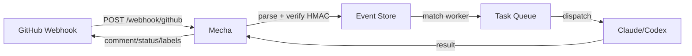
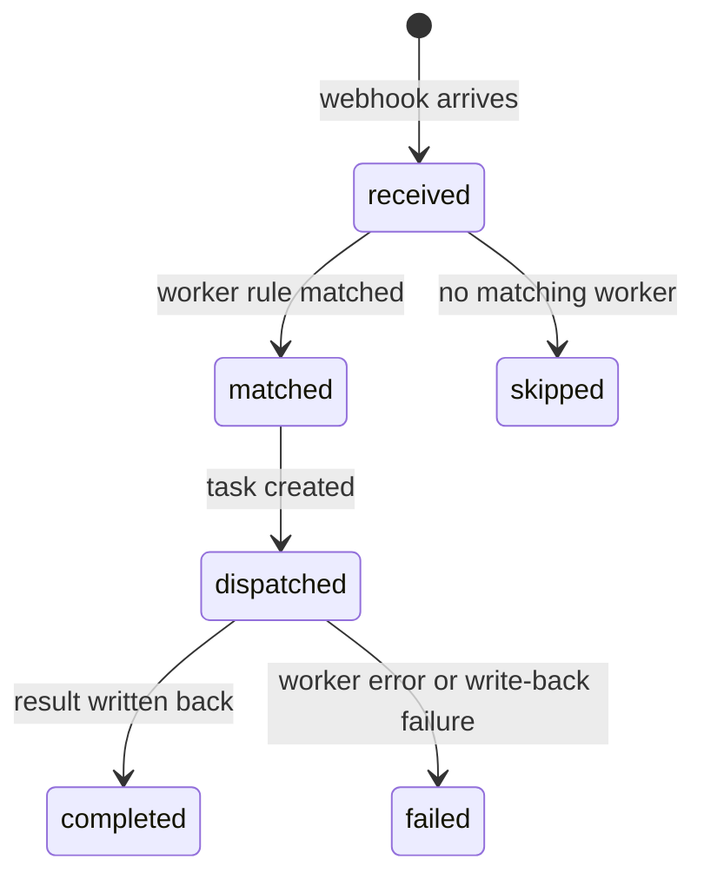

# Events & Webhooks

Events connect external sources (GitHub) to mecha workers. When a webhook arrives, mecha matches it to a worker, renders a prompt, dispatches a task, and writes the result back to GitHub.

## Pipeline



## Setup

### 1. Configure Secrets

Add your GitHub token and webhook secret to `~/.mecha/secrets.yml`:

```yaml
github:
  token: ghp_your_github_pat
  webhook_secret: whsec_your_webhook_secret
```

- `token` — GitHub PAT for API calls (diff fetching + write-back)
- `webhook_secret` — HMAC secret for webhook signature verification

### 2. Add Event Rules to Workers

Add an `events:` section to your worker YAML:

```yaml
name: pr-reviewer
docker:
  image: mecha-worker-claude:latest
  token: claude.xiaolaidev
  env:
    CLAUDE_MODEL: claude-sonnet-4-6
    CLAUDE_EFFORT: high
timeout: 30m

events:
  - source: github
    on:
      - pull_request.opened
      - pull_request.synchronize
    filter:
      base_branch: main
    prompt: |
      Review this pull request for security and correctness.

      ## PR #{{.number}}: {{.title}}
      Author: {{.sender}}
      Branch: {{.head_branch}} -> {{.base_branch}}

      ### Diff
      {{.diff}}
```

### 3. Configure GitHub Webhook

In your GitHub repo settings → Webhooks:
- **Payload URL**: `https://your-server/webhook/github`
- **Content type**: `application/json`
- **Secret**: same as `webhook_secret` in secrets.yml
- **Events**: Select the events matching your worker rules

### 4. Start the Server

```bash
mecha serve --addr 0.0.0.0:8080 --api-key YOUR_API_KEY
```

## Event Rules

Each rule in the `events:` section defines when the worker should handle an event:

| Field | Required | Description |
|-------|----------|-------------|
| `source` | Yes | Event source (`github`) |
| `on` | Yes | List of event types to match |
| `filter` | No | Key-value payload filters (equality match) |
| `prompt` | Yes | Go template rendered with event data |
| `auto` | No | Auto-dispatch (default: true). False = future manual approval |

### GitHub Event Types

| Type | Trigger |
|------|---------|
| `pull_request.opened` | PR created |
| `pull_request.synchronize` | PR updated (new commits) |
| `pull_request.closed` | PR closed/merged |
| `push` | Push to branch |
| `issues.opened` | Issue created |
| `issues.labeled` | Label added to issue |
| `issue_comment.created` | Comment on issue/PR |
| `pull_request.review_requested` | Review requested |

### Template Variables

Available in the `prompt` template:

| Variable | Source |
|----------|--------|
| `{{.repo_owner}}` | Repository owner |
| `{{.repo_name}}` | Repository name |
| `{{.number}}` | PR/issue number |
| `{{.sender}}` | Who triggered the event |
| `{{.title}}` | PR/issue title |
| `{{.body}}` | PR/issue body |
| `{{.diff}}` | PR diff (fetched via API, max 500KB) |
| `{{.file_list}}` | Changed file names |
| `{{.head_branch}}` | Source branch |
| `{{.base_branch}}` | Target branch |
| `{{.head_sha}}` | Head commit SHA |
| `{{.labels}}` | Comma-separated label names |

## Write-Back

When a worker returns a result with write-back fields, mecha posts them to GitHub:

```json
{
  "output": "Found 2 security issues...",
  "comment": {
    "target": "pr:42",
    "body": "## Security Review\nFound 2 issues..."
  },
  "status": {
    "state": "failure",
    "description": "2 security issues found"
  },
  "labels": {
    "add": ["security-review-failed"],
    "remove": ["needs-review"]
  }
}
```

| Field | GitHub Action |
|-------|-------------|
| `comment.body` | Posts PR/issue comment |
| `status.state` | Sets commit status (success/failure/pending) |
| `labels.add` | Adds labels to PR/issue |
| `labels.remove` | Removes labels from PR/issue |

Write-back requires `github.token` in secrets.yml with appropriate permissions.

## Event States



## Delivery Deduplication

GitHub may retry webhook deliveries. Mecha deduplicates using the `X-GitHub-Delivery` header — each delivery is processed exactly once.

## Security

- Webhooks are verified via HMAC-SHA256 (constant-time comparison)
- Webhook endpoints are exempt from API key auth (use their own signature verification)
- If no webhook secret is configured, a startup warning is logged
- Diff is fetched using SHA-pinned compare endpoints (immutable)
