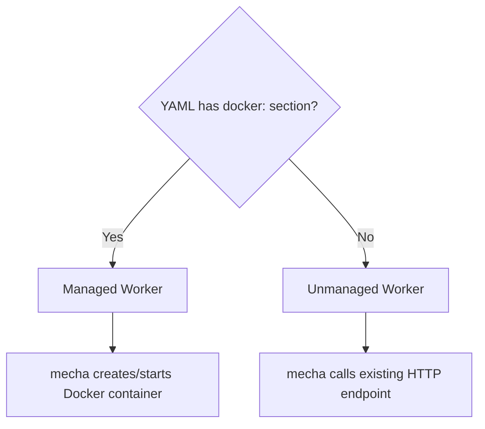
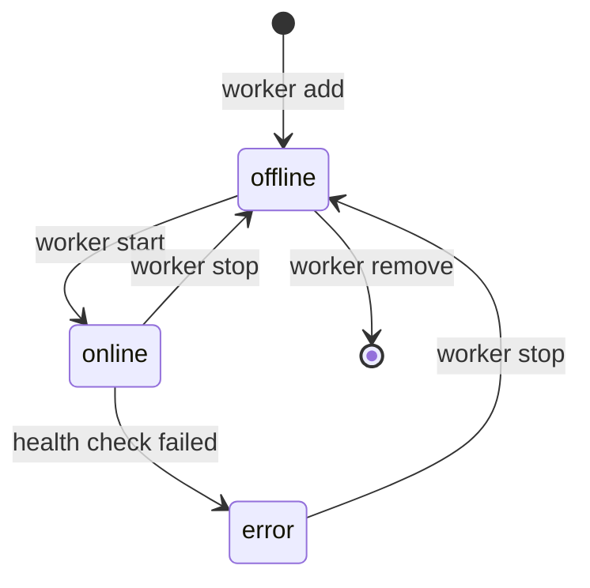

# Worker Configuration

Workers are defined in YAML files. Each file describes one worker.

## Managed vs Unmanaged



- **Managed**: has a `docker:` section. Mecha controls the container lifecycle.
- **Unmanaged**: has an `endpoint:` field. Mecha just calls it.

## Managed Worker (Docker)

```yaml
name: claude-reviewer
docker:
  image: mecha-worker-claude:latest     # required
  cwd: /path/to/project                 # host dir → /workspace in container
  resources:
    cpu: 4                              # CPU cores
    memory: 8G                          # memory limit (M or G)
    pids: 256                           # process limit
  lifecycle: persistent                 # only "persistent" for now
  env:                                  # environment variables
    CLAUDE_MODEL: claude-sonnet-4-6
    CLAUDE_SYSTEM_PROMPT: "You review code."
    CLAUDE_ALLOWED_TOOLS: "Read,Grep,Glob,Bash"
    CLAUDE_PERMISSION_MODE: bypassPermissions
    CLAUDE_EFFORT: high
    CLAUDE_OUTPUT_FORMAT: json
  token: claude.xiaolaidev              # from ~/.mecha/secrets.yml
  labels:                               # custom Docker labels
    team: security
timeout: 30m                            # task timeout
```

### Fields

| Field | Required | Default | Description |
|-------|----------|---------|-------------|
| `name` | Yes | — | Unique worker name. Must match `[a-zA-Z0-9][a-zA-Z0-9_.-]*` |
| `docker.image` | Yes | — | Docker image to run |
| `docker.cwd` | No | — | Host directory mounted read-write to `/workspace` |
| `docker.resources.cpu` | No | unlimited | CPU cores |
| `docker.resources.memory` | No | unlimited | Memory limit (`512M`, `4G`) |
| `docker.resources.pids` | No | unlimited | Max processes |
| `docker.lifecycle` | No | `persistent` | Only `persistent` supported (Phase 2) |
| `docker.host` | No | local socket | Docker daemon URL (e.g. `unix:///var/run/docker.sock`) |
| `docker.env` | No | `{}` | Environment variables passed to container |
| `docker.token` | No | — | Token reference from `~/.mecha/secrets.yml` |
| `docker.labels` | No | `{}` | Custom Docker container labels |
| `timeout` | No | `10m` | Max task execution time |

### Workspace Mount

When `docker.cwd` is set, the directory is bind-mounted read-write into the container at `/workspace`. The container runs as your host user (matching UID/GID) to avoid permission issues.

```yaml
docker:
  cwd: /Users/me/projects/my-repo    # must be an existing directory
```

The path is validated:
- Must exist
- Must be a directory (not a file)
- Symlinks are resolved (no traversal)

## Unmanaged Worker

```yaml
name: my-ollama
endpoint: http://100.64.0.3:11434
timeout: 5m
```

Mecha doesn't manage the process. It just marks the worker online on `start`, probes `GET /health`, and calls `POST /task` on the endpoint.

## Worker Image Contract

Every managed worker image must:

| Requirement | Details |
|-------------|---------|
| Port | Expose `8080` |
| Health | `GET /health` → `200` (ready) or `503` (busy) |
| Task | `POST /task` → result contract JSON |
| Healthcheck | Include `HEALTHCHECK` directive in Dockerfile |
| Config | Read all config from environment variables |
| Backend | Set `WORKER_BACKEND` env var (`claude`, `codex`, `gemini`) |

### POST /task Request

```json
{
  "id": "task-abc123",
  "prompt": "Review this PR for security issues",
  "context": {
    "repo": "owner/repo",
    "diff": "..."
  }
}
```

### POST /task Response

```json
{
  "output": "The PR has a SQL injection vulnerability...",
  "metadata": {
    "model": "claude-sonnet-4-6",
    "duration_ms": 45000,
    "exit_code": 0
  }
}
```

## Backend-Specific Env Vars

### Claude

Claude uses the Agent SDK `query()` directly. Env vars map to SDK options:

| Env Var | SDK Option | Values |
|---------|-----------|--------|
| `CLAUDE_MODEL` | `model` | `claude-sonnet-4-6`, `claude-opus-4-6`, etc. |
| `CLAUDE_SYSTEM_PROMPT` | `systemPrompt` | Any string |
| `CLAUDE_ALLOWED_TOOLS` | `allowedTools` | Comma-separated: `Read,Grep,Glob,Bash` |
| `CLAUDE_DISALLOWED_TOOLS` | `disallowedTools` | Comma-separated |
| `CLAUDE_PERMISSION_MODE` | `permissionMode` | `default`, `plan`, `acceptEdits`, `bypassPermissions` |
| `CLAUDE_EFFORT` | `effort` | `low`, `medium`, `high`, `max` |
| `CLAUDE_MAX_BUDGET_USD` | `maxBudgetUsd` | e.g. `5.00` |
| `CLAUDE_MAX_TURNS` | `maxTurns` | e.g. `50` |

### Codex

Codex uses `codex exec` CLI. Env vars map to CLI flags:

| Env Var | CLI Flag | Values |
|---------|----------|--------|
| `CODEX_MODEL` | `--model` | `gpt-5.4`, `gpt-5.4-mini`, etc. |
| `CODEX_SANDBOX` | `--sandbox` | `read-only`, `workspace-write`, `danger-full-access` |
| `CODEX_FULL_AUTO` | `--full-auto` | `"true"` to enable auto-approve + workspace-write |
| `CODEX_EFFORT` | `-c model_reasoning_effort` | `low`, `medium`, `high` |

### Gemini

| Env Var | CLI Flag | Values |
|---------|----------|--------|
| `GEMINI_MODEL` | `--model` | `gemini-2.5-pro`, `gemini-2.5-flash`, etc. |
| `GEMINI_SANDBOX` | `--sandbox` | `"true"` to enable sandboxed execution |
| `GEMINI_APPROVAL_MODE` | `--approval-mode` | `default`, `auto_edit`, `yolo`, `plan` |
| `GEMINI_OUTPUT_FORMAT` | `--output-format` | `text`, `json`, `stream-json` |

## State Machine



- **offline**: definition exists, container stopped or absent
- **online**: container running, health check passing
- **error**: health check failed or container exited
