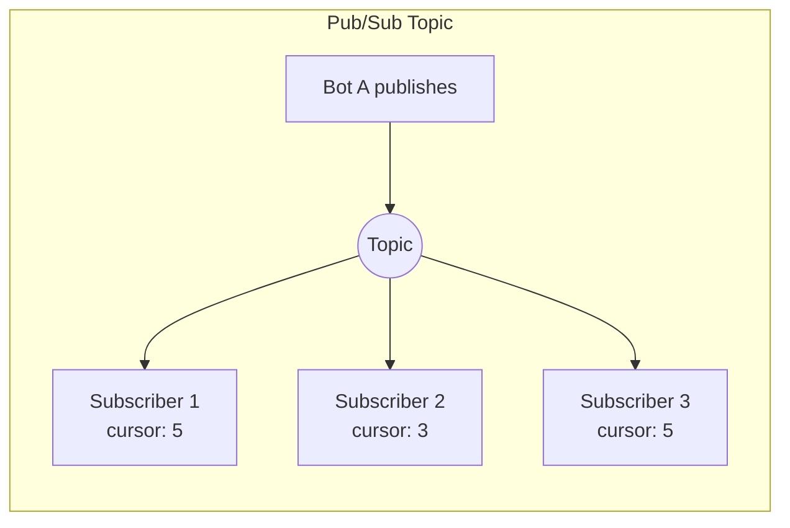
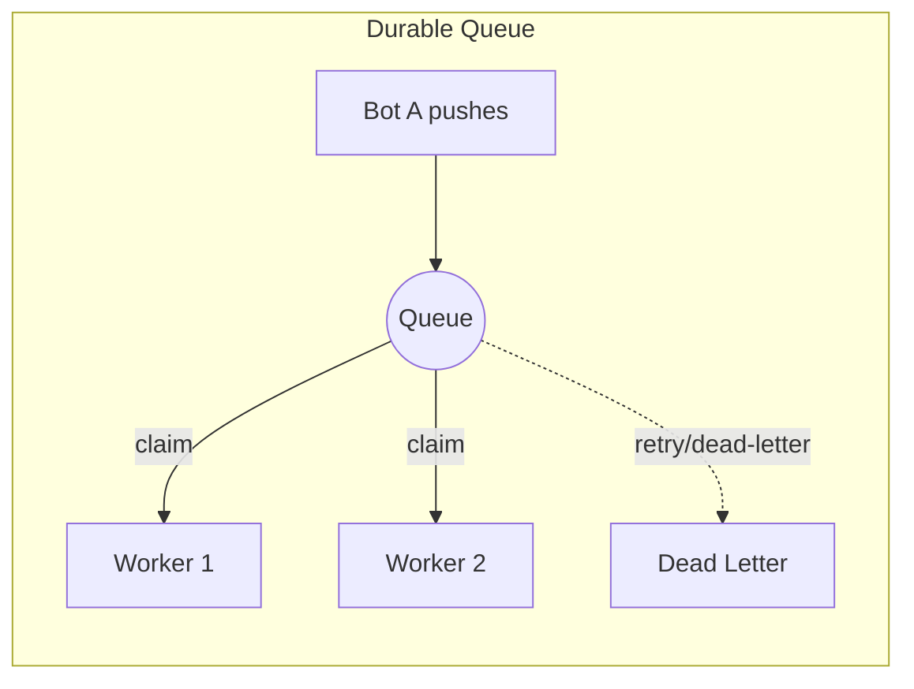

[[toc]]

# Message Bus

The message bus provides asynchronous pub/sub messaging and durable work queues for inter-bot coordination. Instead of synchronous `mesh_query` (where bot A blocks waiting for bot B), bots publish events to topics and claim work from queues.

## Core Concepts





### Topics (Pub/Sub)

A topic is a named channel. Any bot publishes a message; all subscribers receive it independently.

```
Bot A publishes → topic "pr-opened" → Bot B receives, Bot C receives
```

Each subscriber tracks its own cursor — messages are not lost if a subscriber is temporarily offline.

### Queues (Competing Consumers)

A queue distributes work items to the first available consumer. Only one bot processes each message.

```
Work item → queue "review-queue" → first idle bot claims it
```

Failed items retry automatically (configurable max retries). After exhausting retries, items move to a dead-letter queue for inspection.

## Data Model

All bus data is stored as JSONL files under `~/.mecha/bus/`:

```
~/.mecha/bus/
├── topics/
│   └── pr-opened/
│       ├── messages.jsonl       # append-only message log
│       └── subscribers.json     # per-subscriber cursor positions
├── queues/
│   └── review-queue/
│       ├── pending.jsonl        # unclaimed messages
│       ├── inflight.jsonl       # claimed, not yet acknowledged
│       └── dead.jsonl           # failed after max retries
└── bus.json                     # topic/queue definitions
```

## Key Features

- **Idempotency**: Every message has a unique ID. Duplicates are rejected within a retention window.
- **At-least-once delivery**: Subscriber cursors ensure messages redeliver if a bot crashes mid-processing.
- **Backpressure**: Each subscriber has a configurable concurrency limit (default: 1).
- **Dead-letter queue**: Failed messages are preserved for inspection, not silently dropped.
- **Persistence**: All state survives daemon restarts — messages are JSONL files, not in-memory.

## CLI Usage

### Topics

```bash
# Create a topic
mecha bus topic create pr-events
# Topic "pr-events" created

# Publish a message
mecha bus topic publish pr-events '{"repo":"acme","pr":42}'
# Published message 4bdd4644-... to topic "pr-events"

# List topics
mecha bus topic list
# Name
# ------------
# pr-events
# deploy-ready

# View recent messages
mecha bus topic tail pr-events -n 5
# ID                                    Timestamp                 Sender  Payload
# ------------------------------------  ------------------------  ------  -----------------------
# 4bdd4644-3144-4b09-b446-c95ef04451f4  2026-03-21T09:22:36.737Z  cli     {"repo":"acme","pr":42}
```

### Queues

```bash
# Create a queue
mecha bus queue create review-queue --max-retries 5
# Queue "review-queue" created (maxRetries: 5)

# Inspect queue
mecha bus queue inspect review-queue
# Metric    Count
# --------  -----
# pending   0
# inflight  0
# dead      0

# Drain (move all pending to dead letter)
mecha bus queue drain review-queue
```

## MCP Tools (available to bots)

Bots can access the bus via MCP tools: `bus_publish`, `bus_queue_push`, `bus_queue_claim`, `bus_queue_ack`, `bus_queue_nack`, `bus_poll`.

- `bus_queue_nack` -- Return a claimed queue item for retry or dead-letter
- `bus_poll` -- Read new messages from a bus topic (requires subscription)

## Type Reference

### `BusMessage`

The message envelope used by both queues and topics. Every message has a unique `id` for idempotent deduplication.

| Field | Type | Description |
|-------|------|-------------|
| `id` | `string` | Unique message ID (UUID). Used for deduplication |
| `ts` | `string` | ISO 8601 timestamp of when the message was created |
| `sender` | `string` | Name of the bot or entity that produced the message |
| `payload` | `unknown` | Arbitrary message payload (typically a JSON-serializable object) |
| `notBefore` | `string?` | Earliest time this message can be claimed (set by nack with exponential backoff) |

### `QueueConfig`

Configuration for a durable queue, persisted in `bus.json`.

| Field | Type | Description |
|-------|------|-------------|
| `name` | `string` | Queue name (used as filesystem directory name) |
| `maxRetries` | `number` | Maximum delivery attempts before moving to dead letter (default: `3`) |
| `retryBackoffMs` | `number` | Backoff interval in milliseconds between retries (default: `5000`) |
| `claimTimeoutMs` | `number?` | Timeout in ms before inflight items expire and return to pending (default: 300000) |

### `ClaimedItem`

A queue message that has been claimed by a consumer for processing.

| Field | Type | Description |
|-------|------|-------------|
| `message` | `BusMessage` | The original message envelope |
| `claimedBy` | `string` | Name of the bot that claimed the message |
| `claimedAt` | `string` | ISO 8601 timestamp of when the claim occurred |
| `attempts` | `number` | Number of delivery attempts so far (incremented on each claim) |

### `Subscriber`

A topic subscriber with cursor-based delivery tracking.

| Field | Type | Description |
|-------|------|-------------|
| `bot` | `string` | Name of the subscribing bot |
| `cursor` | `number` | Index into the topic's message log (advances on each poll) |
| `concurrency` | `number` | Maximum number of messages processed concurrently |
| `promptTemplate` | `string?` | Optional prompt template applied to incoming messages |
| `filter` | `string?` | Optional filter expression for message selection |

### `TopicConfig`

Configuration for a pub/sub topic, persisted in `bus.json`.

| Field | Type | Description |
|-------|------|-------------|
| `name` | `string` | Topic name (used as filesystem directory name) |
| `retentionDays` | `number` | Number of days to retain messages (default: `7`) |

### `BusConfig`

Top-level configuration file (`bus.json`) that tracks all registered queues and topics.

| Field | Type | Description |
|-------|------|-------------|
| `queues` | `Record<string, QueueConfig>` | Map of queue name to queue configuration |
| `topics` | `Record<string, TopicConfig>` | Map of topic name to topic configuration |

### `Broker`

Message broker interface that manages the lifecycle of queues and topics. Created via `createBroker()`.

| Method | Signature | Description |
|--------|-----------|-------------|
| `queue` | `(name: string, config?: Partial<Omit<QueueConfig, "name">>) => DurableQueue` | Create or retrieve a durable queue by name. Returns existing queue if already created |
| `topic` | `(name: string, config?: Partial<Omit<TopicConfig, "name">>) => Topic` | Create or retrieve a pub/sub topic by name. Returns existing topic if already created |
| `queueNames` | `() => string[]` | List all registered queue names |
| `topicNames` | `() => string[]` | List all registered topic names |
| `busDir` | `readonly string` | The bus directory path |

### `DurableQueue`

Durable work queue with push/claim/ack/nack semantics and dead-letter support. Created via `createQueue()`.

| Method | Signature | Description |
|--------|-----------|-------------|
| `push` | `(msg: Omit<BusMessage, "id" \| "ts"> & { id?: string }) => string` | Push a message to the queue. Returns the message ID. Deduplicates by ID |
| `claim` | `(bot: string) => ClaimedItem \| null` | Claim the next pending message for processing. Returns `null` if empty |
| `ack` | `(messageId: string) => boolean` | Acknowledge successful processing. Removes the message from inflight |
| `nack` | `(messageId: string) => boolean` | Negative-acknowledge. Returns to pending for retry, or moves to dead letter if retries exhausted |
| `stats` | `() => { pending: number; inflight: number; dead: number }` | Get counts of pending, inflight, and dead-letter messages |
| `deadLetters` | `() => BusMessage[]` | List all dead-letter messages |
| `drain` | `() => number` | Move all pending messages to dead letter. Returns the number drained |
| `name` | `readonly string` | The queue name |

### `Topic`

Pub/sub topic with per-subscriber cursor tracking. Created via `createTopic()`.

| Method | Signature | Description |
|--------|-----------|-------------|
| `publish` | `(msg: Omit<BusMessage, "id" \| "ts"> & { id?: string }) => string` | Publish a message to the topic. Returns message ID. Deduplicates by ID |
| `subscribe` | `(sub: Omit<Subscriber, "cursor">) => void` | Add or update a subscriber. New subscribers start at the current end of the log |
| `unsubscribe` | `(bot: string) => boolean` | Remove a subscriber by bot name. Returns `false` if not found |
| `poll` | `(bot: string, limit?: number) => BusMessage[]` | Read up to `limit` messages from the subscriber's cursor position (default: `10`). Advances the cursor |
| `subscribers` | `() => Subscriber[]` | List all subscribers with their current cursor positions |
| `messageCount` | `() => number` | Count total messages in the topic log |
| `enforceRetention` | `() => number` | Remove messages older than `retentionDays`, adjust subscriber cursors, return count of removed messages |
| `name` | `readonly string` | The topic name |

### `Replicator`

Cross-node topic replicator that forwards local topic messages to remote nodes. Created via `createReplicator()`.

| Method | Signature | Description |
|--------|-----------|-------------|
| `replicate` | `() => Promise<ReplicationResult>` | Run one replication cycle: poll new messages and forward to remote nodes |
| `startReplication` | `(intervalMs: number) => void` | Start periodic replication at the given interval |
| `stopReplication` | `() => void` | Stop periodic replication |
| `active` | `readonly boolean` | Whether periodic replication is currently running |

### `ReplicationResult`

Result of a single replication cycle.

| Field | Type | Description |
|-------|------|-------------|
| `sent` | `number` | Number of messages successfully forwarded |
| `errors` | `string[]` | Error messages for any failures during the cycle |

### `ReplicatorOpts`

Options for creating a replicator instance.

| Field | Type | Description |
|-------|------|-------------|
| `busDir` | `string` | Path to the bus directory |
| `mechaDir` | `string` | Path to the mecha home directory (for node registry lookup) |
| `topicName` | `string` | Name of the topic to replicate |
| `targetNodes` | `string[]` | List of remote node names to forward messages to |

### Factory Functions

#### `createBroker(busDir)`

Create a message broker backed by a filesystem directory. The broker manages queues and topics, persisting their configuration to `bus.json`.

| Parameter | Type | Description |
|-----------|------|-------------|
| `busDir` | `string` | Path to the bus directory (created if it does not exist) |

**Returns:** `Broker`

#### `createQueue(opts)`

Create a durable queue backed by JSONL files (`pending.jsonl`, `inflight.jsonl`, `dead.jsonl`).

| Parameter | Type | Description |
|-----------|------|-------------|
| `opts` | `CreateQueueOpts` | Queue creation options |
| `opts.busDir` | `string` | Path to the bus directory |
| `opts.config` | `QueueConfig` | Queue configuration (name, maxRetries, retryBackoffMs) |

**Returns:** `DurableQueue`

#### `createTopic(opts)`

Create a pub/sub topic backed by JSONL files (`messages.jsonl`) and a subscriber registry (`subscribers.json`).

| Parameter | Type | Description |
|-----------|------|-------------|
| `opts` | `CreateTopicOpts` | Topic creation options |
| `opts.busDir` | `string` | Path to the bus directory |
| `opts.config` | `TopicConfig` | Topic configuration (name, retentionDays) |

**Returns:** `Topic`

#### `createReplicator(opts, fetchFn, readNodesFn)`

Create a replicator that monitors a local topic and forwards new messages to remote nodes. Messages with an `origin` field in their payload are skipped to prevent replication loops.

| Parameter | Type | Description |
|-----------|------|-------------|
| `opts` | `ReplicatorOpts` | Replicator options (busDir, mechaDir, topicName, targetNodes) |
| `fetchFn` | `ReplicatorFetchFn` | Function to send HTTP requests to remote nodes |
| `readNodesFn` | `(mechaDir: string) => Array<{ name, host, port, apiKey }>` | Function to read the node registry |

**Returns:** `Replicator`

## Package

`@mecha/bus` — `packages/bus/src/`

| Export | Description |
|--------|-------------|
| `createBroker(busDir)` | Create a broker managing queues and topics |
| `createQueue(opts)` | Create a durable queue with retry and dead-letter |
| `createTopic(opts)` | Create a pub/sub topic with per-subscriber cursors |
| `createReplicator(opts)` | Cross-node topic replicator for multi-machine setups |
| `readJsonl(path)` | Parse a JSONL file into array of objects |
| `writeJsonl(path, items)` | Write array as JSONL (atomic) |
| `appendJsonl(path, item)` | Append single item to JSONL file |
| `withFileLock(lockPath, fn, timeoutMs?)` | Execute function under advisory file lock |

## See Also

- [Task Protocol](/features/task-protocol) — async task delegation alternative
- [Workflow Engine](/features/workflow) — DAG execution using bus events
- [Orchestration CLI](/reference/cli/orchestration#bus) — full command reference
- [Mesh Networking](/features/mesh-networking) — synchronous query alternative
