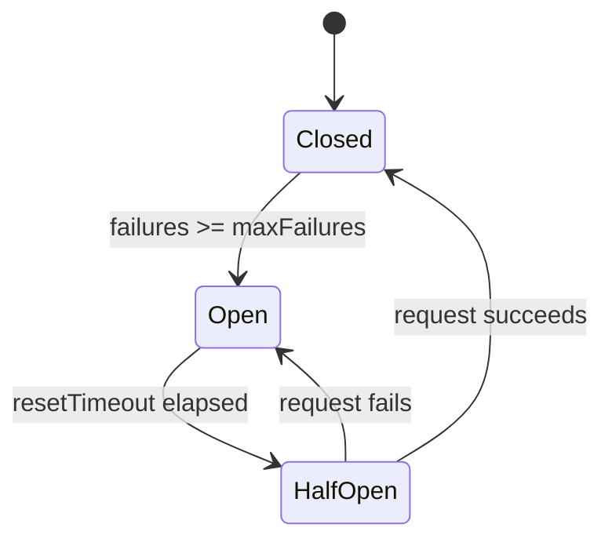

# Gateway

The gateway package provides three capabilities for secure external service integration: a file-backed credential store for managing secrets and per-bot access grants, circuit breakers for protecting outbound calls from cascading failures, and an HTTP gateway that enforces host allowlists with per-host circuit breaking. A registry of service adapters (GitHub, Slack, Email, Discord, Linear) provides a uniform interface for inbound webhooks and outbound messaging.

## Credential Store

The credential store persists secrets and access grants as JSON files under `~/.mecha/gateway/`:

```
~/.mecha/gateway/
├── secrets.json    # stored secrets (base64-encoded values, mode 0600)
└── grants.json     # per-bot access grants (mode 0600)
```

Secrets are base64-encoded at rest. Each secret has a name, an encoded value, and `createdAt`/`updatedAt` timestamps. Access grants are explicit -- a bot cannot read a secret unless it has been granted access by name.

### How It Works

1. An operator stores a secret (e.g., `GITHUB_TOKEN`) via the CLI
2. The operator grants specific bots access to that secret
3. At runtime, the bot's environment resolves secrets through `checkAccess` before injecting them
4. Revoking access or deleting a secret takes effect immediately -- grants are cleaned up on delete

### Data Model

**StoredSecret:**

| Field | Type | Description |
|-------|------|-------------|
| `name` | `string` | Unique secret identifier |
| `value` | `string` | Base64-encoded secret value |
| `createdAt` | `string` | ISO 8601 creation timestamp |
| `updatedAt` | `string` | ISO 8601 last-update timestamp |

**SecretGrant:**

| Field | Type | Description |
|-------|------|-------------|
| `secretName` | `string` | Name of the secret |
| `botName` | `string` | Name of the bot granted access |
| `grantedAt` | `string` | ISO 8601 grant timestamp |

## Circuit Breaker

The circuit breaker tracks consecutive failures to external services and trips after a configurable threshold, preventing cascading failures when a dependency is down.

### States

```
       success
  ┌───────────────┐
  v               │
CLOSED ──────> OPEN ──────> HALF-OPEN
  ^   N failures   │  timeout    │
  │                │  expires    │
  └────────────────┴─────────────┘
        success          failure → back to OPEN
```



- **Closed** -- requests pass through normally. Consecutive failures are counted. After `maxFailures` (default: 5), the circuit trips to open.
- **Open** -- all requests are immediately rejected with `CircuitOpenError`. After `resetTimeoutMs` (default: 60,000 ms), the circuit transitions to half-open.
- **Half-open** -- one test request is allowed. If it succeeds, the circuit resets to closed. If it fails, the circuit returns to open.

### Configuration

| Option | Type | Default | Description |
|--------|------|---------|-------------|
| `maxFailures` | `number` | `5` | Consecutive failures before tripping |
| `resetTimeoutMs` | `number` | `60000` | Milliseconds before open transitions to half-open |

## HTTP Gateway

The HTTP gateway wraps outbound HTTP requests with a host allowlist and per-host circuit breakers. Requests to hosts not in the allowlist are rejected with `GatewayDeniedError`.

### How It Works

1. Create a gateway with a list of allowed host patterns
2. Each outbound request is checked against the allowlist
3. If allowed, the request is routed through a per-host circuit breaker
4. The circuit breaker protects against cascading failures per host

### Host Matching

The allowlist supports exact matches and wildcard prefixes:

- `"api.github.com"` -- matches only `api.github.com`
- `"*.example.com"` -- matches `api.example.com`, `webhook.example.com`, but not `example.com` itself

### Request Flow

```
executeRequest("https://api.github.com/repos")
  │
  ├── Parse URL → extract hostname
  ├── Check allowlist → GatewayDeniedError if denied
  ├── Get/create per-host circuit breaker
  ├── Execute through circuit breaker
  │     ├── CircuitOpenError if circuit is open
  │     └── fetch() with redirect: "manual"
  └── Return { status, headers, body }
```

### Supported Methods

`GET`, `POST`, `PUT`, `DELETE`

## Adapters

The adapter registry provides a uniform interface for integrating with external services. Each adapter implements the `GatewayAdapter` interface with optional methods for parsing inbound webhooks, sending outbound messages, and verifying webhook signatures.

### Available Adapters

| Adapter | Name | Webhook Parsing | Send | Signature Verification |
|---------|------|:-:|:-:|:-:|
| `githubAdapter` | `"github"` | Yes | -- | -- |
| `slackAdapter` | `"slack"` | -- | -- | -- |
| `emailAdapter` | `"email"` | -- | -- | -- |
| `discordAdapter` | `"discord"` | -- | -- | -- |
| `linearAdapter` | `"linear"` | -- | -- | -- |

The GitHub adapter parses the `X-GitHub-Event` header into a structured `InboundEvent`. The remaining adapters are stubs that define the contract -- implementations will be added when the corresponding API tokens are available.

### Adapter Configuration

Each adapter can be configured with an `AdapterConfig`:

| Field | Type | Description |
|-------|------|-------------|
| `type` | `"webhook" \| "websocket" \| "poll"` | Connection type |
| `path` | `string?` | Webhook endpoint path |
| `secret` | `string?` | Webhook signing secret |
| `token` | `string?` | API token for outbound calls |
| `mappings` | `Array?` | Event-to-topic mappings |

Mappings connect external events to bus topics:

| Field | Type | Description |
|-------|------|-------------|
| `event` | `string` | External event name (e.g., `"pull_request"`) |
| `topic` | `string` | Bus topic to publish to |
| `filter` | `string?` | Optional filter expression |
| `payload` | `string?` | Optional payload template |

### ADAPTER_REGISTRY

The `ADAPTER_REGISTRY` is a `Record<string, GatewayAdapter>` containing all built-in adapters keyed by name: `github`, `slack`, `email`, `discord`, `linear`.

## CLI Usage

### Store a secret

```bash
mecha secret set <name> <value>
# Secret "GITHUB_TOKEN" stored

mecha secret set GITHUB_TOKEN ghp_abc123
```

### List secrets

```bash
mecha secret list
# Name
# ----------------
# GITHUB_TOKEN
# SLACK_BOT_TOKEN
```

### Grant a bot access

```bash
mecha secret grant <bot> <secret>

mecha secret grant coder GITHUB_TOKEN
# Granted "coder" access to secret "GITHUB_TOKEN"
```

### Revoke access

```bash
mecha secret revoke <bot> <secret>

mecha secret revoke coder GITHUB_TOKEN
# Revoked "coder" access to secret "GITHUB_TOKEN"
```

## Package

`@mecha/gateway` -- `packages/gateway/src/`

| Export | Description |
|--------|-------------|
| `createCredentialStore(secretsDir)` | Create a file-backed credential store for secrets and grants |
| `createCircuitBreaker(opts?)` | Create a circuit breaker with configurable failure threshold |
| `CircuitOpenError` | Error thrown when the circuit breaker is open |
| `createHttpGateway(opts)` | Create an HTTP gateway with host allowlist and circuit breakers |
| `GatewayDeniedError` | Error thrown when a request host is not in the allowlist |
| `ADAPTER_REGISTRY` | Registry of all built-in service adapters |
| `githubAdapter` | GitHub webhook adapter |
| `slackAdapter` | Slack adapter (stub) |
| `emailAdapter` | Email adapter (stub) |
| `discordAdapter` | Discord adapter (stub) |
| `linearAdapter` | Linear adapter (stub) |

## See also

- [Gateway API Reference](/reference/api/gateway) -- Full API reference for all exports and types
- [Message Bus](/features/bus) -- Pub/sub topics that adapters publish events to
- [Permissions](/features/permissions) -- ACL capabilities for bot access control
