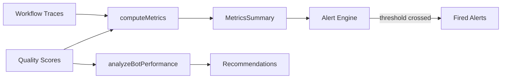

[[toc]]

# Observability

The observability package provides structured traces, metrics aggregation, quality scoring, and threshold-based alerts for workflow runs and bot performance.

## Core Concepts

### Traces

Every workflow run produces a structured trace linking the run to its steps, with per-step duration, cost, tool usage, and quality scores.

```json
{
  "traceId": "run-2026-03-21-001",
  "workflow": "content-pipeline",
  "totalCostUsd": 2.47,
  "steps": [
    { "stepId": "research", "bot": "researcher", "duration": "120.0s", "costUsd": 0.50 },
    { "stepId": "draft", "bot": "writer", "duration": "180.0s", "costUsd": 1.50 }
  ]
}
```

### Quality Scoring

Three sources of quality signal:

| Source | How it works |
|--------|-------------|
| **Human** | `mecha workflow rate <run-id> 4` (1-5 scale) |
| **Automated** | A reviewer bot evaluates output against criteria |
| **Implicit** | Gate approved without revision = high quality; step repeated = low quality |

### Metrics

Aggregated per-bot and per-workflow metrics computed from traces:

- Success rate, average cost, average duration
- Quality score trends, revision rate
- Queue depth and wait time



### Alerts

Rule-based threshold alerts that fire when metrics cross boundaries:

```json
{ "id": "cost-high", "metric": "cost_per_run", "threshold": 5.0, "comparison": "gt", "message": "Run cost exceeded $5" }
```

## Data Model

All observability data is stored as JSON files — no database required.

```
~/.mecha/observe/
├── traces/
│   └── content-pipeline/
│       └── run-001.trace.json
├── scores/
│   └── scores.jsonl              # append-only quality scores
└── alerts/
    ├── rules.json                # alert rule definitions
    └── alerts.jsonl              # fired alert history
```

## CLI Usage

```bash
# Rate a workflow run (1-5 scale)
mecha workflow rate run-2026-03-21-b2d92950 4
# Recorded score 4/5 for run run-2026-03-21-b2d92950

# View bot performance metrics
mecha metrics bot researcher --days 7
# Shows success rate, avg cost, avg duration

# View workflow metrics
mecha metrics workflow test-pipeline

# Add an alert rule
mecha alert add cost-high --metric cost_per_run --threshold 5 --comparison gt --message "Run cost exceeded $5"
# Alert rule "cost-high" added

# List alert rules
mecha alert list --rules
# ID         Metric        Comparison  Threshold  Message
# ---------  ------------  ----------  ---------  ---------------------------
# cost-high  cost_per_run  gt          5          Run cost exceeded $5

# View fired alerts
mecha alert list

# Remove an alert rule
mecha alert remove cost-high

# Tuning recommendations
mecha meta tune researcher
# Analyzes quality score trends, suggests prompt changes

# Company report
mecha meta report --days 7
# Company Report (last 7 days)
# ────────────────────────────────────────
# test-pipeline:
#   Runs: 3  Success: 100%  Avg cost: $0.02
# Total: 3 runs, $0.06 spent
```

## Type Reference

### `RunTrace`

Structured trace for an entire workflow run.

| Field | Type | Required | Description |
|-------|------|----------|-------------|
| `traceId` | `string` | Yes | Unique identifier for this trace |
| `workflow` | `string` | Yes | Workflow name |
| `startedAt` | `string` | Yes | ISO 8601 timestamp when the run started |
| `completedAt` | `string` | No | ISO 8601 timestamp when the run completed |
| `status` | `string` | Yes | Run status (e.g. `"done"`, `"failed"`) |
| `totalCostUsd` | `number` | Yes | Total cost in USD across all steps |
| `qualityScore` | `number` | No | Aggregate quality score for the run |
| `steps` | `StepTrace[]` | Yes | Ordered list of step traces |

### `StepTrace`

Structured trace for a single workflow step.

| Field | Type | Required | Description |
|-------|------|----------|-------------|
| `stepId` | `string` | Yes | Step identifier within the workflow |
| `bot` | `string` | Yes | Name of the bot that executed this step |
| `status` | `string` | Yes | Step status (e.g. `"completed"`, `"failed"`) |
| `duration` | `string` | No | Human-readable duration (e.g. `"120.0s"`) |
| `startedAt` | `string` | No | ISO 8601 timestamp when the step started |
| `completedAt` | `string` | No | ISO 8601 timestamp when the step completed |
| `tokens` | `{ input: number; output: number }` | No | Token usage breakdown |
| `costUsd` | `number` | Yes | Cost in USD for this step |
| `toolCalls` | `string[]` | No | List of tool names invoked during this step |
| `qualityScore` | `number` | No | Quality score for this step |
| `revisionCount` | `number` | No | Number of revisions requested for this step |
| `error` | `string` | No | Error message if the step failed |

### `QualityScore`

Quality score entry recorded against a run or individual step.

| Field | Type | Required | Description |
|-------|------|----------|-------------|
| `runId` | `string` | Yes | The run this score belongs to |
| `stepId` | `string` | No | Specific step within the run (omit for run-level score) |
| `bot` | `string` | No | Bot name associated with the score |
| `score` | `number` | Yes | Numeric score value |
| `source` | `"human" \| "automated" \| "implicit"` | Yes | How the score was produced |
| `comment` | `string` | No | Optional comment or rationale |
| `scoredAt` | `string` | Yes | ISO 8601 timestamp when the score was recorded |
| `workflow` | `string?` | No | Workflow name associated with this score (used by avgForWorkflow filtering) |

### `MetricsSummary`

Aggregated metrics for a bot or workflow over a time period.

| Field | Type | Required | Description |
|-------|------|----------|-------------|
| `name` | `string` | Yes | Bot or workflow name |
| `type` | `"bot" \| "workflow"` | Yes | Whether this summary is for a bot or workflow |
| `period` | `{ from: string; to: string }` | Yes | Time range (ISO 8601 timestamps) |
| `runCount` | `number` | Yes | Total number of runs or step executions |
| `successRate` | `number` | Yes | Fraction of successful runs (0.0 - 1.0) |
| `avgCostUsd` | `number` | Yes | Average cost per run in USD |
| `avgDurationMs` | `number` | Yes | Average duration per run in milliseconds |
| `avgQualityScore` | `number` | No | Average quality score (undefined if no scores) |
| `revisionRate` | `number` | No | Fraction of steps with revisions (bot type only) |

### `AlertRule`

Alert rule definition that triggers when a metric crosses a threshold.

| Field | Type | Required | Description |
|-------|------|----------|-------------|
| `id` | `string` | Yes | Unique rule identifier |
| `metric` | `string` | Yes | Metric name to monitor (e.g. `"cost_per_run"`) |
| `threshold` | `number` | Yes | Threshold value |
| `comparison` | `"gt" \| "lt" \| "gte" \| "lte"` | Yes | Comparison operator |
| `message` | `string` | Yes | Human-readable alert message |

### `Alert`

A fired alert instance.

| Field | Type | Required | Description |
|-------|------|----------|-------------|
| `ruleId` | `string` | Yes | ID of the rule that fired |
| `value` | `number` | Yes | The metric value that triggered the alert |
| `message` | `string` | Yes | Alert message (copied from the rule) |
| `firedAt` | `string` | Yes | ISO 8601 timestamp when the alert fired |

### `Trend`

```ts
type Trend = "improving" | "declining" | "stable";
```

Direction of a bot's quality score trend over time.

### `PerformanceAnalysis`

Result of analyzing a bot's quality score trend.

| Field | Type | Required | Description |
|-------|------|----------|-------------|
| `bot` | `string` | Yes | Bot name |
| `trend` | `Trend` | Yes | Detected trend direction |
| `avgScore` | `number` | Yes | Overall average quality score |
| `recentAvg` | `number` | Yes | Average score for the recent half of data |
| `olderAvg` | `number` | Yes | Average score for the older half of data |
| `totalScores` | `number` | Yes | Total number of scores analyzed |
| `recommendation` | `string` | Yes | Human-readable tuning recommendation |

### `Experiment`

A/B test experiment definition.

| Field | Type | Required | Description |
|-------|------|----------|-------------|
| `name` | `string` | Yes | Experiment name |
| `variantA` | `ExperimentVariant` | Yes | First variant configuration |
| `variantB` | `ExperimentVariant` | Yes | Second variant configuration |
| `workflow` | `string` | Yes | Workflow to test against |
| `runs` | `number` | Yes | Number of runs per variant (minimum 1) |

### `ExperimentVariant`

Configuration variant for an A/B experiment.

| Field | Type | Required | Description |
|-------|------|----------|-------------|
| `label` | `string` | Yes | Human-readable label for this variant |
| `config` | `Record<string, unknown>` | Yes | Arbitrary configuration passed to the executor |

### `ExperimentResult`

Result of comparing two experiment variants.

| Field | Type | Required | Description |
|-------|------|----------|-------------|
| `name` | `string` | Yes | Experiment name |
| `winner` | `"A" \| "B" \| "tie"` | Yes | Which variant won (or tie) |
| `variantA` | `VariantMetrics` | Yes | Aggregated metrics for variant A |
| `variantB` | `VariantMetrics` | Yes | Aggregated metrics for variant B |
| `confidence` | `"low" \| "medium" \| "high"` | Yes | Confidence level based on sample size (`< 6` total runs = low, `< 20` = medium, `>= 20` = high) |

### `VariantMetrics`

Aggregated metrics for one experiment variant.

| Field | Type | Required | Description |
|-------|------|----------|-------------|
| `label` | `string` | Yes | Variant label |
| `runs` | `number` | Yes | Number of runs executed |
| `avgCostUsd` | `number` | Yes | Average cost per run in USD |
| `avgDurationMs` | `number` | Yes | Average duration per run in milliseconds |
| `avgQualityScore` | `number \| undefined` | Yes | Average quality score (undefined if no scores) |
| `successRate` | `number` | Yes | Fraction of successful runs (0.0 - 1.0) |

### `ExperimentExecutor`

```ts
type ExperimentExecutor = (
  config: Record<string, unknown>,
  workflow: string,
  runs: number,
) => Promise<RunTrace[]>;
```

Callback function provided by the caller to execute a workflow with a given configuration. Receives the variant config, workflow name, and number of runs. Must return the resulting traces.

## Function Reference

### `createTraceStore(tracesDir)`

Create a file-backed trace store. Traces are persisted as JSON files at `<tracesDir>/<workflow>/<traceId>.trace.json`.

| Parameter | Type | Description |
|-----------|------|-------------|
| `tracesDir` | `string` | Directory for trace storage (created if missing) |

Returns a `TraceStore` with the following methods:

| Method | Signature | Description |
|--------|-----------|-------------|
| `save` | `(trace: RunTrace) => void` | Persist a trace. Throws on invalid workflow/traceId names |
| `load` | `(workflow: string, traceId: string) => RunTrace \| null` | Load a trace by ID. Returns `null` if not found |
| `list` | `(workflow: string, limit?: number) => RunTrace[]` | List traces for a workflow, most recent first. Default limit: 20 |
| `workflows` | `() => string[]` | List all workflow names that have traces |

### `buildTrace(opts)`

Build a `RunTrace` from a workflow run state. Adapts from the workflow package's internal representation.

| Parameter | Type | Description |
|-----------|------|-------------|
| `opts.runId` | `string` | Run identifier (becomes `traceId`) |
| `opts.workflow` | `string` | Workflow name |
| `opts.status` | `string` | Run status |
| `opts.startedAt` | `string` | ISO 8601 start timestamp |
| `opts.completedAt` | `string?` | ISO 8601 completion timestamp |
| `opts.totalCostUsd` | `number` | Total run cost |
| `opts.steps` | `Record<string, { status, startedAt?, completedAt?, costUsd?, error? }>` | Step data keyed by step ID |
| `opts.stepBots` | `Record<string, string>` | Map of step ID to bot name |

Returns `RunTrace`.

### `createScoreStore(scoresDir)`

Create a file-backed quality score store. Scores are appended to `<scoresDir>/scores.jsonl`.

| Parameter | Type | Description |
|-----------|------|-------------|
| `scoresDir` | `string` | Directory for score storage (created if missing) |

Returns a `ScoreStore` with the following methods:

| Method | Signature | Description |
|--------|-----------|-------------|
| `record` | `(score: QualityScore) => void` | Append a quality score |
| `forRun` | `(runId: string) => QualityScore[]` | Get all scores for a run |
| `forBot` | `(bot: string) => QualityScore[]` | Get all scores for a bot across all runs |
| `avgForBot` | `(bot: string) => number \| undefined` | Average score for a bot. Returns `undefined` if no scores |
| `avgForWorkflow` | `(workflow: string) => number \| undefined` | Average score for a specific workflow name, excluding step-level scores. Filters by the `workflow` field on `QualityScore`. Returns `undefined` if no matching run-level scores |
| `all` | `() => QualityScore[]` | Get all recorded scores |

### `computeMetrics(traces, opts)`

Compute aggregated metrics from a list of traces, grouped by bot or workflow.

| Parameter | Type | Description |
|-----------|------|-------------|
| `traces` | `RunTrace[]` | Traces to aggregate |
| `opts.by` | `"bot" \| "workflow"` | Aggregation dimension |
| `opts.name` | `string` | Bot or workflow name to filter by |

Returns `MetricsSummary | null`. Returns `null` if no matching traces or steps are found.

When `by` is `"workflow"`, filters traces by workflow name and aggregates run-level metrics. When `by` is `"bot"`, aggregates step-level data across all traces for the named bot.

### `createAlertEngine(alertsDir)`

Create a file-backed alert engine. Rules persist to `rules.json`, fired alerts to `alerts.jsonl`.

| Parameter | Type | Description |
|-----------|------|-------------|
| `alertsDir` | `string` | Directory for alert data (created if missing) |

Returns an `AlertEngine` with the following methods:

| Method | Signature | Description |
|--------|-----------|-------------|
| `addRule` | `(rule: AlertRule) => void` | Add or update a rule (upsert by `id`) |
| `removeRule` | `(id: string) => boolean` | Remove a rule. Returns `false` if not found |
| `rules` | `() => AlertRule[]` | List all rules |
| `evaluate` | `(metric: string, value: number) => Alert[]` | Evaluate a metric against matching rules. Returns fired alerts and persists them |
| `fired` | `(limit?: number) => Alert[]` | List recently fired alerts. Default limit: 50 |

### `analyzeBotPerformance(scoreStore, botName)`

Analyze a bot's quality scores to detect trend direction. Splits scores chronologically into two halves and compares averages. A difference of >= 0.5 points triggers `"improving"` or `"declining"`; otherwise `"stable"`.

| Parameter | Type | Description |
|-----------|------|-------------|
| `scoreStore` | `ScoreStore` | Score store instance |
| `botName` | `string` | Bot name to analyze |

Returns `PerformanceAnalysis | null`. Returns `null` if the bot has no scores.

### `suggestPromptChange(analysis)`

Generate a human-readable prompt tuning recommendation from a performance analysis.

| Parameter | Type | Description |
|-----------|------|-------------|
| `analysis.bot` | `string` | Bot name |
| `analysis.trend` | `Trend` | Detected trend |
| `analysis.avgScore` | `number` | Overall average score |
| `analysis.recentAvg` | `number` | Recent half average |
| `analysis.olderAvg` | `number` | Older half average |
| `analysis.totalScores` | `number` | Total score count |

Returns `string` with a recommendation. For declining bots, suggests reviewing the system prompt. For stable bots with low scores (< 3.0), suggests significant prompt changes.

### `createExperiment(opts)`

Create an A/B test experiment definition.

| Parameter | Type | Description |
|-----------|------|-------------|
| `opts.name` | `string` | Experiment name (required, non-empty) |
| `opts.variantA` | `ExperimentVariant` | First variant |
| `opts.variantB` | `ExperimentVariant` | Second variant |
| `opts.workflow` | `string` | Workflow to test |
| `opts.runs` | `number` | Runs per variant (minimum 1) |

Returns `Experiment`. Throws if `name` is empty or `runs` is less than 1.

### `runExperiment(experiment, executor)`

Execute an A/B experiment: runs the workflow N times with each variant's config using the provided executor, then compares results.

| Parameter | Type | Description |
|-----------|------|-------------|
| `experiment` | `Experiment` | Experiment definition |
| `executor` | `ExperimentExecutor` | Callback to run the workflow |

Returns `Promise<ExperimentResult>`.

### `compareResults(experimentName, labelA, tracesA, labelB, tracesB)`

Compare traces from two experiment variants and determine a winner. Each metric (cost, quality, success rate) awards one point to the better variant. The variant with the most points wins.

| Parameter | Type | Description |
|-----------|------|-------------|
| `experimentName` | `string` | Experiment name for the result |
| `labelA` | `string` | Label for variant A |
| `tracesA` | `RunTrace[]` | Traces from variant A |
| `labelB` | `string` | Label for variant B |
| `tracesB` | `RunTrace[]` | Traces from variant B |

Returns `ExperimentResult`.

## Package

`@mecha/observe` — `packages/observe/src/`

| Export | Description |
|--------|-------------|
| `createTraceStore(dir)` | File-backed trace storage |
| `buildTrace(opts)` | Build a trace from workflow run state |
| `createScoreStore(dir)` | Quality score storage with per-bot/per-run queries |
| `computeMetrics(traces, opts)` | Aggregate metrics by bot or workflow |
| `createAlertEngine(dir)` | Rule-based alert evaluation with history |
| `analyzeBotPerformance(store, bot)` | Trend detection for prompt tuning |
| `suggestPromptChange(analysis)` | Generate prompt improvement suggestions from analysis |
| `createExperiment(opts)` | Define A/B test experiments |
| `runExperiment(experiment, executor)` | Execute experiment variants |
| `compareResults(...)` | A/B test comparison |

## See Also

- [Workflow Engine](/features/workflow) — trace workflow execution
- [Orchestration CLI](/reference/cli/orchestration#trace) — trace and metrics commands
- [Task Protocol](/features/task-protocol) — task duration and cost tracking
