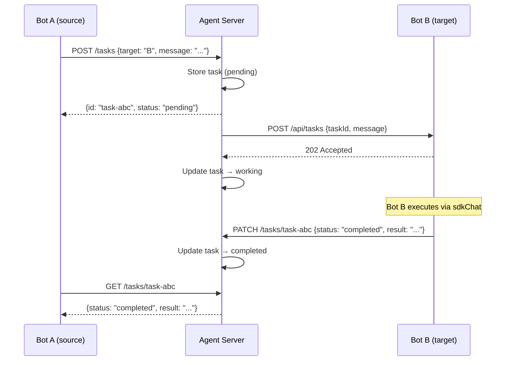
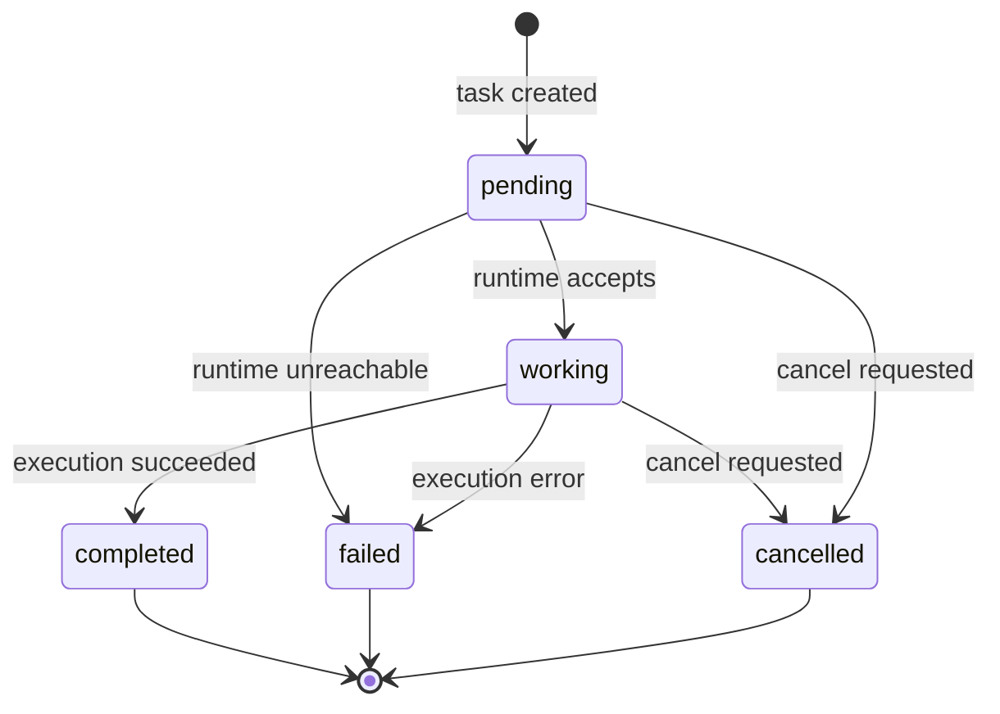

# Task Protocol

[[toc]]

The task protocol enables asynchronous work delegation between bots. Inspired by the [A2A (Agent-to-Agent) protocol](https://google.github.io/A2A/), one bot (or admin) creates a task targeting another bot, which executes it independently and reports results back.

Unlike synchronous `mesh_query` (where the caller blocks), tasks run in the background — the caller gets a task ID immediately and can poll for status, cancel, or move on to other work.

## Core Concepts



### Task

A task has a **source** (who created it), a **target** (which bot runs it), a **message** (the instruction), and a **status** that progresses through the lifecycle.

### Lifecycle



| Status | Description |
|--------|-------------|
| `pending` | Created but not yet dispatched to the bot runtime |
| `working` | Runtime accepted and is executing via `sdkChat` |
| `completed` | Execution finished with a result |
| `failed` | Execution error or runtime unreachable |
| `cancelled` | Cancelled by source or admin |

### Cancellation

Cancellation is real, not cooperative — when a task is cancelled, the `AbortController` signal aborts the underlying SDK query mid-execution. The bot stops immediately rather than running to completion.

## Architecture

The task protocol spans three layers:

| Layer | Component | Role |
|-------|-----------|------|
| **Agent** | `@mecha/agent` task routes | Persistent storage, ACL, proxy dispatch |
| **Runtime** | `@mecha/runtime` task routes | Execution via `sdkChat`, result callback |
| **MCP** | `task_*` MCP tools | Bot-to-bot delegation from within Claude |

### Storage

Tasks are stored as JSON files in `~/.mecha/tasks/<id>.json`. No database required — pure filesystem with `0o600` permissions.

On agent restart, any tasks in `working` or `pending` state are reconciled to `failed` (the executing process is gone).

### ACL

Task operations respect the ACL engine:

- **Create**: requires `query` capability from source to target
- **Read/Cancel**: only the task's source, target, or admin can access (matched by bare bot name from `x-mecha-source` header)
- **Update (PATCH)**: only the executing bot's runtime or admin can report results (Bearer token auth, not signature-verified)

## MCP Tools

Bots use these MCP tools to delegate work to each other:

| Tool | Description |
|------|-------------|
| `task_create` | Create a task for another bot |
| `task_status` | Check task status and result |
| `task_cancel` | Cancel a running task |
| `task_list` | List tasks with optional filters |

### Example: Research Pipeline

Bot A (coordinator) delegates research to Bot B:

```
Bot A uses task_create:
  target: "researcher"
  message: "Find the top 5 trending AI papers this week and summarize each"

→ Returns: task-a1b2c3d4

Bot A uses task_status:
  taskId: "task-a1b2c3d4"

→ Returns: { status: "working" }

... later ...

Bot A uses task_status:
  taskId: "task-a1b2c3d4"

→ Returns: { status: "completed", result: "1. Paper about..." }
```

## CLI

All task commands live under `mecha task`:

```bash
# Create a task
mecha task create researcher "Summarize the README in this project"

# List tasks
mecha task list
mecha task ls --target researcher --status completed

# Show task details
mecha task show task-a1b2c3d4e5f67890

# Cancel a running task
mecha task cancel task-a1b2c3d4e5f67890
```

See the [CLI reference](/reference/cli/orchestration#task) for full command details.

## Limits

- **Concurrent tasks per bot**: 10 (hardcoded limit)
- **Task timeout**: 10 minutes auto-abort to prevent zombie tasks
- **Result retention**: 7 days, cleaned up opportunistically during task listing
- **In-memory result cache**: 100 most recent results (ephemeral, for quick polling)

## See Also

- [Orchestration CLI Reference](/reference/cli/orchestration#task) — full command syntax
- [Message Bus](/features/bus) — asynchronous pub/sub alternative
- [Workflow Engine](/features/workflow) — multi-step DAG execution with similar async patterns
- [Mesh Networking](/features/mesh-networking) — synchronous `mesh_query` alternative
- [Permissions](/features/permissions) — ACL capabilities for task authorization
