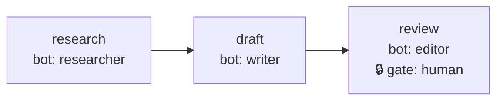
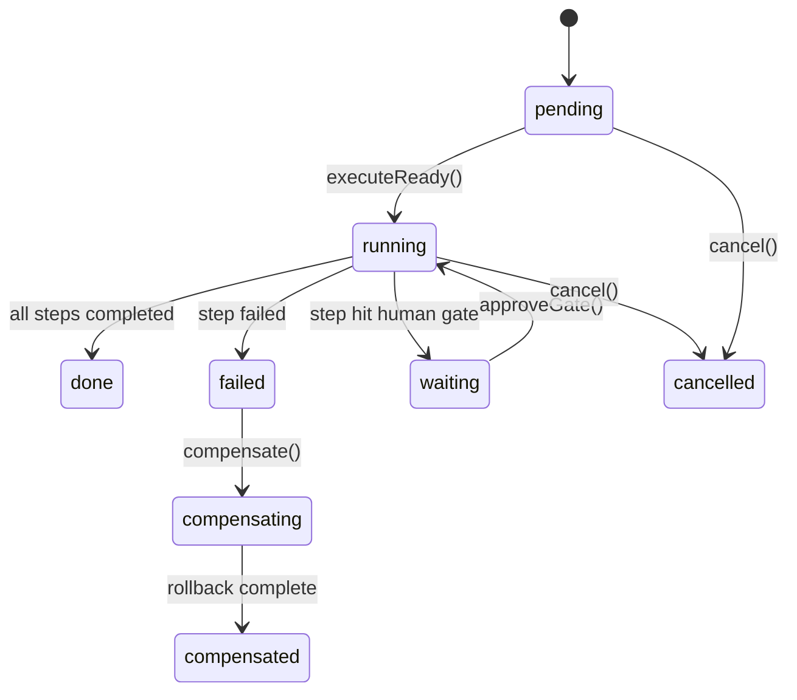

# Workflow Engine

The workflow engine executes multi-step DAGs (directed acyclic graphs) where the output of one bot feeds into the next. Steps can run in parallel, branch conditionally, pause for human approval, and roll back on failure.

## Core Concepts

### Workflow

A named DAG of steps defined in YAML. Each step specifies which bot runs it, what prompt to send, and what dependencies it has.

### Step

A unit of work: bot + prompt template + dependencies + optional output schema. Steps execute when all their dependencies are satisfied.

### Gate

A pause point where a human must approve before the workflow continues. Used for deployments, publications, or high-cost operations.

### Compensation

If a downstream step fails, the engine walks backward through completed steps running rollback prompts (saga pattern).

## Example

```yaml
name: content-pipeline
steps:
  research:
    bot: researcher
    prompt: "Find trending topics in AI"
    output: topics

  draft:
    bot: writer
    prompt: "Write about: {{research.topics}}"
    depends: [research]
    output: article

  review:
    bot: editor
    prompt: "Review: {{draft.article}}"
    depends: [draft]
    gate: human
```

The DAG for this workflow looks like:



## Key Features

- **Definition snapshot**: Workflow definition is frozen at run start — in-progress runs aren't affected by definition changes.
- **Step idempotency**: Each step has a unique `stepRunId`. Re-execution is skipped if a result already exists (safe daemon restart).
- **Template rendering**: Prompts use <code v-pre>{{step.output.field}}</code> syntax with dot notation and array indexing.
- **Conditional steps**: Steps can be skipped based on previous outputs (`condition: "!review.approved"`).
- **Parallel execution**: Steps with the same dependencies run concurrently (fan-out/fan-in).
- **Compensation (saga rollback)**: Steps declare optional `compensate` prompts. On failure, completed steps are rolled back in reverse order.
- **Cycle detection**: The engine validates the DAG at creation time and rejects circular dependencies.
- **Cost tracking**: Per-step and per-run cost accumulation.

## Data Model

```
~/.mecha/workflows/
├── content-pipeline.yaml              # workflow definition
└── runs/
    └── content-pipeline/
        ├── run-2026-03-21-abc.json    # run state (step statuses + outputs)
        └── run-2026-03-21-abc.yaml    # snapshotted definition (JSON content, .yaml extension)
```

## CLI Usage

```bash
# List workflows
mecha workflow list
# Name           File
# -------------  ------------------
# test-pipeline  test-pipeline.yaml

# Show DAG
mecha workflow show test-pipeline
# Workflow: test-pipeline
# Steps:
#   research: bot=researcher
#   summarize: bot=writer -> depends: [research]

# Dry-run (no API calls, $0 cost)
mecha workflow run test-pipeline --dry-run
# [DRY RUN] Started run: run-2026-03-21-7df47ce8
# [DRY RUN]   Step "research": completed
# [DRY RUN]   Step "summarize": completed
# [DRY RUN] Run run-2026-03-21-7df47ce8: done

# Real execution
mecha workflow run test-pipeline
# Started run: run-2026-03-21-b2d92950
#   Step "research": completed
#   Step "summarize": completed
# Run run-2026-03-21-b2d92950: done
# Total cost: $0.0209

# Run history
mecha workflow runs test-pipeline
# Run ID                   Status  Started                   Cost
# -----------------------  ------  ------------------------  -------
# run-2026-03-21-b2d92950  done    2026-03-21T09:25:01.322Z  $0.0209

# Per-step detail
mecha workflow run-detail run-2026-03-21-b2d92950
# Steps:
# Step       Status     Cost     Duration
# ---------  ---------  -------  --------
# research   completed  $0.0106  6927ms
# summarize  completed  $0.0102  6628ms

# Approve a gate
mecha workflow approve test-pipeline run-2026-03-21-xxx

# Cancel a run
mecha workflow cancel test-pipeline run-2026-03-21-xxx
```

### MCP Tools (available to bots)

Bots can manage workflows via MCP: `workflow_list`, `workflow_run`, `workflow_status`.

## Type Reference

### `WorkflowDef`

Workflow definition parsed from a YAML file. Describes the DAG of steps, triggers, inputs, and budget constraints.

| Field | Type | Description |
|-------|------|-------------|
| `name` | `string` | Workflow name (used as filesystem directory name and identifier) |
| `description` | `string?` | Optional human-readable description |
| `trigger` | `object?` | Optional trigger configuration (see below) |
| `trigger.schedule` | `string?` | Cron expression for scheduled execution |
| `trigger.topic` | `string?` | Bus topic name that triggers the workflow on new messages |
| `trigger.webhook` | `string?` | Webhook path that triggers the workflow on HTTP POST |
| `trigger.manual` | `boolean?` | Whether the workflow can be triggered manually via CLI |
| `inputs` | `Record<string, { type: string; default?: unknown }>?` | Input parameter definitions with types and optional defaults |
| `budgetUsd` | `number?` | Maximum total cost in USD for the entire workflow run |
| `steps` | `Record<string, StepDef>` | Map of step name to step definition (the DAG) |
| `outputs` | `Record<string, string>?` | Map of output name to template expression for workflow-level outputs |

### `StepDef`

Definition of a single step within a workflow. Each step targets a bot, sends a prompt, and can declare dependencies, conditions, and compensation logic.

| Field | Type | Description |
|-------|------|-------------|
| `bot` | `string` | Bot name to execute this step. Use `bot@node` for remote execution |
| `prompt` | `string` | Prompt template sent to the bot. Supports double-brace interpolation |
| `depends` | `string[]` | Step names this step depends on. Append `?` for optional deps (e.g., `"review?"`) |
| `condition` | `string?` | Condition expression evaluated against context. Step is skipped if falsy |
| `compensate` | `string?` | Compensation prompt for saga rollback if a downstream step fails |
| `output` | `string?` | Key name for this step's output in the template context (defaults to step name) |
| `outputSchema` | `Record<string, unknown>?` | JSON Schema for validating the step's output |
| `timeout` | `string?` | Timeout duration for step execution (e.g., `"30s"`, `"5m"`) |
| `budgetUsd` | `number?` | Maximum cost in USD for this individual step |
| `gate` | `"human"?` | If set to `"human"`, the step pauses for manual approval before executing |

### `StepStatus`

Status of a single step in a run. One of the following string literals:

| Value | Description |
|-------|-------------|
| `"pending"` | Step has not started yet |
| `"running"` | Step is currently executing |
| `"completed"` | Step finished successfully |
| `"failed"` | Step execution failed |
| `"skipped"` | Step was skipped due to a condition evaluating to falsy |
| `"waiting"` | Step is paused at a human gate, awaiting approval |
| `"compensating"` | Compensation prompt is currently executing for this step |
| `"compensated"` | Compensation completed successfully |

### `RunStatus`

Status of an entire workflow run. One of the following string literals:

| Value | Description |
|-------|-------------|
| `"pending"` | Run has been created but no steps have started |
| `"running"` | At least one step is executing |
| `"done"` | All steps completed or were skipped |
| `"failed"` | At least one step failed |
| `"waiting"` | Run is paused because a step is waiting at a human gate |
| `"compensating"` | Saga rollback is in progress |
| `"compensated"` | All compensation steps completed |
| `"cancelled"` | Run was manually cancelled |



### `StepState`

Runtime state for a single step within a run. Persisted to the run state JSON file.

| Field | Type | Description |
|-------|------|-------------|
| `status` | `StepStatus` | Current status of the step |
| `stepRunId` | `string` | Unique identifier for this step execution (`runId:stepName:random`) |
| `startedAt` | `string?` | ISO 8601 timestamp when the step started executing |
| `completedAt` | `string?` | ISO 8601 timestamp when the step finished (success or failure) |
| `output` | `unknown?` | Output produced by the step (used in template context for downstream steps) |
| `error` | `string?` | Error message if the step failed |
| `attempts` | `number` | Number of execution attempts |
| `costUsd` | `number?` | API cost in USD for this step |
| `gateApproved` | `boolean?` | Whether a human gate has been approved |

### `RunState`

Persistent state for an entire workflow run. Stored as `<runId>.json` in the runs directory.

| Field | Type | Description |
|-------|------|-------------|
| `runId` | `string` | Unique run identifier (format: `run-YYYY-MM-DD-<8-hex>`) |
| `workflow` | `string` | Name of the workflow definition |
| `status` | `RunStatus` | Current status of the run |
| `inputs` | `Record<string, unknown>` | Merged input values (user-provided + defaults from definition) |
| `steps` | `Record<string, StepState>` | Map of step name to step runtime state |
| `startedAt` | `string` | ISO 8601 timestamp when the run started |
| `completedAt` | `string?` | ISO 8601 timestamp when the run reached a terminal state |
| `totalCostUsd` | `number` | Accumulated API cost across all steps |

### `StepExecutor`

Function type that executes a single step by sending a prompt to a bot and returning the result. Used by the engine to abstract over local and remote execution.

```ts
type StepExecutor = (opts: {
  bot: string;
  prompt: string;
  stepRunId: string;
  timeout?: string;
  budgetUsd?: number;
}) => Promise<{ output: unknown; costUsd?: number }>;
```

| Parameter | Type | Description |
|-----------|------|-------------|
| `bot` | `string` | Bot name (or `bot@node` for remote) |
| `prompt` | `string` | Rendered prompt text |
| `stepRunId` | `string` | Unique step run identifier for session tracking |
| `timeout` | `string?` | Timeout duration |
| `budgetUsd` | `number?` | Cost limit for this step |

**Returns:** `Promise<{ output: unknown; costUsd?: number }>` -- the step's output and optional cost.

### `WorkflowEngine`

DAG execution engine with gates, compensation, and state persistence. Created via `createEngine()`.

| Method | Signature | Description |
|--------|-----------|-------------|
| `startRun` | `(inputs?: Record<string, unknown>) => string` | Start a new run with the given inputs. Returns the run ID |
| `executeReady` | `(executor: StepExecutor) => Promise<string[]>` | Execute all steps whose dependencies are satisfied. Returns names of steps executed |
| `approveGate` | `(stepName: string) => boolean` | Approve a human gate, moving the step back to pending. Returns `false` if step is not waiting |
| `cancel` | `() => void` | Cancel the run (sets status to `"cancelled"`) |
| `state` | `() => RunState` | Get a snapshot of the current run state |
| `isTerminal` | `() => boolean` | Check if the run has reached a terminal state (`done`, `failed`, `cancelled`, or `compensated`) |
| `compensate` | `(executor: StepExecutor) => Promise<string[]>` | Run compensation for a failed run. Walks completed steps in reverse order executing their `compensate` prompts (saga rollback). Returns names of compensated steps |

### `CreateEngineOpts`

Options for creating a workflow engine instance.

| Field | Type | Description |
|-------|------|-------------|
| `workflowsDir` | `string` | Path to the workflows directory (run state is stored under `runs/<workflow-name>/`) |
| `definition` | `WorkflowDef` | The workflow definition (parsed from YAML) |
| `runId` | `string?` | Existing run ID to resume. If not provided, you must call `startRun()` |

### `LockInfo`

Contents of a lock file on disk.

| Field | Type | Description |
|-------|------|-------------|
| `resource` | `string` | The resource path being locked |
| `owner` | `string` | Identity of the lock holder (default: `pid-<process.pid>`) |
| `acquiredAt` | `string` | ISO 8601 timestamp when the lock was acquired |

### `LockHandle`

Handle returned by `acquireLock()`. Pass to `releaseLock()` to release the lock.

| Field | Type | Description |
|-------|------|-------------|
| `lockPath` | `string` | Absolute path to the lock file on disk |
| `info` | `LockInfo` | The lock metadata |

### `RemoteExecutorOpts`

Options for creating a remote-capable step executor that routes steps to local or remote bots.

| Field | Type | Description |
|-------|------|-------------|
| `localChat` | `LocalChatFn` | Function that chats with a local bot |
| `remoteFetch` | `RemoteFetchFn` | Function that sends HTTP requests to remote nodes |
| `nodeLookup` | `NodeLookupFn` | Function that resolves a node name to its host/port/apiKey entry |

#### `LocalChatFn`

```ts
type LocalChatFn = (opts: {
  bot: string;
  prompt: string;
  sessionId?: string;
}) => Promise<{ response: string; costUsd: number }>;
```

#### `RemoteFetchFn`

```ts
type RemoteFetchFn = (opts: {
  node: { name: string; host: string; port: number; apiKey: string };
  path: string;
  method: string;
  body: unknown;
  allowPrivateHosts?: boolean;
}) => Promise<Response>;
```

#### `NodeLookupFn`

```ts
type NodeLookupFn = (
  nodeName: string,
) => { name: string; host: string; port: number; apiKey: string } | undefined;
```

### Factory Functions

#### `createEngine(opts)`

Create a workflow engine for a specific workflow definition. State is persisted to JSON files in the runs directory. Validates the step dependency graph for cycles at creation time.

| Parameter | Type | Description |
|-----------|------|-------------|
| `opts` | `CreateEngineOpts` | Engine creation options (workflowsDir, definition, optional runId) |

**Returns:** `WorkflowEngine`

#### `renderTemplate(template, context)`

Replace double-brace placeholders in a template string with values from the context object. Supports dot notation and array indexing. Returns empty string for `null`/`undefined` values; objects are JSON-stringified.

| Parameter | Type | Description |
|-----------|------|-------------|
| `template` | `string` | Template string containing double-brace placeholders |
| `context` | `Record<string, unknown>` | Context object for expression resolution |

**Returns:** `string`

#### `evaluateCondition(condition, context)`

Evaluate a simple condition expression against a context object. Supports truthy checks (`"step.field"`) and negation (`"!step.field"`).

| Parameter | Type | Description |
|-----------|------|-------------|
| `condition` | `string` | Condition expression |
| `context` | `Record<string, unknown>` | Context object for expression resolution |

**Returns:** `boolean`

#### `createDryRunExecutor(responses?)`

Create a mock step executor that never makes real API calls. Useful for testing workflows without incurring costs.

| Parameter | Type | Description |
|-----------|------|-------------|
| `responses` | `Record<string, unknown>?` | Optional map of bot name to canned response. If a bot is not in the map, a placeholder string is returned |

**Returns:** `StepExecutor` (always returns `costUsd: 0`)

#### `acquireLock(lockDir, resource, owner?)`

Acquire an exclusive filesystem lock on a resource. Creates a `<hash>.lock` file atomically using `O_CREAT | O_EXCL`. Throws if the resource is already locked.

| Parameter | Type | Description |
|-----------|------|-------------|
| `lockDir` | `string` | Directory to store lock files |
| `resource` | `string` | Resource identifier to lock (hashed to a safe filename) |
| `owner` | `string?` | Lock owner identity (default: `pid-<process.pid>`) |

**Returns:** `LockHandle`

#### `releaseLock(handle)`

Release a previously acquired lock. Verifies ownership before deleting the lock file.

| Parameter | Type | Description |
|-----------|------|-------------|
| `handle` | `LockHandle` | Handle returned by `acquireLock()` |

**Returns:** `void`

#### `isLocked(lockDir, resource)`

Check whether a resource is currently locked (lock file exists).

| Parameter | Type | Description |
|-----------|------|-------------|
| `lockDir` | `string` | Directory containing lock files |
| `resource` | `string` | Resource identifier to check |

**Returns:** `boolean`

#### `createRemoteExecutor(opts)`

Create a step executor that routes steps to local or remote bots. If the `bot` field contains `@` (e.g., `developer@spark01`), the step is sent to the remote node via HTTP. Otherwise, it executes locally.

| Parameter | Type | Description |
|-----------|------|-------------|
| `opts` | `RemoteExecutorOpts` | Executor options (localChat, remoteFetch, nodeLookup) |

**Returns:** `StepExecutor`

## Package

`@mecha/workflow` — `packages/workflow/src/`

| Export | Description |
|--------|-------------|
| `createEngine(opts)` | Create a workflow engine for a definition |
| `renderTemplate(template, context)` | Render double-brace templates |
| `evaluateCondition(condition, context)` | Evaluate step conditions |
| `createDryRunExecutor(responses?)` | Mock executor for testing |
| `acquireLock(lockDir, resource)` | Workspace file lock |
| `releaseLock(handle)` | Release a held lock |
| `isLocked(lockDir, resource)` | Check if a resource is locked |
| `createRemoteExecutor(opts)` | Executor that routes steps to remote nodes via mesh |

## See Also

- [Task Protocol](/features/task-protocol) — async task delegation used by workflow steps
- [Message Bus](/features/bus) — event-driven triggers for workflows
- [Orchestration CLI](/reference/cli/orchestration#workflow) — full command reference
- [Observability](/features/observability) — trace and score workflow execution
