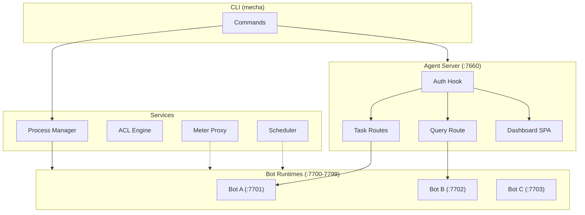
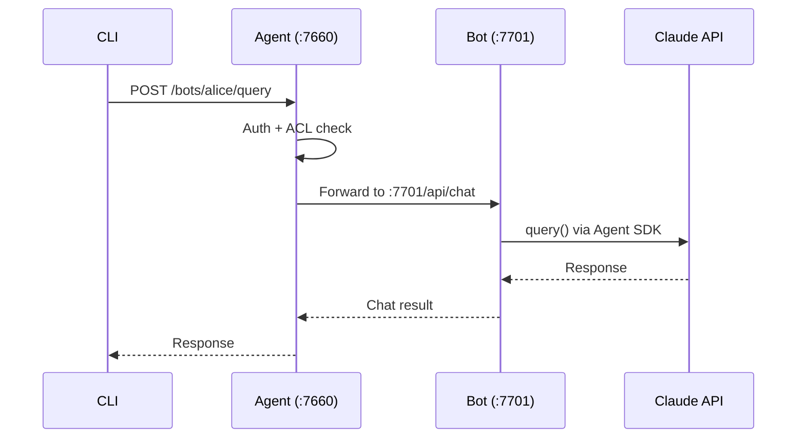
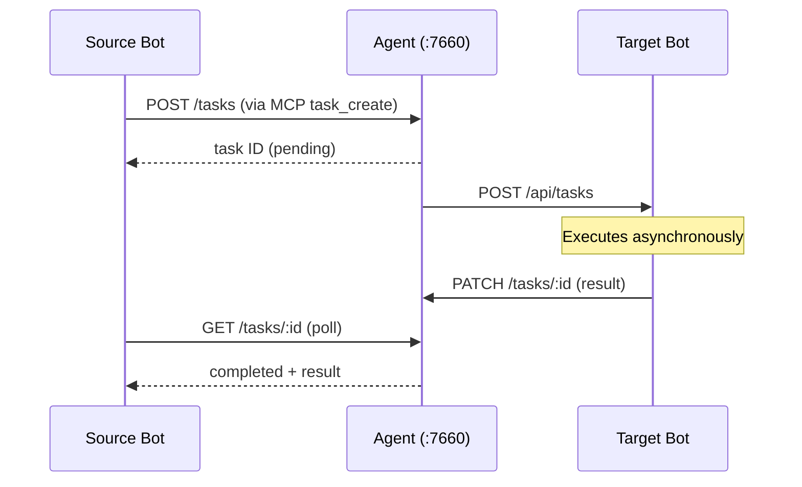
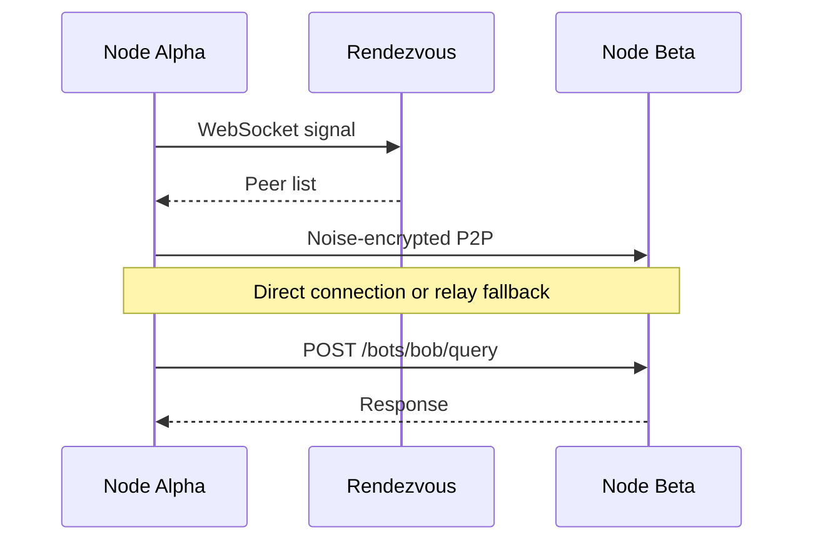

# Architecture

Mecha is a local-first multi-agent runtime built as a layered system. Each layer has a clear responsibility and communicates through well-defined interfaces.

[[toc]]

## System Overview



## Component Layers

### Layer 0: Foundation

| Component | Package | Port | Role |
|-----------|---------|------|------|
| **CLI** | `@mecha/cli` | — | User-facing commands, thin wrapper over service layer |
| **Process Manager** | `@mecha/process` | — | Spawn, stop, restart bot processes with health checks |
| **Core** | `@mecha/core` | — | Shared types, validation, config, ACL, errors, logging |
| **Service** | `@mecha/service` | — | Business logic (spawn, chat, sessions, auth profiles) |

### Layer 1: Runtime

| Component | Package | Port | Role |
|-----------|---------|------|------|
| **Bot Runtime** | `@mecha/runtime` | 7700-7799 | Per-bot Fastify server wrapping Claude Agent SDK |
| **Sandbox** | `@mecha/sandbox` | — | OS-level isolation (readonly root, capability drop, network restrict) |
| **Meter** | `@mecha/meter` | 7600 | HTTP proxy tracking API token usage and enforcing budgets |

Each bot is a sandboxed process with its own:
- HTTP server (chat, sessions, MCP, task execution)
- Workspace directory (the project the bot works on)
- Config and state files (`~/.mecha/<botName>/`)

### Layer 2: Coordination

| Component | Package | Port | Role |
|-----------|---------|------|------|
| **Agent Server** | `@mecha/agent` | 7660 | Central hub: auth, task routing, bot queries, dashboard |
| **Connect** | `@mecha/connect` | — | P2P connectivity (Noise encryption, STUN, hole-punch, relay) |
| **Server** | `@mecha/server` | 7661 | Rendezvous + relay for mesh networking |
| **MCP Server** | `@mecha/mcp-server` | — | Expose Mecha as an MCP server to external clients |

### Layer 3: Orchestration

| Component | Package | Role |
|-----------|---------|------|
| **Bus** | `@mecha/bus` | Pub/sub topics + durable work queues |
| **Workflow** | `@mecha/workflow` | DAG execution engine with gates and compensation |
| **Teams** | `@mecha/teams` | Team template deployment |
| **Gateway** | `@mecha/gateway` | Credential store, HTTP adapters, circuit breakers |
| **Observe** | `@mecha/observe` | Traces, metrics, alerts, quality scoring |

## Data Flow

### Bot Query (Synchronous)



### Task Delegation (Asynchronous)



### Mesh Query (Cross-Node)



## Filesystem Layout

```
~/.mecha/                          ← mechaDir (MECHA_DIR)
├── agent.json                     ← agent server port + host
├── totp-secret                    ← TOTP auth secret (0o600)
├── nodes.json                     ← known mesh nodes
├── acl.json                       ← ACL rules
├── bus/                           ← message bus data
├── workflows/                     ← workflow definitions (YAML)
├── tasks/                         ← task JSON files
├── alice/                         ← bot directory
│   ├── config.json                ← port, token, workspace, settings
│   ├── state.json                 ← running/stopped/error
│   ├── logs/                      ← stdout.log, stderr.log
│   └── .claude/projects/.../      ← session JSONL files
└── bob/
    └── ...
```

## Network Topology

Mecha supports three deployment modes:

### Single Machine (Default)

All bots and the agent server run locally. Communication is via `127.0.0.1`. No network configuration needed.

### P2P Mesh

Nodes discover each other via a rendezvous server and establish direct Noise-encrypted connections. NAT hole-punching with STUN/relay fallback.

```bash
# On node alpha
mecha start --daemon
mecha node init --rendezvous wss://rv.example.com

# On node beta
mecha node join --invite <token>
```

### HTTP Mesh

For environments where P2P is blocked, nodes connect via HTTP with Ed25519-signed requests.

```bash
mecha node add beta --host 192.168.1.50 --port 7660
```

## See Also

- [Core Concepts](/guide/concepts) — bots, workspaces, sessions, lifecycle states
- [Configuration](/guide/configuration) — auth profiles, bot settings
- [Multi-Machine Setup](/guide/multi-machine) — P2P and HTTP mesh setup
- [Task Protocol](/features/task-protocol) — asynchronous task delegation
- [Mesh Networking](/features/mesh-networking) — connectivity details
