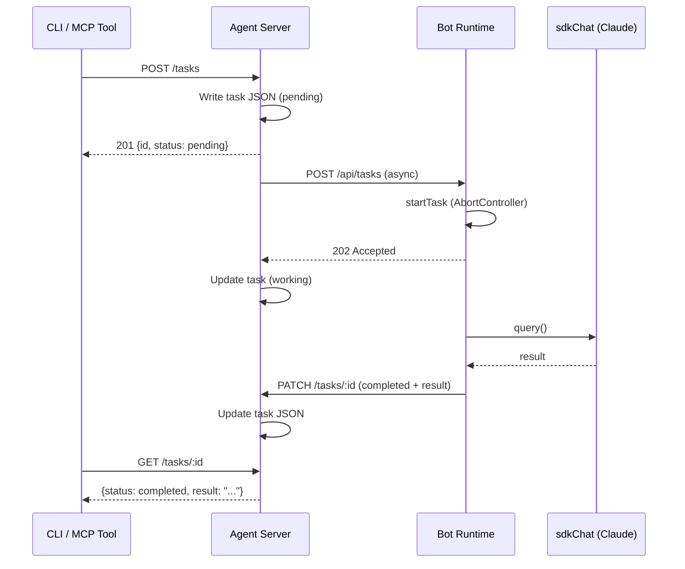

# @mecha/agent

[[toc]]

The `@mecha/agent` package provides the agent HTTP server that receives bot queries from the local CLI, dashboard, and remote mesh nodes. It handles session-based and bearer token authentication, Ed25519 request signature verification with nonce replay protection, and meter daemon lifecycle management.

## Barrel Exports

| Export | Kind | Source |
|--------|------|--------|
| `createAgentServer` | Function | `server.ts` |
| `AgentServerOptions` | Type | `server.ts` |
| `startMeterDaemon` | Function | `meter.ts` |
| `deriveSessionKey` | Function | `session.ts` |
| `createSessionToken` | Function | `session.ts` |
| `validateSessionToken` | Function | `session.ts` |
| `createAuthHook` | Function | `auth.ts` |
| `createAuthContext` | Function | `auth.ts` |
| `verifyRequestSignature` | Function | `auth.ts` |
| `AuthConfig` | Type | `auth.ts` |
| `AuthContext` | Type | `auth.ts` |
| `registerTaskRoutes` | Function | `task-routes.ts` |
| `TaskRouteOpts` | Type | `task-routes.ts` |
| `runDiscoveryScan` | Function | `discovery.ts` |
| `startDiscoveryLoop` | Function | `discovery.ts` |
| `startMdnsAdvertise` | Function | `discovery.ts` |
| `scanMdnsPeers` | Function | `discovery.ts` |
| `SCAN_INTERVAL_MS` | Constant | `discovery.ts` |
| `MDNS_BROWSE_TIMEOUT_MS` | Constant | `discovery.ts` |
| `MdnsAdvertiseOpts` | Type | `discovery.ts` |
| `MdnsPeer` | Type | `discovery.ts` |

## `createAgentServer(opts)`

Creates a configured Fastify HTTP server with authentication hooks, bot query forwarding, and optional SPA static file serving. Returns an **unstarted** Fastify instance -- call `.listen()` to bind.

```ts
import { createAgentServer } from "@mecha/agent";

const app = createAgentServer({
  port: 7660,
  auth: { totpSecret: "JBSWY3DPEHPK3PXP", apiKey: "mesh-bearer-token" },
  processManager,
  acl,
  mechaDir: "/Users/you/.mecha",
  nodeName: "alice",
});

await app.listen({ port: 7660, host: "127.0.0.1" });
```

### `AgentServerOptions`

| Field | Type | Required | Description |
|-------|------|----------|-------------|
| `port` | `number` | Yes | Port the server will bind to (conventionally `7660`; use `0` for a random available port) |
| `auth` | `AuthConfig` | Yes | Authentication configuration (TOTP secret and/or API key) |
| `processManager` | `ProcessManager` | Yes | Process manager instance from `@mecha/process` |
| `acl` | `AclEngine` | Yes | Access control engine from `@mecha/core` |
| `mechaDir` | `string` | Yes | Path to the mecha configuration directory (e.g., `~/.mecha`) |
| `nodeName` | `string` | Yes | Local node name for mesh identification |
| `startedAt` | `string` | No | ISO timestamp of when the server started |
| `publicIp` | `string` | No | Public IP address of this node |
| `ptySpawnFn` | `unknown` | No | PTY spawn function -- stored for future terminal routes |
| `spaDir` | `string` | No | Path to built SPA assets. When set, registers `@fastify/static` and serves the SPA shell for unmatched routes |

### HTTP Routes

| Method | Path | Auth | Description |
|--------|------|------|-------------|
| `GET` | `/healthz` | None | Liveness check. Returns `{ status: "ok" }` |
| `GET` | `/bots` | Required | List local bots with state, port, and tags (used by `bot ls --mesh`) |
| `POST` | `/bots/:botName/query` | Required | Forward a query to a local bot process |
| `POST` | `/tasks` | Required | Create a task (see [Task Routes](#task-routes)) |
| `GET` | `/tasks` | Required | List tasks (see [Task Routes](#task-routes)) |
| `GET` | `/tasks/:id` | Required | Get a single task (see [Task Routes](#task-routes)) |
| `PATCH` | `/tasks/:id` | Required | Update task result (see [Task Routes](#task-routes)) |
| `POST` | `/tasks/:id/cancel` | Required | Cancel a task (see [Task Routes](#task-routes)) |

> `GET /bots` returns `[{ name, state, port, tags }]` for each local bot. Used by `mecha bot ls --mesh` and `mecha node health` to discover remote bots.

### `POST /bots/:botName/query`

Forwards a message to the named bot's SDK process and returns the response.

**Request body:**

| Field | Type | Required | Description |
|-------|------|----------|-------------|
| `message` | `string` | Yes | The query message to send to the bot |
| `sessionId` | `string` | No | Session ID for conversation continuity |
| `requestId` | `string` | No | Client-generated request ID for correlation |

**Success response** (`200`):

```json
{
  "response": "The bot's reply text",
  "sessionId": "session-id-or-null"
}
```

**Error responses:**

| Status | Condition |
|--------|-----------|
| `400` | Invalid bot name or missing/empty message |
| `401` | Authentication failed (invalid bearer token or session cookie) |
| `403` | ACL denied the query capability for the requesting source |
| `404` | Bot not found (no `config.json` in bot directory) |
| `502` | Forwarding to the bot process failed |

**ACL enforcement:** The route reads the `X-Mecha-Source` header to identify the caller (e.g., `"coder@alice"`). If the header is absent, the source defaults to `"admin"`. The ACL engine checks whether the source has the `query` capability for the target bot.

**Signature verification:** If `X-Mecha-Signature`, `X-Mecha-Timestamp`, and `X-Mecha-Nonce` headers are present, the request is verified against the sender node's Ed25519 public key. See [Request Signature Verification](#verifyRequestSignature) below.

## Authentication

The agent server supports two authentication mechanisms, evaluated in order:

1. **Bearer token** -- `Authorization: Bearer <apiKey>` for mesh node-to-node routing
2. **Session cookie** -- `mecha-session=<token>` for dashboard and CLI access

If neither `totpSecret` nor `apiKey` is configured, all requests are allowed. The `/healthz` endpoint always skips authentication.

### `AuthConfig`

| Field | Type | Required | Description |
|-------|------|----------|-------------|
| `totpSecret` | `string` | No | TOTP secret string. When set, enables session cookie authentication |
| `apiKey` | `string` | No | API key for Bearer token authentication (mesh routing) |

At least one of `totpSecret` or `apiKey` should be provided for production use.

### `AuthContext`

| Field | Type | Description |
|-------|------|-------------|
| `config` | `AuthConfig` | The authentication configuration |
| `mechaDir` | `string` | Path to the mecha configuration directory |
| `nonces` | `NonceSet` | Bounded set (max 10,000 entries) for nonce replay protection |

### `createAuthContext(config, mechaDir)`

Creates an `AuthContext` with an initialized nonce set. Used internally by `createAgentServer` and can be used standalone for testing.

```ts
import { createAuthContext } from "@mecha/agent";

const authCtx = createAuthContext(
  { totpSecret: "JBSWY3DPEHPK3PXP", apiKey: "mesh-key" },
  "/Users/you/.mecha",
);
```

**Parameters:**

| Parameter | Type | Description |
|-----------|------|-------------|
| `config` | `AuthConfig` | Authentication configuration |
| `mechaDir` | `string` | Path to mecha directory (used for node public key lookups) |

**Returns:** `AuthContext`

### `createAuthHook(authCtx)`

Creates a Fastify `preHandler` hook that enforces authentication on all routes except `/healthz`.

```ts
import { createAuthHook, createAuthContext } from "@mecha/agent";

const authCtx = createAuthContext(config, mechaDir);
app.addHook("preHandler", createAuthHook(authCtx));
```

**Authentication flow:**

1. If the route is `/healthz`, skip authentication
2. If neither `totpSecret` nor `apiKey` is configured, allow all requests
3. Check `Authorization: Bearer <token>` header -- if it matches `apiKey`, allow
4. Check `mecha-session` cookie -- if it passes TOTP validation, allow
5. Otherwise, respond with `401 Unauthorized`

**Parameters:**

| Parameter | Type | Description |
|-----------|------|-------------|
| `authCtx` | `AuthContext` | Authentication context created by `createAuthContext` |

**Returns:** `(req: FastifyRequest, reply: FastifyReply) => Promise<void>` -- a Fastify preHandler hook function.

## Session Token Functions

Session authentication uses HMAC-SHA256 tokens derived from a TOTP secret. The session key is derived via a labeled HMAC, and tokens are generated for counter values within a sliding window.

### `deriveSessionKey(totpSecret)`

Derives a 256-bit session key from a TOTP secret string using HMAC-SHA256 with the label `"mecha-session-key"`.

```ts
import { deriveSessionKey } from "@mecha/agent";

const key = deriveSessionKey("JBSWY3DPEHPK3PXP");
// key: Uint8Array (32 bytes)
```

**Parameters:**

| Parameter | Type | Description |
|-----------|------|-------------|
| `totpSecret` | `string` | The TOTP secret string |

**Returns:** `Uint8Array` -- 32-byte session key.

### `createSessionToken(sessionKey, counter)`

Creates an HMAC-SHA256 session token for a given counter value, returned as a hex string.

```ts
import { deriveSessionKey, createSessionToken } from "@mecha/agent";

const key = deriveSessionKey("JBSWY3DPEHPK3PXP");
const token = createSessionToken(key, 0);
// token: "a1b2c3..." (64-char hex string)
```

**Parameters:**

| Parameter | Type | Description |
|-----------|------|-------------|
| `sessionKey` | `Uint8Array` | Session key from `deriveSessionKey` |
| `counter` | `number` | Counter value for the token |

**Returns:** `string` -- hex-encoded HMAC-SHA256 token.

### `validateSessionToken(totpSecret, token)`

Validates a session token against a TOTP secret by checking counter values 0 through 4 (a sliding window of 5 values). Uses timing-safe comparison to prevent timing attacks.

```ts
import { validateSessionToken } from "@mecha/agent";

const isValid = validateSessionToken("JBSWY3DPEHPK3PXP", "a1b2c3...");
// isValid: true | false
```

**Parameters:**

| Parameter | Type | Description |
|-----------|------|-------------|
| `totpSecret` | `string` | The TOTP secret string |
| `token` | `string` | Hex-encoded session token to validate |

**Returns:** `boolean` -- `true` if the token matches any counter in the window.

## Request Signature Verification

### `verifyRequestSignature(req, rawBody, authCtx)` {#verifyRequestSignature}

Verifies an Ed25519 request signature for mesh node-to-node communication. Signature verification is optional -- if no signature headers are present, the function returns `null` (no error). When any signature header is present, all three must be provided.

```ts
import { verifyRequestSignature, createAuthContext } from "@mecha/agent";

const authCtx = createAuthContext(config, mechaDir);
const rawBody = JSON.stringify(requestBody);
const error = verifyRequestSignature(req, rawBody, authCtx);

if (error) {
  // error is a descriptive string like "Timestamp expired or invalid"
  reply.status(401).send({ error });
}
```

**Parameters:**

| Parameter | Type | Description |
|-----------|------|-------------|
| `req` | `FastifyRequest` | The incoming Fastify request |
| `rawBody` | `string` | The raw (serialized) request body used to compute the signature |
| `authCtx` | `AuthContext` | Authentication context with nonce set and mecha directory |

**Returns:** `string | null` -- `null` if valid or no signature headers present; an error message string if verification fails.

**Signature headers** (all three required, or none — partial sets are rejected):

| Header | Description |
|--------|-------------|
| `X-Mecha-Timestamp` | Unix timestamp in milliseconds. Must be within 5 minutes of server time |
| `X-Mecha-Nonce` | Unique request nonce. Rejected if already seen (bounded set of 10,000) |
| `X-Mecha-Signature` | Base64-encoded Ed25519 signature over the canonical envelope |

`X-Mecha-Source` is read independently (defaults to `"admin"` when absent). It identifies the sender in `bot@node` format (e.g., `"coder@alice"`) and is used for ACL checks and as part of the signed envelope.

**Canonical envelope format:**

The signed data is constructed as a newline-delimited string:

```
{METHOD}\n{PATH}\n{SOURCE}\n{TIMESTAMP}\n{NONCE}\n{RAW_BODY}
```

For example:

```
POST\n/bots/helper/query\ncoder@alice\n1679900000000\nabc123\n{"message":"hello"}
```

**Verification steps:**

1. If no signature headers are present, return `null` (skip verification)
2. If only some signature headers are present, return `"Incomplete signature headers"`
3. Validate timestamp is within 5-minute window
4. Check nonce has not been seen before (replay protection)
5. Extract node name from `X-Mecha-Source` header (part after `@`)
6. Look up the node's Ed25519 public key from `nodes.json` via `readNodes(mechaDir)`
7. Construct the canonical envelope and verify the signature
8. If valid, mark the nonce as used and return `null`

**Possible error strings:**

| Error | Cause |
|-------|-------|
| `"Incomplete signature headers"` | Some but not all signature headers present |
| `"Timestamp expired or invalid"` | Timestamp outside 5-minute window or not a number |
| `"Nonce already used"` | Replay attack detected |
| `"Cannot verify signature: no node in source"` | `X-Mecha-Source` missing `@node` portion |
| `"Cannot verify signature: unknown node or missing public key"` | Node not found in `nodes.json` |
| `"Invalid signature"` | Ed25519 signature verification failed |

## `startMeterDaemon(mechaDir, port?)`

Starts the meter proxy daemon in-process. The meter daemon is an HTTP proxy that intercepts Anthropic API calls to track token usage and cost. This is a convenience wrapper around `@mecha/meter`'s `startDaemon`.

```ts
import { startMeterDaemon } from "@mecha/agent";

const handle = await startMeterDaemon("/Users/you/.mecha");
console.log(`Meter running on port ${handle.info.port}, pid ${handle.info.pid}`);

// Later: shut down
await handle.close();
```

**Parameters:**

| Parameter | Type | Default | Description |
|-----------|------|---------|-------------|
| `mechaDir` | `string` | -- | Path to the mecha configuration directory (e.g., `~/.mecha`) |
| `port` | `number` | `7600` | Port for the meter proxy to listen on |

**Returns:** `Promise<DaemonHandle>` -- resolves with the daemon handle.

**`DaemonHandle`** (from `@mecha/meter`):

| Field | Type | Description |
|-------|------|-------------|
| `server` | `Server` | The underlying Node.js HTTP server |
| `info` | `ProxyInfo` | Runtime info (see below) |
| `close` | `() => Promise<void>` | Gracefully shuts down the meter daemon |

**`ProxyInfo`**:

| Field | Type | Description |
|-------|------|-------------|
| `port` | `number` | Port the meter daemon is listening on |
| `pid` | `number` | Process ID |
| `required` | `boolean` | Whether the meter daemon is required (always `true` when started via `startMeterDaemon`) |
| `startedAt` | `string` | ISO timestamp of when the daemon started |

**Throws** if the meter daemon is already running or the port is busy.

## Task Routes

The agent server acts as the persistent task store and proxy layer for the task protocol. Tasks are stored as JSON files in `~/.mecha/tasks/` and execution is proxied to the target bot's runtime process.



**Source:** `packages/agent/src/task-routes.ts`

### Task Route Summary

| Method | Path | Auth | Description |
|--------|------|------|-------------|
| `POST` | `/tasks` | Required | Create a task and proxy to bot runtime |
| `GET` | `/tasks` | Required | List tasks (filtered by caller ownership) |
| `GET` | `/tasks/:id` | Required | Get a single task |
| `PATCH` | `/tasks/:id` | Required | Update task result (runtime callback) |
| `POST` | `/tasks/:id/cancel` | Required | Cancel a task |

All task routes require authentication (Bearer token or session cookie). Non-admin callers only see tasks where they are the `source` or `target`.

### `POST /tasks`

Create a new task and proxy it to the target bot's runtime process.

**Request body:**

| Field | Type | Required | Description |
|-------|------|----------|-------------|
| `target` | `string` | Yes | Bot name to execute the task |
| `message` | `string` | Yes | Task instruction/prompt |

**ACL enforcement:** The `X-Mecha-Source` header identifies the caller (defaults to `"admin"`). The ACL engine checks the `query` capability from source to target.

**Success response** (`201`):

```json
{
  "id": "task-a1b2c3d4e5f6g7h8",
  "status": "pending"
}
```

The task is created with `pending` status and written to disk. The agent then fires an async proxy request to the bot runtime's `POST /api/tasks` endpoint. If the runtime accepts, the status transitions to `working`; if the runtime rejects or is unreachable, the status transitions to `failed`.

**Error responses:**

| Status | Condition |
|--------|-----------|
| `400` | Invalid input (Zod validation) or invalid bot name |
| `403` | ACL denied the `query` capability |
| `404` | Target bot not found (no `config.json`) |

### `GET /tasks`

List tasks with optional filters. Results are sorted by `updatedAt` descending. Expired tasks (older than 7 days in a terminal state) are cleaned up opportunistically (at most once per minute).

**Query parameters:**

| Parameter | Type | Description |
|-----------|------|-------------|
| `target` | `string?` | Filter by target bot name |
| `status` | `string?` | Filter by status (`pending`, `working`, `completed`, `failed`, `cancelled`) |

**Ownership filtering:** Non-admin callers only see tasks where `source` or `target` matches their identity.

**Success response** (`200`): Array of `Task` objects.

**Error responses:**

| Status | Condition |
|--------|-----------|
| `400` | Invalid status value |

### `GET /tasks/:id`

Get a single task by ID.

**Success response** (`200`): A `Task` object.

**Error responses:**

| Status | Condition |
|--------|-----------|
| `403` | Caller is not the task source, target, or admin |
| `404` | Task not found |

### `PATCH /tasks/:id`

Update a task with execution results. This endpoint is intended for the bot runtime callback -- only the executing bot (identified by a source starting with `<target>@`) or admin can update results.

**Request body** (all fields optional):

| Field | Type | Description |
|-------|------|-------------|
| `status` | `string` | New status (`completed`, `failed`, `cancelled`) |
| `result` | `string` | Task result text |
| `error` | `string` | Error message |
| `sessionId` | `string` | SDK session ID used during execution |
| `durationMs` | `number` | Execution duration in milliseconds |
| `costUsd` | `number` | Execution cost in USD |

**Success response** (`200`):

```json
{ "updated": true }
```

**Error responses:**

| Status | Condition |
|--------|-----------|
| `400` | Invalid status value |
| `403` | Caller is not the executing bot or admin |
| `404` | Task not found |

### `POST /tasks/:id/cancel`

Cancel a pending or working task. The agent proxies the cancel request to the bot's runtime, then marks the task as `cancelled` in storage.

**Success response** (`200`):

```json
{ "cancelled": true }
```

**Error responses:**

| Status | Condition |
|--------|-----------|
| `403` | Caller is not the task source or admin |
| `404` | Task not found |
| `409` | Task is already in a terminal state (`completed`, `failed`, `cancelled`) |

### Startup Reconciliation

On startup, the agent server reconciles stale tasks via `reconcileStaleTasks()`. Any tasks left in `working` or `pending` status from a previous agent process are marked as `failed` with an appropriate error message.

## Discovery

**Source:** `packages/agent/src/discovery.ts`

Periodic peer auto-discovery via Tailscale and mDNS (LAN fallback). Scans for online Tailscale peers and mDNS-advertised Mecha agents, probes their healthz endpoint, and registers newly found peers in the discovered-nodes registry.

### `MdnsAdvertiseOpts`

```ts
interface MdnsAdvertiseOpts {
  nodeName: string;
  port: number;
  version: string;
}
```

| Field | Type | Description |
|-------|------|-------------|
| `nodeName` | `string` | Local node name to advertise |
| `port` | `number` | Agent server port to advertise |
| `version` | `string` | Mecha version string included in TXT record |

### `MdnsPeer`

```ts
interface MdnsPeer {
  ip: string;
  hostname: string;
  port: number;
}
```

| Field | Type | Description |
|-------|------|-------------|
| `ip` | `string` | IPv4 address of the discovered peer |
| `hostname` | `string` | Peer hostname (from TXT `nodeName` or service name) |
| `port` | `number` | Agent server port |

### `SCAN_INTERVAL_MS`

```ts
const SCAN_INTERVAL_MS = 60_000;
```

Interval between discovery scans in milliseconds (60 seconds).

### `MDNS_BROWSE_TIMEOUT_MS`

```ts
const MDNS_BROWSE_TIMEOUT_MS = 3_000;
```

Maximum time to wait for mDNS responses before resolving (3 seconds).

### `startMdnsAdvertise(opts)`

```ts
function startMdnsAdvertise(opts: MdnsAdvertiseOpts): () => void
```

Publish a `_mecha._tcp` mDNS service on the LAN so that peers can discover this agent. The mesh API key is not placed in TXT records -- key exchange happens during the authenticated healthz probe.

Returns a cleanup function that stops advertising and destroys the Bonjour instance. If mDNS binding fails (port 5353 in use), logs a warning and returns a no-op cleanup.

**Parameters:**

| Parameter | Type | Description |
|-----------|------|-------------|
| `opts` | `MdnsAdvertiseOpts` | Advertise configuration (node name, port, version) |

**Returns:** `() => void` -- cleanup function to stop advertising.

```ts
import { startMdnsAdvertise } from "@mecha/agent";

const stop = startMdnsAdvertise({
  nodeName: "alice",
  port: 7660,
  version: "4.1.8",
});

// Later: stop advertising
stop();
```

### `scanMdnsPeers()`

```ts
function scanMdnsPeers(): Promise<MdnsPeer[]>
```

Browse the LAN for mDNS-advertised Mecha agents. Creates a fresh Bonjour instance for each scan. Resolves early (after a 500ms debounce) once the first peer responds, or after `MDNS_BROWSE_TIMEOUT_MS` if no peers respond. Returns an empty array if mDNS binding fails.

**Returns:** `Promise<MdnsPeer[]>` -- array of discovered LAN peers.

```ts
import { scanMdnsPeers } from "@mecha/agent";

const peers = await scanMdnsPeers();
for (const peer of peers) {
  console.log(`Found ${peer.hostname} at ${peer.ip}:${peer.port}`);
}
```

### `runDiscoveryScan(mechaDir, meshApiKey)`

```ts
function runDiscoveryScan(mechaDir: string, meshApiKey: string): Promise<void>
```

Run a single discovery cycle:

1. Scan Tailscale for online peers and mDNS for LAN peers (in parallel)
2. Merge and deduplicate by IP (Tailscale takes precedence)
3. Filter out local IPs to avoid self-discovery
4. Probe each unknown peer's `/healthz` endpoint
5. Verify the peer shares the same mesh key via an authenticated `/bots` request
6. Register newly found Mecha agents in the discovered registry
7. Refresh `lastSeen` for already-known peers that are still online
8. Clean up nodes not seen for 24 hours

**Parameters:**

| Parameter | Type | Description |
|-----------|------|-------------|
| `mechaDir` | `string` | Path to the `.mecha` directory |
| `meshApiKey` | `string` | Mesh API key for authenticated peer verification |

```ts
import { runDiscoveryScan } from "@mecha/agent";

await runDiscoveryScan("/home/alice/.mecha", "mesh-api-key");
```

### `startDiscoveryLoop(mechaDir, meshApiKey)`

```ts
function startDiscoveryLoop(mechaDir: string, meshApiKey: string): () => void
```

Start periodic discovery every 60 seconds. Uses chained `setTimeout` (not `setInterval`) to prevent overlapping scans -- the next scan is scheduled only after the current one finishes. Fires an initial scan immediately on startup.

Returns a cleanup function that stops the timer.

**Parameters:**

| Parameter | Type | Description |
|-----------|------|-------------|
| `mechaDir` | `string` | Path to the `.mecha` directory |
| `meshApiKey` | `string` | Mesh API key for authenticated peer verification |

**Returns:** `() => void` -- stop function to cancel the discovery loop.

```ts
import { startDiscoveryLoop } from "@mecha/agent";

const stop = startDiscoveryLoop("/home/alice/.mecha", "mesh-api-key");

// Later: stop the discovery loop
stop();
```

## Dashboard HTTP Routes

The agent server registers additional routes for the dashboard SPA beyond the core API routes documented above. These routes provide read-only access to system state, settings, and aggregated data.

| Method | Path | Auth | Description |
|--------|------|------|-------------|
| `GET` | `/healthz` | None | Health check. Returns `{ status: "ok" }` |
| `GET` | `/auth/status` | None | Available auth methods (TOTP enabled, API key configured) |
| `POST` | `/auth/login` | None | TOTP code verification, returns session cookie |
| `POST` | `/auth/totp/verify` | None | Alias for `/auth/login` |
| `GET` | `/bots` | Required | List local bots with state, port, tags. Supports `?node=<name>` for remote proxy |
| `GET` | `/bots/schedules/overview` | Required | Aggregated schedules from all running bots |
| `GET` | `/acl` | Required | List all ACL rules |
| `GET` | `/models` | Required | Available Claude models |
| `GET` | `/node/info` | Required | Node hostname, OS, memory, CPU, IPs |
| `GET` | `/mesh/nodes` | Required | All nodes (manual + discovered) with health probes |
| `GET` | `/settings/totp` | Required | TOTP enabled status |
| `GET` | `/settings/runtime` | Required | Runtime configuration |
| `GET` | `/settings/network` | Required | Network settings |
| `GET` | `/settings/auth-profiles` | Required | Auth profile metadata (no tokens) |
| `GET` | `/schedules` | Required | Aggregated schedules from all bots |
| `GET` | `/budgets` | Required | Budget configuration |
| `GET` | `/meter/cost` | Required | Today's cost from meter proxy |
| `GET` | `/meter/status` | Required | Meter proxy running status |
| `GET` | `/audit` | Required | Audit log entries |
| `GET` | `/events/log` | Required | System event log |
| `GET` | `/tools` | Required | MCP tools list |
| `GET` | `/tools/runtime` | Required | Claude runtime info (path, version) |

> Authentication routes (`/auth/*`) do not require a session -- they are the entry point for establishing one. All other routes (except `/healthz`) require either a valid session cookie or Bearer token.

## See also

- [@mecha/server](/reference/api/server) -- Rendezvous server, WebSocket signaling, relay, and gossip
- [@mecha/core](/reference/api/core) -- Core utilities, ACL engine, node registry, and identity
- [@mecha/meter](/reference/api/meter) -- Meter proxy daemon and token usage tracking
- [@mecha/process](/reference/api/process) -- Process manager for bot lifecycle
- [Mesh Networking](/features/mesh-networking) -- User guide for multi-node mesh setup
- [CLI Reference](/reference/cli/) -- CLI commands that interact with the agent server
