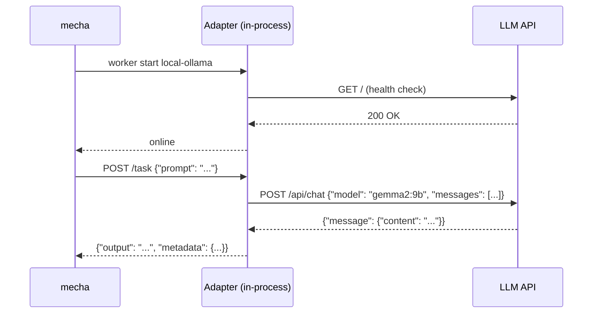

# Adapter Workers

Adapters translate native LLM APIs into the mecha worker contract (`GET /health`, `POST /task`). They run in-process — no Docker required.

## When to Use Adapters

| Use case | Worker type |
|---|---|
| Claude/Codex in Docker | **Managed** (`docker:` section) |
| Ollama, vLLM, LiteLLM, llama.cpp | **Adapter** (`adapter:` section) |
| External HTTP endpoint you control | **Unmanaged** (`endpoint:` field) |

Adapters are ideal for local LLMs where you don't need Docker isolation but want mecha's lifecycle management (start/stop/health).

## Supported Adapters

| Type | Upstream API | Health Check | Source |
|---|---|---|---|
| `ollama` | `/api/chat` | `GET /` | `internal/adapter/ollama.go` |
| `openai` | `/v1/chat/completions` | `GET /v1/models` | `internal/adapter/openai.go` |

## Configuration

### Ollama

```yaml
name: local-ollama
adapter:
  type: ollama
  upstream: http://localhost:11434
  model: gemma2:9b
timeout: 10m
```

### OpenAI-Compatible

Works with vLLM, LiteLLM, llama.cpp server, or any OpenAI-compatible endpoint:

```yaml
name: vllm-worker
adapter:
  type: openai
  upstream: http://gpu-server:8000
  model: meta-llama/Llama-3-70b
  api_key: ${VLLM_API_KEY}
timeout: 15m
```

### Fields

| Field | Required | Description |
|---|---|---|
| `adapter.type` | Yes | `ollama` or `openai` |
| `adapter.upstream` | Yes | Base URL of the LLM API |
| `adapter.model` | Yes | Model name passed to the API |
| `adapter.api_key` | No | API key for authenticated endpoints |

## How It Works



When you run `mecha worker start`, mecha starts an in-process HTTP server that:

1. Translates `GET /health` into the upstream's native health endpoint
2. Translates `POST /task` into the upstream's chat completion API
3. Converts the upstream response into the mecha result contract

The adapter server binds to a random port. Mecha records the endpoint in the registry like any other worker.

## Lifecycle

```bash
# Add the worker definition
mecha worker add workers/ollama-gemma.yml

# Start the in-process adapter
mecha worker start local-ollama

# Check status
mecha worker ls
# NAME          STATE   TYPE     ENDPOINT                    HEALTH
# local-ollama  online  adapter  http://127.0.0.1:52431      ok

# Stop
mecha worker stop local-ollama
```

Adapter workers follow the same state machine as managed workers: `offline → online ↔ busy → error`.

## Comparison with Unmanaged Workers

| Feature | Adapter | Unmanaged |
|---|---|---|
| Lifecycle management | Yes (start/stop) | No (always running externally) |
| Health translation | Yes (native API → worker contract) | No (must implement /health natively) |
| In-process | Yes | No |
| Docker required | No | No |
| Custom API translation | Automatic | Manual (your endpoint must speak worker contract) |

## Adding Custom Adapters

Adapters are compiled-in Go packages implementing the `adapter.Adapter` interface:

```go
type Adapter interface {
    Health(ctx context.Context) error
    Execute(ctx context.Context, prompt string) (policy.Result, error)
}
```

See `internal/adapter/ollama.go` for a reference implementation.
