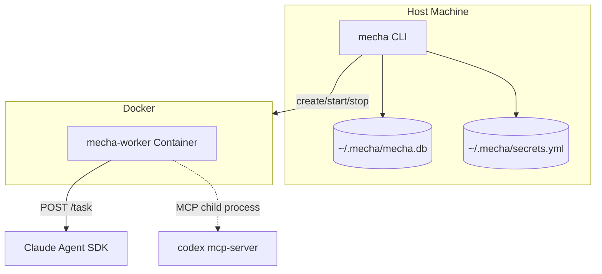
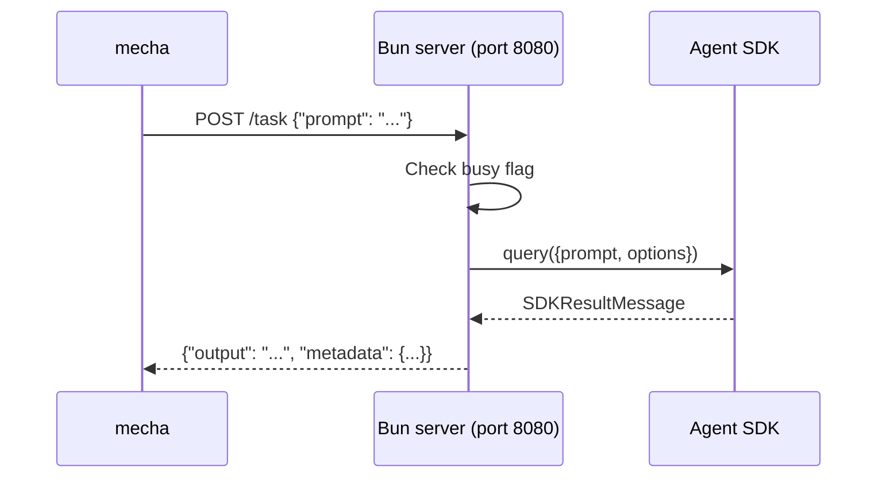
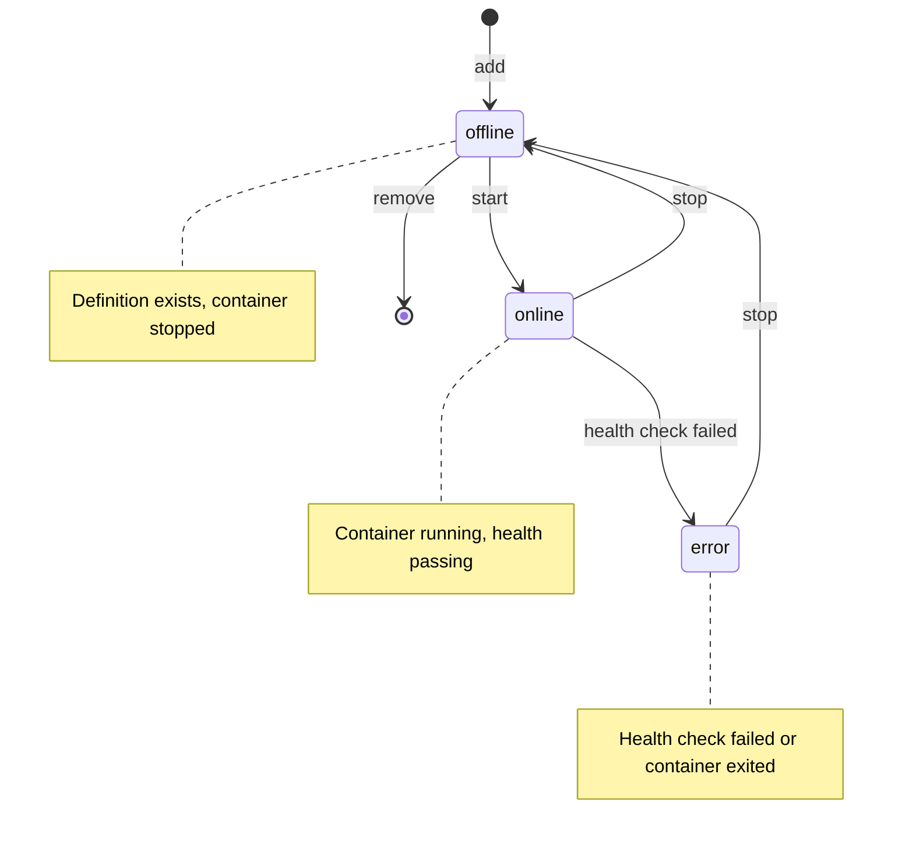
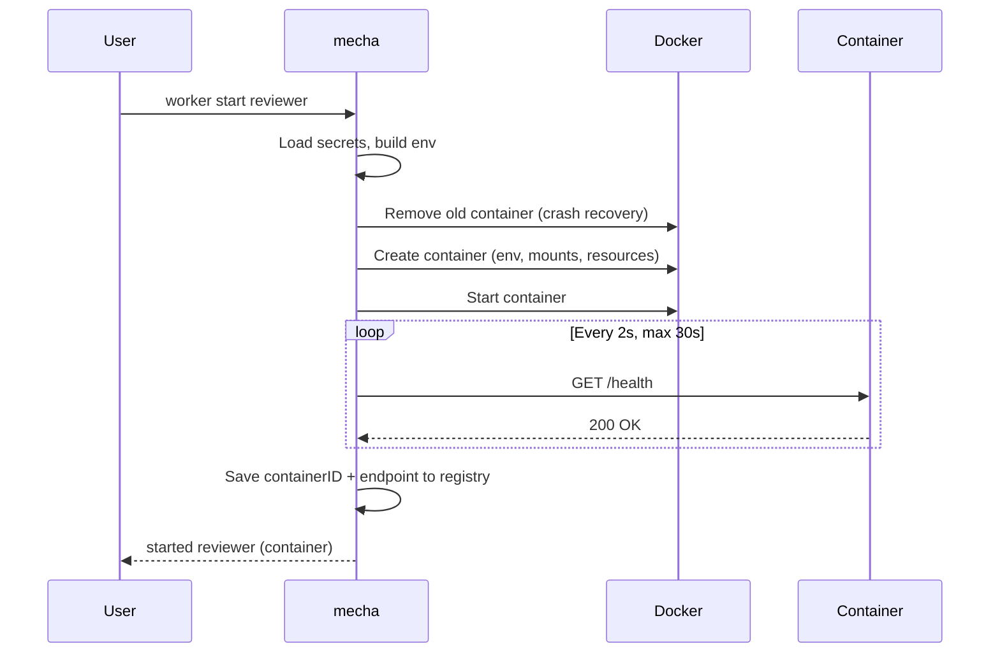
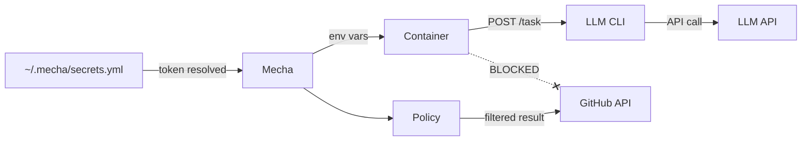

# Architecture

## Overview



## Components

### mecha binary (Go)

The single binary handles all worker management:

| Package | Responsibility |
|---------|---------------|
| `cmd/mecha/` | Entry point |
| `internal/cli/` | Cobra commands, Docker lifecycle glue |
| `internal/worker/` | Config, registry, Docker client, secrets, health, redaction |

### Worker runtime (TypeScript/Bun)

Inside each container, a Bun HTTP server receives tasks and dispatches to the backend:

- **Claude**: calls the Agent SDK `query()` directly (structured response, no subprocess)
- **Codex**: available as an MCP child process within the Claude session (auto-detected via credential mount)



The server is single-flight: one task at a time. A second request while busy returns `429 Too Many Requests`.

### Registry

State is persisted to `~/.mecha/mecha.db` (SQLite, WAL mode):

| Table | Purpose |
|---|---|
| `workers` | Worker definitions + runtime state (JSON) |
| `tasks` | Task lifecycle (pending → dispatched → completed/failed) |
| `events` | Webhook events + matching state |

The registry uses clone-on-write: mutations clone the in-memory map, persist to SQLite in a transaction, then swap the pointer. On persistence failure, in-memory state is unchanged.

### Secrets

Tokens live in `~/.mecha/secrets.yml`, referenced by `backend.name`:

```
docker.token: claude.xiaolaidev
  → secrets.yml lookup
  → sk-ant-oat01-xxx...
  → detect prefix → CLAUDE_CODE_OAUTH_TOKEN
  → inject into container env
```

See [Secrets](./secrets) for full details.

## Worker Lifecycle



### Docker Start Sequence



### Rollback on Failure

| Failure point | Cleanup |
|---|---|
| Create fails | Set error state, no container to clean |
| Start fails | Remove created container, set error |
| Health timeout | Stop + remove container, set error |
| Registry persist fails | Container runs, recoverable via label discovery |

## Security Model



- Workers receive LLM tokens via env vars or credential mounts
- GitHub tokens are blocked from container env
- All GitHub writes go through mecha → Policy
- Error messages are redacted before display

## Dependencies

| Dependency | Version | Purpose |
|------------|---------|---------|
| `github.com/spf13/cobra` | 1.10.2 | CLI framework |
| `gopkg.in/yaml.v3` | 3.0.1 | Worker YAML parsing |
| `github.com/moby/moby` | client 0.3.0 | Docker container management |
| `modernc.org/sqlite` | 1.48.0 | SQLite persistence (workers, tasks, events) |
