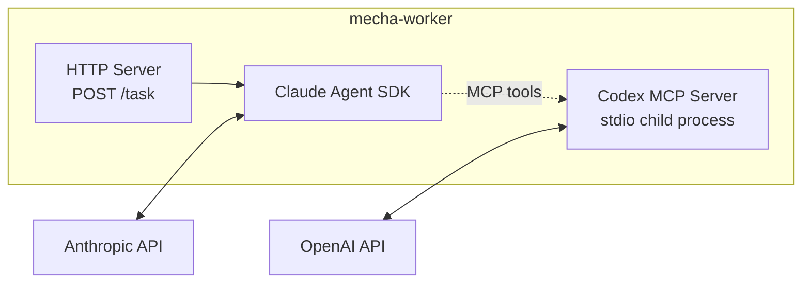
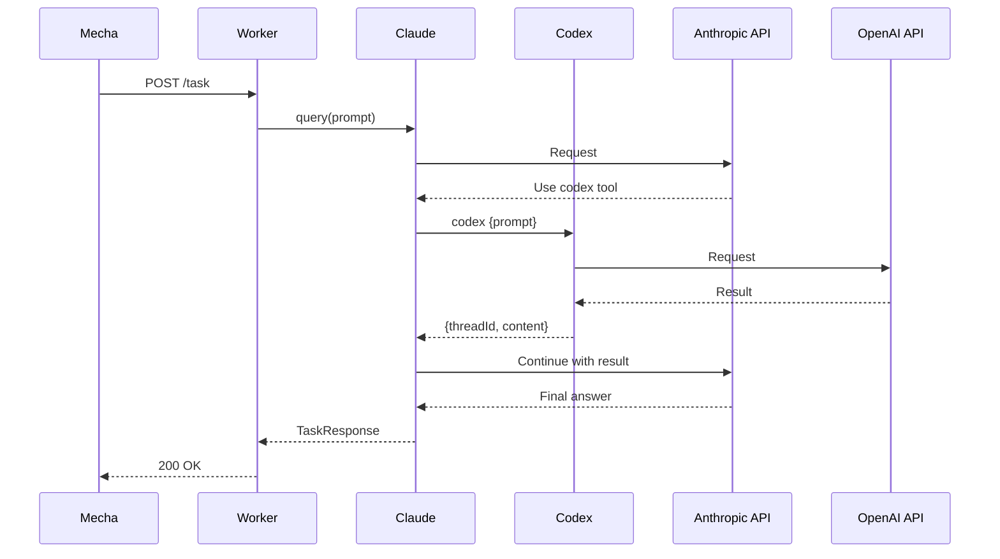

# Dual-Agent Workers

Mecha supports running Claude and Codex together in a single Docker container. Claude acts as the primary agent, with Codex available as an MCP tool for second opinions, web search, and alternative implementations.

::: warning Planned Feature
Dual-agent workers are under active development. The Codex MCP wiring inside the Claude backend is **not yet implemented** — the Codex CLI is installed in the image but no runtime code path activates it. This page documents the intended architecture and configuration.
:::

## Why Two Models?

Different LLMs have different strengths. Running both in one worker lets you combine them:

| Use case | Claude does | Codex does |
|---|---|---|
| **Cross-model review** | Reviews code, synthesizes findings | Reviews same code independently |
| **Research + implement** | Implements based on findings | Web search for current docs |
| **Second opinion** | Makes architectural decisions | Validates or challenges them |
| **Multi-turn collaboration** | Drives the task | Answers follow-up questions |

## How It Works

Claude runs as the primary agent via the Agent SDK. Codex runs as an MCP server (child process) inside the same container. Claude can call Codex tools whenever it needs to.



No special networking — the MCP server communicates over stdin/stdout of a child process. Both APIs are called outbound over HTTPS.

## Available MCP Tools

When Codex MCP is enabled (planned), Claude will get access to these tools:

| Tool | What it does |
|---|---|
| `mcp__codex__codex` | Start a new Codex session with a prompt |
| `mcp__codex__codex-reply` | Continue an existing Codex session (multi-turn) |
| `mcp__codex__websearch` | Search the web via Codex |

The system prompt tells Claude when and how to use them.

## Worker Configuration

```yaml
name: claude-with-codex
docker:
  image: mecha-worker:latest
  credentials: [claude]                  # Claude subscription auth
  cwd: /path/to/project
  resources:
    cpu: 4
    memory: 8G
  env:
    CLAUDE_MODEL: claude-sonnet-4-6
    CLAUDE_EFFORT: high
    CLAUDE_PERMISSION_MODE: bypassPermissions
    CODEX_API_KEY: ${CODEX_KEY}          # enables Codex MCP
    CLAUDE_SYSTEM_PROMPT: |
      You are a code review agent. Use your built-in tools for file access.
      When you need a second opinion or web search, use the Codex MCP tools.
timeout: 30m
```

Once implemented, setting `CODEX_API_KEY` will automatically enable the Codex MCP server. Claude's system prompt will guide when to use it.

## Authentication

Both models need their own credentials:

| Model | Auth method | How |
|---|---|---|
| Claude | Subscription | `credentials: [claude]` (mounts `~/.claude/`) or `token: claude.name` |
| Codex | API key | `CODEX_API_KEY` in `docker.env` or `token: codex.name` |
| Codex | Subscription | `credentials: [codex]` (mounts `~/.codex/`) + set `CODEX_MCP: "true"` |

If using credential mounts for both:

```yaml
docker:
  credentials: [claude]
  env:
    CODEX_MCP: "true"    # enable Codex MCP using mounted credentials
```

## Request Flow



Claude decides when to consult Codex. It might never call Codex if the task is straightforward, or it might have a multi-turn conversation using `codex-reply`.

## Example: Cross-Model Code Review

```yaml
name: dual-reviewer
docker:
  image: mecha-worker:latest
  credentials: claude
  cwd: /path/to/project
  env:
    CLAUDE_MODEL: claude-sonnet-4-6
    CODEX_API_KEY: ${CODEX_KEY}
    CLAUDE_SYSTEM_PROMPT: |
      Review the PR diff for bugs, security issues, and code quality.
      After your review, use the Codex tool to get an independent review
      of the same diff. Compare both reviews and produce a unified report
      noting where you agree and where you differ.
events:
  - source: github
    on: [pull_request.opened, pull_request.synchronize]
    prompt: "Review this PR:\n\n{{.diff}}"
policy:
  comment: { allow: true, max_length: 4000 }
  labels: { allow: true }
timeout: 30m
```

## Compared to Separate Workers

You could achieve similar results with two separate workers (one Claude, one Codex) and a policy that combines their outputs. The dual-agent approach is simpler when:

- You want Claude to **decide** when to consult Codex (not always)
- You want **multi-turn** back-and-forth between models
- You want a **single output** that synthesizes both perspectives
- You want to minimize latency (no inter-container HTTP calls)

Use separate workers when:

- Each model should produce **independent** outputs
- You want **parallel** execution (both start simultaneously)
- You need different **policies** per model
- You want to **compare** raw outputs without synthesis

## Environment Variables

| Env var | Purpose | Default |
|---|---|---|
| `CODEX_API_KEY` | Codex API key — also enables MCP wiring | — |
| `CODEX_MCP` | Enable Codex MCP without API key (use credential mount) | `"false"` |
| `CODEX_MCP_MODEL` | Override model for Codex sessions | Codex default |

All standard [Claude env vars](/guide/workers#claude-env-vars) are also supported.
