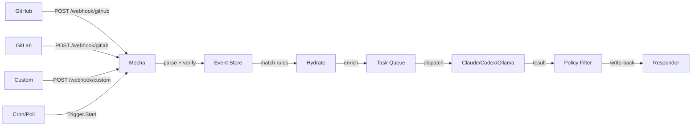
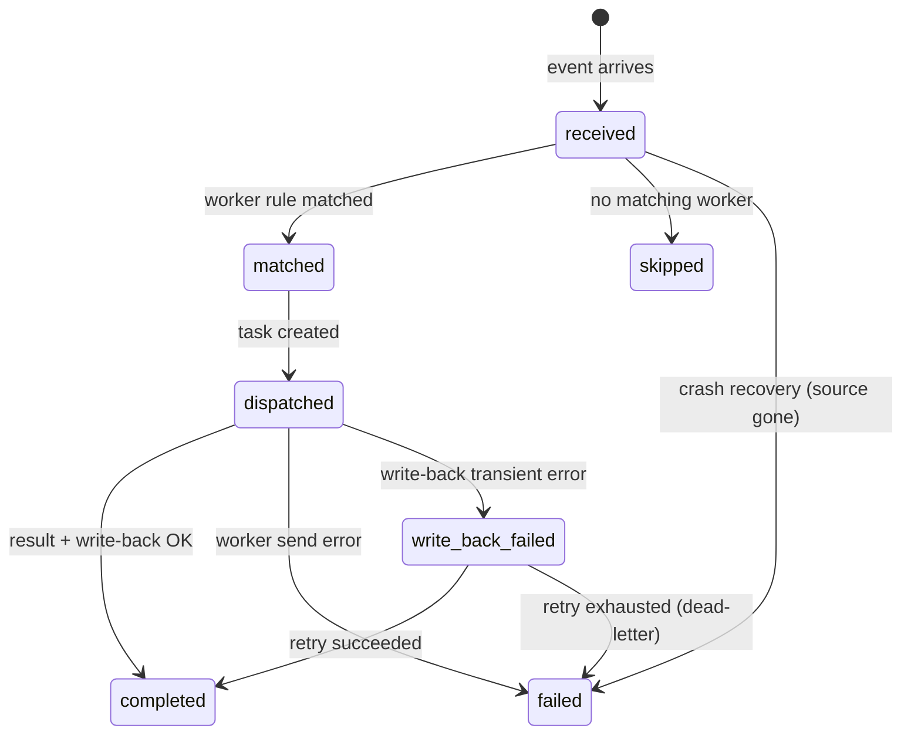

# Events & Webhooks

Events connect external sources to mecha workers. Sources can be passive (webhooks from GitHub, GitLab, or custom services) or active (cron schedules, API polling). When an event arrives, mecha matches it to a worker, renders a prompt, dispatches a task, and writes the result back.

## Universal Event Model

Every event — regardless of source — has the same shape:

| Field | Description | Example |
|-------|-------------|---------|
| `Source` | Provider name | `github`, `gitlab`, `slack`, `cron` |
| `Type` | Event type | `pull_request.opened`, `push`, `message`, `tick` |
| `Actor` | Who triggered it | username, login, bot name |
| `Subject` | What it's about | `owner/repo`, `#channel`, schedule name |
| `Attrs` | Provider-specific data | `repo_owner`, `number`, `diff`, `text` |
| `DedupKey` | Semantic dedup key (enforced) | Content hash for polls/cron — active events block duplicates |

`Actor` and `Subject` are universal — available for all sources. `Attrs` keys are provider-specific (e.g., `repo_owner` exists for GitHub/GitLab but not for a custom webhook).

## Provider Interfaces

| Interface | Direction | Description |
|-----------|-----------|-------------|
| `Source` | Inbound (passive) | Parses webhooks into events (`Parse`) |
| `Trigger` | Inbound (active) | Generates events on schedule or poll (`Start`) |
| `Hydrator` | Enrichment | Fetches additional data via API (e.g., PR diffs) |
| `Verifier` | Handshake | Handles webhook verification challenges (Meta, Slack) |
| `Authenticated` | Marker | Sources with built-in auth (HMAC, token) skip API key check |
| `Responder` | Outbound | Writes results back to the source platform |

GitHub and GitLab implement `Source` + `Hydrator` + `Authenticated`. Slack and Telegram implement `Source` + `Authenticated`. Generic sources implement only `Source`.

## Pipeline



## Setup

### 1. Configure Secrets

Add your GitHub token and webhook secret to `~/.mecha/secrets.yml`:

```yaml
github:
  token: ghp_your_github_pat
  webhook_secret: whsec_your_webhook_secret
```

- `token` — GitHub PAT for API calls (diff fetching + write-back)
- `webhook_secret` — HMAC secret for webhook signature verification

### 2. Add Event Rules to Workers

Add an `events:` section to your worker YAML:

<!-- @formatter:off -->
::: v-pre
```yaml
name: pr-reviewer
docker:
  image: mecha-worker:latest
  token: claude.xiaolaidev
  env:
    CLAUDE_MODEL: claude-sonnet-4-6
    CLAUDE_EFFORT: high
timeout: 30m

events:
  - source: github
    on:
      - pull_request.opened
      - pull_request.synchronize
    filter:
      base_branch: main
    prompt: |
      Review this pull request for security and correctness.

      ## PR #{{.number}}: {{.title}}
      Author: {{.actor}}
      Branch: {{.head_branch}} -> {{.base_branch}}

      ### Diff
      {{.diff}}
```
:::
<!-- @formatter:on -->

### 3. Configure GitHub Webhook

In your GitHub repo settings → Webhooks:
- **Payload URL**: `https://your-server/webhook/github`
- **Content type**: `application/json`
- **Secret**: same as `webhook_secret` in secrets.yml
- **Events**: Select the events matching your worker rules

### 4. Start the Server

```bash
mecha serve --addr 0.0.0.0:21212 --api-key YOUR_API_KEY
```

## Event Rules

Each rule in the `events:` section defines when the worker should handle an event:

| Field | Required | Description |
|-------|----------|-------------|
| `source` | Yes | Event source (`github`, `gitlab`, or custom name) |
| `on` | Yes | List of event types to match |
| `filter` | No | Key-value payload filters (equality match) |
| `prompt` | Yes | Go template rendered with event data |
| `auto` | No | Auto-dispatch (default: true). Set `false` to match without dispatching |

### GitHub Event Types

| Type | Trigger |
|------|---------|
| `pull_request.opened` | PR created |
| `pull_request.synchronize` | PR updated (new commits) |
| `pull_request.closed` | PR closed/merged |
| `push` | Push to branch |
| `issues.opened` | Issue created |
| `issues.labeled` | Label added to issue |
| `issue_comment.created` | Comment on issue/PR |
| `pull_request.review_requested` | Review requested |

### Template Variables

Available in the `prompt` template:

::: v-pre
**Universal fields** (available for all sources):

| Variable | Description |
|----------|-------------|
| `{{.actor}}` | Who triggered the event (username, login, phone) |
| `{{.subject}}` | What it's about (`owner/repo`, `#channel`, schedule name) |
| `{{.source}}` | Provider name (`github`, `gitlab`, custom) |
| `{{.type}}` | Event type (`pull_request.opened`, `push`, `message`) |

**GitHub/GitLab attrs** (source-specific, from `Attrs` map):

| Variable | Description |
|----------|-------------|
| `{{.repo_owner}}` | Repository owner |
| `{{.repo_name}}` | Repository name |
| `{{.number}}` | PR/issue/MR number |
| `{{.sender}}` | Who triggered (GitHub-specific alias for `actor`) |
| `{{.title}}` | PR/issue title |
| `{{.body}}` | PR/issue body |
| `{{.diff}}` | PR diff (fetched via API, max 500KB) |
| `{{.file_list}}` | Changed file names |
| `{{.head_branch}}` | Source branch |
| `{{.base_branch}}` | Target branch |
| `{{.head_sha}}` | Head commit SHA |
| `{{.labels}}` | Comma-separated label names |
:::

## Write-Back (Responder)

When a worker returns a result with write-back fields, mecha routes them through the **Responder** registered for the event's source. The GitHub Responder posts comments, labels, and statuses to the GitHub API. Custom Responders can be registered for other platforms (Slack, Telegram, etc.).

```json
{
  "output": "Found 2 security issues...",
  "comment": {
    "target": "pr:42",
    "body": "## Security Review\nFound 2 issues..."
  },
  "status": {
    "state": "failure",
    "description": "2 security issues found"
  },
  "labels": {
    "add": ["security-review-failed"],
    "remove": ["needs-review"]
  }
}
```

| Field | GitHub Action |
|-------|-------------|
| `comment.body` | Posts PR/issue comment |
| `status.state` | Sets commit status (success/failure/pending) |
| `labels.add` | Adds labels to PR/issue |
| `labels.remove` | Removes labels from PR/issue |

Write-back requires `github.token` in secrets.yml with appropriate permissions.

## Event States



- **received → failed**: on startup, events stuck in `received` (crashed before matching) are re-processed if the source is still registered, or marked `failed` if the source is gone
- **dispatched → write_back_failed**: if the worker task completed but write-back to the external platform failed (GitHub rate limit, transient network, 5xx), the event transitions to `write_back_failed` and is retried by the background write-back retry loop (30s interval). After `max_retries` attempts, it is dead-lettered to `failed`.

## Delivery Deduplication

Each event source uses its own deduplication strategy:

| Source | Dedup key | Method |
|--------|-----------|--------|
| GitHub | `X-GitHub-Delivery` header | Unique per delivery |
| GitLab | `X-Gitlab-Event-UUID` header (preferred), falls back to `X-Gitlab-Instance/X-Request-Id` | Unique per delivery |
| Slack | `event_id` from payload | Unique per event |
| Telegram | Content hash (SHA-256 of body) | Deterministic |
| Generic | Content hash (SHA-256 of event type + body) | Deterministic |
| Cron | FNV hash of (name, subject, unix_time) | Prevents duplicate ticks |

Additionally, events with a non-empty `DedupKey` are blocked if an active event (received, matched, or dispatched) with the same key already exists. Terminal states (completed, failed, skipped) release the key.

## GitLab Source

Add `gitlab.webhook_secret` to `~/.mecha/secrets.yml`:

```yaml
gitlab:
  webhook_secret: your_gitlab_secret
```

### GitLab Event Types

| Type | Trigger |
|------|---------|
| `merge_request.open` | MR created |
| `merge_request.update` | MR updated |
| `merge_request.merge` | MR merged |
| `push` | Push to branch |
| `tag_push` | Tag created |
| `note` | Comment on MR/issue |
| `issue.open` | Issue created |

### GitLab Worker Example

<!-- @formatter:off -->
::: v-pre
```yaml
events:
  - source: gitlab
    on:
      - merge_request.open
    prompt: "Review MR #{{.number}}: {{.title}}"
```
:::
<!-- @formatter:on -->

### GitLab Write-Back

The `GitLabResponder` writes task results back to GitLab merge requests and issues. It is registered as a `Responder` and is keyed by `ev.Source` (so GitLab events automatically use it).

**Capabilities:**

| Result field | GitLab action |
|------|-------------|
| `comment.body` | Posts a note on the MR or issue |
| `status.state` | Sets commit status on `head_sha` (context name: `mecha`) |
| `labels.add` | Adds labels to the MR or issue |
| `labels.remove` | Removes labels from the MR or issue |
| `commit.diff` | Posts a note with the suggested diff as a markdown code block |

**State mapping (GitHub to GitLab):**

| GitHub state | GitLab state |
|---|---|
| `error` | `failed` |
| `failure` | `failed` |
| `pending` | `pending` |
| `success` | `success` |

**Configuration:**

The GitLab Responder requires a GitLab Personal Access Token (PAT) with `api` scope, separate from the `gitlab.webhook_secret` used for webhook verification. Create the responder with:

```go
resp := source.NewGitLabResponder("https://gitlab.com/api/v4", "glpat-xxx...")
registry.RegisterResponder(resp)
```

The project path (`owner/repo`) is extracted from event attrs and URL-encoded automatically (`owner/repo` becomes `owner%2Frepo` in API calls).

::: info
Commit status requires the event to have a `head_sha` attr. If `head_sha` is empty, the status update is silently skipped.
:::

## Slack Source

Add `slack.signing_secret` to `~/.mecha/secrets.yml`:

```yaml
slack:
  signing_secret: your_slack_signing_secret
```

Slack webhooks are verified via HMAC-SHA256 (`v0=` scheme) with replay protection (5-minute timestamp window). URL verification challenges are handled automatically.

### Slack Event Types

| Type | Trigger |
|------|---------|
| `message` | Message posted in channel |
| `message.bot_message` | Bot message |
| `app_mention` | Bot mentioned |
| `reaction_added` | Emoji reaction |

### Slack Template Variables

::: v-pre
| Variable | Description |
|----------|-------------|
| `{{.channel}}` | Channel ID |
| `{{.text}}` | Message text |
| `{{.sender}}` | User ID |
| `{{.thread_ts}}` | Thread timestamp |
| `{{.ts}}` | Message timestamp |
| `{{.team_id}}` | Workspace ID |
:::

### Slack Worker Example

<!-- @formatter:off -->
::: v-pre
```yaml
events:
  - source: slack
    on:
      - message
    prompt: "Respond to this Slack message: {{.text}}"
```
:::
<!-- @formatter:on -->

## Telegram Source

Add `telegram.secret_token` to `~/.mecha/secrets.yml`:

```yaml
telegram:
  secret_token: your_telegram_secret_token
```

Telegram webhooks are verified via `X-Telegram-Bot-Api-Secret-Token` header (constant-time comparison).

### Telegram Event Types

| Type | Trigger |
|------|---------|
| `message` | New message |
| `edited_message` | Message edited |
| `callback_query` | Inline button pressed |
| `inline_query` | Inline query |

### Telegram Template Variables

::: v-pre
| Variable | Description |
|----------|-------------|
| `{{.text}}` | Message text |
| `{{.chat_id}}` | Chat ID |
| `{{.chat_type}}` | `private`, `group`, `supergroup`, `channel` |
| `{{.sender}}` | Username |
| `{{.from_id}}` | User ID |
| `{{.message_id}}` | Message ID |
| `{{.callback_data}}` | Callback button data |
:::

### Telegram Worker Example

<!-- @formatter:off -->
::: v-pre
```yaml
events:
  - source: telegram
    on:
      - message
    prompt: "Reply to this Telegram message: {{.text}}"
```
:::
<!-- @formatter:on -->

## Cron Trigger

The cron trigger generates events on a fixed schedule. Unlike webhook sources (which are passive), CronTrigger is an active trigger that emits events at a configurable interval.

Cron triggers are registered programmatically -- not via `secrets.yml`. They implement the `Trigger` interface and are started by `mecha serve`.

### How It Works

`NewCronTrigger(name, interval, subject)` creates a trigger that fires every `interval`. When it fires, it emits an event with these fields:

| Field | Value |
|-------|-------|
| `Source` | `cron` |
| `Type` | `tick` |
| `Actor` | Trigger name (the `name` argument) |
| `Subject` | The `subject` argument |
| `DedupKey` | FNV-64a hash of `name:subject:unix_time` |

The `DedupKey` is computed as an FNV-64a hash of the trigger name, subject, and Unix timestamp. This prevents duplicate processing if the emit callback is slow -- a tick that has already been emitted (and is still active) will be blocked by dedup enforcement.

### Template Variables

::: v-pre
| Variable | Description |
|----------|-------------|
| `{{.tick_time}}` | RFC 3339 timestamp of when the tick fired |
| `{{.actor}}` | Trigger name |
| `{{.subject}}` | Trigger subject |
:::

### Cron Worker Example

<!-- @formatter:off -->
::: v-pre
```yaml
events:
  - source: cron
    on:
      - tick
    prompt: |
      Run the scheduled task at {{.tick_time}}.
      Schedule: {{.actor}} / {{.subject}}
```
:::
<!-- @formatter:on -->

## Generic Webhook Source

For custom integrations (Jenkins, Buildkite, etc.), register a generic source. The event type is read from a configurable HTTP header.

Generic sources are registered programmatically (not via secrets). They use content-hash deduplication and have no built-in authentication — use the server's API key for access control.

### Generic Worker Example

<!-- @formatter:off -->
::: v-pre
```yaml
events:
  - source: jenkins
    on:
      - build.completed
    filter:
      status: "failure"
    prompt: "Analyze this build failure: {{.branch}}"
```
:::
<!-- @formatter:on -->

## Commit Suggestions

Workers can return a `commit` field with suggested code changes. Mecha posts the diff as a PR comment:

```json
{
  "output": "Fixed the typo",
  "commit": {
    "message": "fix: correct variable name",
    "diff": "--- a/main.go\n+++ b/main.go\n@@ -1 +1 @@\n-old\n+new"
  }
}
```

The diff is rendered as a markdown code block in the PR comment. Requires `policy.commit.allow: true` in the worker config.

## Security

- GitHub webhooks verified via HMAC-SHA256 (constant-time comparison)
- GitLab webhooks verified via `X-Gitlab-Token` (constant-time comparison)
- Slack webhooks verified via HMAC-SHA256 (`v0=` scheme) with 5-minute replay protection
- Telegram webhooks verified via `X-Telegram-Bot-Api-Secret-Token` (constant-time comparison)
- Authenticated sources (GitHub, GitLab, Slack, Telegram) are exempt from API key auth — they use their own verification. Generic sources without built-in auth must supply the server API key
- Diff is fetched using SHA-pinned compare endpoints (immutable)
- Delivery deduplication prevents replay attacks
