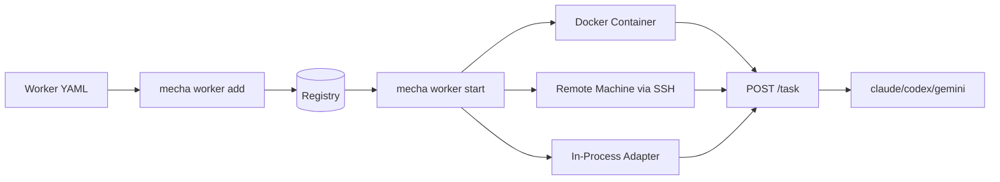
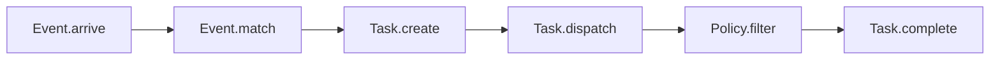

# What is Mecha

**Mecha is a workflow engine that runs LLM agents in Docker containers, on remote machines via SSH, or through in-process adapters — managed by a single Go binary.**

## The Problem

You want multiple AI agents — a code reviewer, a bug triager, a doc writer — each with its own model, tools, and permissions. Without mecha, you manage each one manually: start containers, inject tokens, check health, clean up.

## The Solution

Mecha gives you a YAML-driven lifecycle for LLM workers:

```
mecha worker add workers/reviewer.yml    # define it
mecha worker start reviewer              # run it
curl http://localhost:32768/task          # use it
mecha worker stop reviewer               # stop it
```

One binary. One YAML per worker. Docker, SSH, or adapters handle execution.

## How It Works



Each worker runs an LLM CLI — in a Docker container, on a remote machine via SSH, or through an in-process adapter. Mecha creates the runtime, injects auth tokens, waits for health, and tracks state.

## Four Nouns

The full system (when complete) is built on four concepts:

- **Event** — something happened (webhook, schedule, API call)
- **Worker** — takes a prompt, returns a result (Docker container, SSH remote, adapter, or external endpoint)
- **Task** — an event matched to a worker
- **Policy** — what a result is allowed to contain

## Pipeline



All four nouns and the full pipeline are implemented. Events arrive via webhooks, match to workers, create tasks, get dispatched, pass through policy filtering, and complete with write-back to GitHub.
