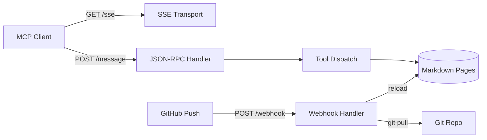

# MCP Server

Mecha includes an MCP (Model Context Protocol) server that lets AI assistants query the documentation programmatically. Deploy it at your docs domain and any MCP-compatible client can search, browse, and read mecha docs.

## Quick Start

```bash
# Run locally
DOCS_DIR=website/guide mecha-mcp

# With webhook auto-refresh
GITHUB_MECHA_MCP_WEBHOOK_SECRET=your-secret mecha-mcp
```

The server listens on `:8090` by default (override with `ADDR`).

## Endpoints

| Endpoint | Method | Purpose |
|---|---|---|
| `/sse` | GET | SSE transport — MCP client connects here |
| `/message` | POST | JSON-RPC message handler |
| `/webhook` | POST | GitHub webhook for auto-refresh on push |
| `/health` | GET | Health check (`200 ok`) |

## MCP Tools

The server exposes six tools to MCP clients:

### list-topics

List all documentation pages with slugs and titles.

```json
{"name": "list-topics", "arguments": {}}
```

Returns an array of `{slug, title}` objects.

### get-page

Fetch the full content of a documentation page by slug.

```json
{"name": "get-page", "arguments": {"slug": "workers"}}
```

Available slugs: `adapters`, `api`, `architecture`, `cli`, `dual-agent`, `events`, `go-api`, `index`, `installation`, `mcp-server`, `policy`, `quickstart`, `secrets`, `server`, `workers`.

### search-docs

Search all pages by keyword. Returns matching pages with truncated previews (500 chars). Use `get-page` for full content.

```json
{"name": "search-docs", "arguments": {"query": "credentials"}}
```

### get-spec

Fetch a project rule/spec from `.claude/rules/` by name.

```json
{"name": "get-spec", "arguments": {"name": "worker-yaml-spec"}}
```

Available specs: `domain-model`, `go-conventions`, `security`, `secrets`, `worker-yaml-spec`, `worker-design`, `result-contract`, `documentation`, `rules-sync`.

### get-examples

List or fetch example worker YAML files from `workers/`.

```json
{"name": "get-examples", "arguments": {}}
{"name": "get-examples", "arguments": {"name": "claude-reviewer"}}
```

### get-version

Return current mecha version and recent changes.

```json
{"name": "get-version", "arguments": {}}
```

## Configuration

| Env var | Default | Purpose |
|---|---|---|
| `DOCS_DIR` | `website/guide` | Directory containing markdown files |
| `REPO_DIR` | `.` | Git repo root (for webhook `git pull`) |
| `RULES_DIR` | `.claude/rules` | Directory containing rule/spec markdown files |
| `EXAMPLES_DIR` | `workers` | Directory containing example worker YAML files |
| `GITHUB_MECHA_MCP_WEBHOOK_SECRET` | — | HMAC secret for GitHub webhook validation |
| `ADDR` | `:8090` | Listen address |

## Auto-Refresh via Webhook

Configure a GitHub webhook pointing to `https://mcp.mecha.im/webhook`:

1. Set content type to `application/json`
2. Set the secret to match `GITHUB_MECHA_MCP_WEBHOOK_SECRET`
3. Select "Just the push event"

On push, the server checks if any `website/` files changed. If so, it runs `git pull --ff-only` and reloads all pages.

## Connecting from Claude Code

Add to your `.mcp.json`:

```json
{
  "mcpServers": {
    "mecha-docs": {
      "type": "sse",
      "url": "https://mcp.mecha.im/sse"
    }
  }
}
```

Then use the tools:

```text
mcp__mecha-docs__list-topics
mcp__mecha-docs__get-page {"slug": "workers"}
mcp__mecha-docs__search-docs {"query": "dual agent"}
```

## Architecture



The server loads all `.md` files from `DOCS_DIR` at startup, parses YAML frontmatter for titles, and serves content from memory. Pages are reloaded on webhook push events.

## Building

```bash
go build -o mecha-mcp ./cmd/mecha-mcp
```

The binary is standalone — no runtime dependencies beyond git (for webhook pulls).
