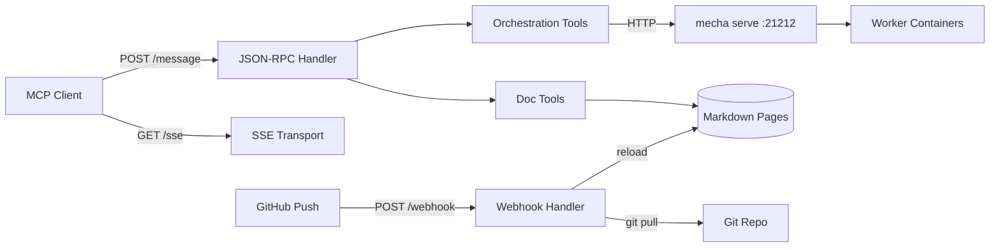

# MCP Server

Mecha includes an MCP (Model Context Protocol) server that lets AI assistants query documentation **and** control the mecha pipeline. Deploy it alongside `mecha serve` and any MCP-compatible client can submit tasks, monitor workers, fire events, and browse docs.

## Quick Start

```bash
# Run locally
DOCS_DIR=website/guide mecha-mcp

# With webhook auto-refresh
GITHUB_MECHA_MCP_WEBHOOK_SECRET=your-secret mecha-mcp
```

The server listens on `:8090` by default (override with `ADDR`).

## Endpoints

| Endpoint | Method | Purpose |
|---|---|---|
| `/sse` | GET | SSE transport — MCP client connects here |
| `/message` | POST | JSON-RPC message handler |
| `/webhook` | POST | GitHub webhook for auto-refresh on push |
| `/health` | GET | Health check (`200 ok`) |

## Orchestration Tools

These tools control the mecha pipeline. They proxy to the running `mecha serve` instance.

### mecha-task

Submit a task to a worker (async). Returns the task ID immediately.

```json
{"name": "mecha-task", "arguments": {"prompt": "Review this PR", "worker": "reviewer"}}
```

Omit `worker` for round-robin selection among online workers.

### mecha-task-wait

Submit a task and wait for the result (sync). Polls until completed or failed.

```json
{"name": "mecha-task-wait", "arguments": {"prompt": "Fix the bug", "timeout": 300}}
```

Default timeout: 300 seconds. Returns the full task object with result.

### mecha-task-status

Get the current state and result of a task by ID.

```json
{"name": "mecha-task-status", "arguments": {"id": "abc123def456"}}
```

### mecha-workers

List all registered workers with type, state, and endpoint.

```json
{"name": "mecha-workers", "arguments": {}}
```

### mecha-tasks

List recent tasks, optionally filtered by state.

```json
{"name": "mecha-tasks", "arguments": {"state": "completed"}}
```

### mecha-events

List recent events, optionally filtered by state.

```json
{"name": "mecha-events", "arguments": {"state": "failed"}}
```

### mecha-fire-event

Fire a webhook event to a registered source.

```json
{"name": "mecha-fire-event", "arguments": {"source": "generic", "body": "{\"text\":\"hello\"}"}}
```

### mecha-metrics

Get current server metrics in readable format.

```json
{"name": "mecha-metrics", "arguments": {}}
```

Returns tasks created/completed/failed, dispatch latency, queue depth, retry counts, and more.

## Documentation Tools

These tools serve project documentation, rules, and examples.

### list-topics

List all documentation pages with slugs and titles.

```json
{"name": "list-topics", "arguments": {}}
```

### get-page

Fetch the full content of a documentation page by slug.

```json
{"name": "get-page", "arguments": {"slug": "workers"}}
```

### search-docs

Search all pages by keyword. Returns matching pages with truncated previews.

```json
{"name": "search-docs", "arguments": {"query": "credentials"}}
```

### get-spec

Fetch a project rule/spec from `.claude/rules/` by name.

```json
{"name": "get-spec", "arguments": {"name": "worker-yaml-spec"}}
```

### get-examples

List or fetch example worker YAML files from `workers/`.

```json
{"name": "get-examples", "arguments": {"name": "claude-reviewer"}}
```

### get-version

Return current mecha version.

```json
{"name": "get-version", "arguments": {}}
```

## Configuration

### Environment Variables

| Env var | Default | Purpose |
|---|---|---|
| `DOCS_DIR` | `website/guide` | Markdown docs directory |
| `REPO_DIR` | `.` | Git repo root (for webhook `git pull`) |
| `RULES_DIR` | `.claude/rules` | Rule/spec markdown directory |
| `EXAMPLES_DIR` | `workers` | Example worker YAML directory |
| `GITHUB_MECHA_MCP_WEBHOOK_SECRET` | — | HMAC secret for GitHub webhook |
| `ADDR` | `:8090` | MCP server listen address |
| `MECHA_API_URL` | from config.yml | Override mecha API base URL |
| `MECHA_API_KEY` | from config.yml | Override mecha API key |

### Mecha API Connection

The MCP server connects to `mecha serve` for orchestration tools. It reads the address and API key from (in priority order):

1. `MECHA_API_URL` / `MECHA_API_KEY` environment variables
2. `~/.mecha/config.yml` (`addr` and `api_key` fields)
3. Default: `http://127.0.0.1:21212`

Both `mecha serve` and `mecha-mcp` read the same config file — single source of truth.

## Auto-Refresh via Webhook

Configure a GitHub webhook pointing to `https://mcp.mecha.im/webhook`:

1. Set content type to `application/json`
2. Set the secret to match `GITHUB_MECHA_MCP_WEBHOOK_SECRET`
3. Select "Just the push event"

On push, the server checks if any `website/`, `.claude/rules/`, or `workers/` files changed. If so, it runs `git pull --ff-only` and reloads all pages.

## Connecting from Claude Code

Add to your `.mcp.json`:

```json
{
  "mcpServers": {
    "mecha": {
      "type": "sse",
      "url": "https://mcp.mecha.im/sse"
    }
  }
}
```

Then use the tools:

```text
mcp__mecha__mecha-task {"prompt": "Review this code"}
mcp__mecha__mecha-workers
mcp__mecha__search-docs {"query": "dual agent"}
mcp__mecha__get-page {"slug": "workers"}
```

## Architecture



## Building

```bash
go build -o mecha-mcp ./cmd/mecha-mcp
```

The binary is standalone — no runtime dependencies beyond git (for webhook pulls).
