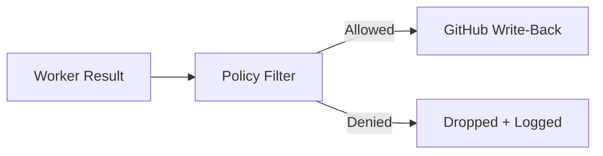
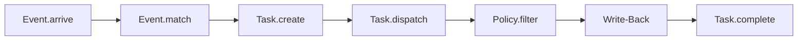

# Policy

Policy controls what a worker result is allowed to do. When a worker completes a task, its result passes through a policy filter before any write-back actions (comments, labels, statuses) reach GitHub.

## How It Works



The policy filter inspects each action in the worker result and either allows it through or drops it. Denied actions are logged with the reason, creating an audit trail.

## Configuring Policy

Add a `policy` section to your worker YAML:

```yaml
name: reviewer
docker:
  image: mecha-worker-claude:latest
  token: claude.xiaolaidev
policy:
  comment:
    allow: true
    max_length: 10000
  labels:
    allow: true
    blocked:
      - approved
      - do-not-merge
  status:
    allow: false
  commit:
    allow: false
```

## Policy Rules

### Comment Policy

| Field | Type | Description |
|-------|------|-------------|
| `allow` | bool | Allow posting PR/issue comments |
| `max_length` | int | Truncate comment body to this many characters (rune-aware for UTF-8) |

When `max_length` is set, comments exceeding the limit are truncated with a `... (truncated by policy)` notice.

### Label Policy

| Field | Type | Description |
|-------|------|-------------|
| `allow` | bool | Allow adding/removing labels |
| `blocked` | list | Labels that cannot be added or removed |

The blocklist applies to both `add` and `remove` operations. A worker cannot add *or* remove a blocked label.

### Status Policy

| Field | Type | Description |
|-------|------|-------------|
| `allow` | bool | Allow setting commit statuses |

Status values are validated against the GitHub API allowed set: `error`, `failure`, `pending`, `success`.

### Commit Policy

| Field | Type | Description |
|-------|------|-------------|
| `allow` | bool | Allow code change suggestions |

When allowed, the worker's diff is posted as a PR comment with a suggested commit message and a fenced diff code block. Requires the event to have a PR number (`ev.Number > 0`) and a non-empty diff.

## Default Behavior

Workers without a `policy` section use **AllowAll** -- all write-back actions are permitted with no restrictions. A warning is logged when AllowAll is active.

## Decision Logging

Every policy evaluation logs both allowed and denied actions:

```
INFO dispatch: policy applied task=abc123 worker=reviewer
    allowed=[comment, labels] denied=[status: blocked by policy]
```

This provides a complete audit trail of what each worker was permitted to do.

## Pipeline Position

Policy sits between task dispatch and write-back in the pipeline:



If policy denies all actions, the result is effectively a no-op -- the task completes but nothing is written to GitHub.

## Examples

### Read-Only Worker (no write-back)

```yaml
policy:
  comment:
    allow: false
  labels:
    allow: false
  status:
    allow: false
  commit:
    allow: false
```

### Comment-Only Worker

```yaml
policy:
  comment:
    allow: true
    max_length: 5000
  labels:
    allow: false
  status:
    allow: false
```

### Restricted Label Worker

```yaml
policy:
  labels:
    allow: true
    blocked:
      - approved
      - security-reviewed
      - do-not-merge
  comment:
    allow: false
  status:
    allow: false
```
