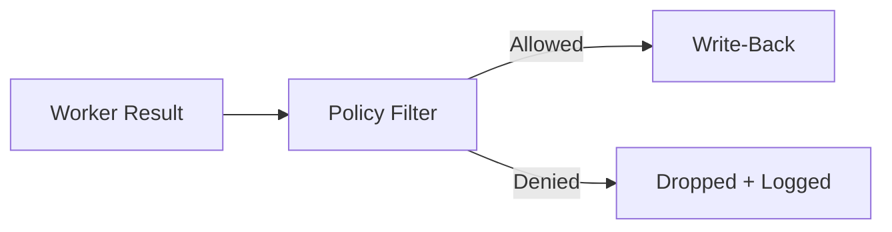
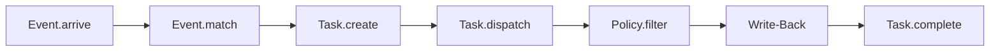

# Policy

Policy controls what a worker result is allowed to do. When a worker completes a task, its result passes through a policy filter before any write-back actions reach the target platform (GitHub, GitLab, Slack).

## How It Works



The policy filter inspects each action in the worker result and either allows it through or drops it. Denied actions are logged with the reason, creating an audit trail.

## Configuring Policy

Add a `policy` section to your worker YAML:

```yaml
name: reviewer
docker:
  image: mecha-worker:latest
  token: claude.xiaolaidev
policy:
  comment:
    allow: true
    max_length: 10000
  labels:
    allow: true
    allowed:
      - bug
      - enhancement
      - needs-review
    blocked:
      - approved
      - do-not-merge
  status:
    allow: true
  commit:
    allow: true
    max_size: 50000
  metadata:
    allow: false
```

## Policy Rules

### Comment Policy

| Field | Type | Description |
|-------|------|-------------|
| `allow` | bool | Allow posting PR/issue comments |
| `max_length` | int | Max total runes including truncation suffix (UTF-8 aware) |

When `max_length` is set, comments exceeding the limit are truncated with a `... (truncated by policy)` suffix. The total output (content + suffix) never exceeds `max_length`. For very small limits (below suffix length), the comment is hard-truncated without suffix.

### Label Policy

| Field | Type | Description |
|-------|------|-------------|
| `allow` | bool | Allow adding/removing labels |
| `allowed` | list | Only these labels are permitted (allowlist, restrictive) |
| `blocked` | list | These labels are never permitted (blocklist, permissive) |

Both `allowed` and `blocked` are **case-insensitive** (matching GitHub/GitLab behavior). The blocklist takes precedence over the allowlist — a label in both lists is blocked.

When both `allowed` and `blocked` are set, a label must be in the allowlist AND not in the blocklist to pass. When only `blocked` is set, all labels except blocked ones pass. When only `allowed` is set, only listed labels pass.

The filter applies to both `add` and `remove` operations.

### Status Policy

| Field | Type | Description |
|-------|------|-------------|
| `allow` | bool | Allow setting commit statuses |

Status state values are validated by policy against the allowed set: `error`, `failure`, `pending`, `success`. Invalid states (e.g., `APPROVED`) are rejected before reaching the write-back layer.

### Commit Policy

| Field | Type | Description |
|-------|------|-------------|
| `allow` | bool | Allow code change suggestions |
| `max_size` | int | Max diff size in bytes (0 = no limit) |

When allowed, the worker's diff is posted as a PR comment with a suggested commit message and a fenced diff code block. Diffs exceeding `max_size` are rejected entirely (not truncated — partial diffs are worse than no diff).

### Metadata Policy

| Field | Type | Description |
|-------|------|-------------|
| `allow` | bool | Include metadata in the result (default: true) |

Metadata contains model name, token counts, duration, and cost. Setting `allow: false` strips this information from the result before write-back. Use this to prevent leaking internal details.

## Default Behavior

Workers without a `policy` section use **AllowAll** — all write-back actions are permitted with no restrictions. For managed (Docker) workers, a warning is logged:

```text
WARN managed worker has no policy — all write-back allowed
     (add policy section to worker YAML)
```

If the policy section contains invalid YAML types, **DenyAll** is used — all actions are blocked. This is fail-closed behavior.

## Decision Logging

Every policy evaluation logs both allowed and denied actions:

```text
INFO dispatch: policy applied task=abc123 worker=reviewer
    allowed=[comment, labels, metadata] denied=[status: blocked by policy]
```

This provides a complete audit trail of what each worker was permitted to do.

## Pipeline Position

Policy sits between task completion and write-back:



If policy denies all actions, the task completes but nothing is written to the platform.

## Examples

### Read-Only Worker (no write-back)

```yaml
policy:
  comment:
    allow: false
  labels:
    allow: false
  status:
    allow: false
  commit:
    allow: false
  metadata:
    allow: false
```

### Comment-Only Worker

```yaml
policy:
  comment:
    allow: true
    max_length: 5000
  labels:
    allow: false
  status:
    allow: false
  metadata:
    allow: false
```

### Restrictive Label Worker (allowlist)

```yaml
policy:
  labels:
    allow: true
    allowed:
      - bug
      - enhancement
      - needs-review
  comment:
    allow: false
  status:
    allow: false
```

Only `bug`, `enhancement`, and `needs-review` labels can be added or removed. All others are denied.

### Full Write-Back with Safety Limits

```yaml
policy:
  comment:
    allow: true
    max_length: 60000
  labels:
    allow: true
    blocked:
      - approved
      - security-reviewed
  status:
    allow: true
  commit:
    allow: true
    max_size: 100000
  metadata:
    allow: true
```
