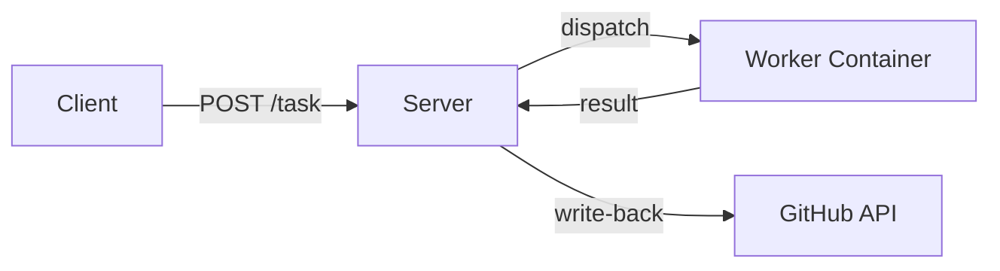

# Server

`mecha serve` starts a long-lived HTTP server that accepts tasks, dispatches them to workers, and writes results back to GitHub.

## Starting the Server

```bash
mecha serve --addr 127.0.0.1:8080
```

With API key authentication:

```bash
mecha serve --addr 0.0.0.0:8080 --api-key YOUR_SECRET_KEY
```

### Flags

| Flag | Default | Description |
|------|---------|-------------|
| `--addr` | `127.0.0.1:8080` | Listen address |
| `--api-key` | (empty) | API key for Bearer/X-API-Key auth (empty = no auth) |

### Environment Variables

| Variable | Description |
|----------|-------------|
| `MECHA_DB_PATH` | Override database location (default: `~/.mecha/mecha.db`) |

## How It Works



1. Workers are added via `mecha worker add` (CLI) — stored in SQLite
2. Server loads workers on startup and reloads the registry before each webhook match
3. Tasks are queued in a channel (256 buffer), dispatched in parallel (up to 16 concurrent)
4. Results are written back to GitHub if the task originated from a webhook

## Graceful Shutdown

`SIGINT` or `SIGTERM` triggers:
1. HTTP server stops accepting new requests (30s drain)
2. In-flight dispatches complete
3. Workers are NOT stopped (persistent containers keep running)

## Startup Recovery

On startup, `mecha serve` recovers from crashes:

- **Tasks** stuck in `pending` or `dispatched` state are re-queued for dispatch
- **Events** stuck in `received` state (crashed before matching) are re-processed through the match pipeline if their source is still registered, or marked `failed` for operator review if the source is gone

## SQLite Database

All state (workers, tasks, events) is stored in `~/.mecha/mecha.db`:
- WAL mode for concurrent CLI + server access
- Versioned migrations via `PRAGMA user_version`
- 5-second busy timeout for cross-process lock contention
