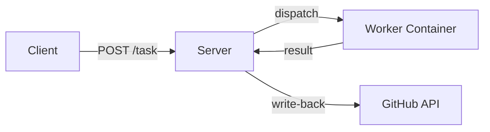

# Server

`mecha serve` starts a long-lived HTTP server that accepts tasks, dispatches them to workers, and writes results back to GitHub.

## Starting the Server

```bash
mecha serve
```

With API key authentication:

```bash
mecha serve --addr 0.0.0.0:21212 --api-key YOUR_SECRET_KEY
```

### Flags

| Flag | Default | Description |
|------|---------|-------------|
| `--addr` | `127.0.0.1:21212` | Listen address |
| `--api-key` | (empty) | API key for Bearer/X-API-Key auth (empty = no auth) |

CLI flags override the config file. The config file overrides compiled defaults.

### Config File

`~/.mecha/config.yml` provides persistent server configuration:

```yaml
addr: 127.0.0.1:21212
api_key: my-secret-key
```

| Field | Default | Description |
|-------|---------|-------------|
| `addr` | `127.0.0.1:21212` | Listen address |
| `api_key` | (empty) | API key for authentication |

The file is optional. Missing file or missing fields use defaults. Both `mecha serve` and `mecha-mcp` read this file.

### Environment Variables

| Variable | Description |
|----------|-------------|
| `MECHA_DB_PATH` | Override database location (default: `~/.mecha/mecha.db`) |

## How It Works



1. Workers are added via `mecha worker add` (CLI) — stored in SQLite
2. Server loads workers on startup and reloads the registry before each webhook match
3. Tasks are queued in a channel (configurable via `Config.QueueSize`, default 256), dispatched in parallel (up to 16 concurrent)
4. Results are written back to the originating platform (GitHub, GitLab, Slack, Telegram) via the Responder registry. Transient write-back failures transition the event to `write_back_failed` and are retried by the background write-back retry loop.

## Rate Limiting

Two token-bucket rate limiters protect the server:

- **Per-worker dispatch** (2 req/s, burst 5) — rate-limited tasks are re-queued automatically, not failed.
- **Per-source webhook ingestion** (`webhook:<source>` key, same bucket parameters) — burst webhook traffic is rejected with `429 Too Many Requests` and counted in `mecha_webhooks_rate_limited`. This protects the SQLite single-writer lock from saturation.

## Task Retry

Transport errors (connection refused, timeout, DNS failure) trigger automatic retry with exponential backoff, capped at 30 minutes:

| Attempt | Delay |
|---------|-------|
| 1 | 30 seconds |
| 2 | 60 seconds |
| 3 | 120 seconds |
| 4+ | doubles until `RetryMaxDelay` (30 min) |

Default `max_retries` is 3. Tasks that exhaust all retries are dead-lettered (permanently failed). Non-transport errors — including any 5xx response from the worker — fail immediately without retry; this prevents retry amplification when a worker is deterministically broken.

## Observability

### Metrics Endpoint

`GET /metrics` returns Prometheus-compatible metrics:

```text
# TYPE mecha_tasks_created counter
mecha_tasks_created 42
# TYPE mecha_tasks_completed counter
mecha_tasks_completed 38
# TYPE mecha_tasks_failed counter
mecha_tasks_failed 2
# TYPE mecha_tasks_recovered counter
mecha_tasks_recovered 5
# TYPE mecha_tasks_retried counter
mecha_tasks_retried 3
# TYPE mecha_tasks_rate_limited counter
mecha_tasks_rate_limited 1
# TYPE mecha_tasks_dedup_skipped counter
mecha_tasks_dedup_skipped 0
# TYPE mecha_webhooks_received counter
mecha_webhooks_received 40
# TYPE mecha_webhooks_rate_limited counter
mecha_webhooks_rate_limited 0
# TYPE mecha_events_dedup_skipped counter
mecha_events_dedup_skipped 2
# TYPE mecha_cron_ticks_dropped_total counter
mecha_cron_ticks_dropped_total 0
# TYPE mecha_writeback_ok counter
mecha_writeback_ok 35
# TYPE mecha_writeback_fail counter
mecha_writeback_fail 1
# TYPE mecha_writeback_retry_ok counter
mecha_writeback_retry_ok 1
# TYPE mecha_writeback_dead_letter counter
mecha_writeback_dead_letter 0
# TYPE mecha_queue_depth gauge
mecha_queue_depth 0
# TYPE mecha_dispatch_latency_ms_ema gauge
mecha_dispatch_latency_ms_ema 4500.000000
# TYPE mecha_dispatch_latency_ms histogram
mecha_dispatch_latency_ms_bucket{le="100"} 0
mecha_dispatch_latency_ms_bucket{le="500"} 2
mecha_dispatch_latency_ms_bucket{le="5000"} 30
mecha_dispatch_latency_ms_bucket{le="60000"} 40
mecha_dispatch_latency_ms_bucket{le="+Inf"} 40
mecha_dispatch_latency_ms_sum 180000.000000
mecha_dispatch_latency_ms_count 40
```

The latency is exposed as both an EMA gauge (α=0.1, responsive to recent spikes)
and a full histogram with 12 buckets from 100ms to 10 minutes. Use
`histogram_quantile(0.95, mecha_dispatch_latency_ms_bucket)` in Prometheus to
get p95 latency.

The `/metrics` endpoint is public (no API key required) for scraper access.

### Log (Structured Pipeline Trace)

`GET /logs` returns structured pipeline observations — every event received, match decision, policy evaluation, dispatch attempt, and write-back result:

```text
GET /logs?event={id}              — trace one event's journey
GET /logs?task={id}               — trace one task's lifecycle
GET /logs?worker={name}&since=1h  — worker activity feed
GET /logs?action=policy&since=24h — all policy decisions today
GET /logs?trace={id}              — full causal chain
GET /logs?limit=50                — latest 50 entries
```

Each entry has: `id` (auto-increment), `trace_id`, `ts`, `action`, `outcome` (ok/fail/skip/retry/deny), `event_id`, `task_id`, `worker`, `attempt`, `error`, `detail` (sparse JSON). All secret patterns are redacted before write.

### Debug Vars

`GET /debug/vars` exposes Go's expvar endpoint with all metrics as JSON. When
`--api-key` is set, `/debug/vars` requires the same Bearer token as the other
endpoints. When no API key is configured, `/debug/vars` is only reachable from
loopback; external callers are rejected with `401` to prevent Go cmdline/env
leakage.

## Background Loops

The server runs five background loops:

| Loop | Interval | Purpose |
|------|----------|---------|
| Retry scan | 30s | Re-enqueues tasks whose backoff delay has elapsed |
| Pending scan | 60s | Catches orphaned pending tasks not in the dispatch channel |
| Reconciliation | 60s | Detects registry/Docker state drift (Docker workers only) |
| Rate limiter cleanup | 5m | Removes stale per-worker buckets (unused for 10m) |
| Write-back retry | 30s | Retries events whose write-back failed transiently (GitHub rate limit, network) |

## Graceful Shutdown

`SIGINT` or `SIGTERM` triggers:
1. HTTP server stops accepting new requests
2. In-flight dispatches drain (default: 10 minutes, override via `MECHA_DRAIN_TIMEOUT`)
3. Workers are NOT stopped (persistent containers keep running)

The drain window is generous by default because LLM tasks can run for many
minutes. Set `MECHA_DRAIN_TIMEOUT=30s` for fast shutdown in CI, or raise it for
long-running worker queues.

## Startup Recovery

On startup, `mecha serve` recovers from crashes:

- **Tasks** stuck in `pending` or `dispatched` state are re-queued for dispatch
- **Dedup check**: tasks with a completed duplicate (same event+worker) are skipped
- **Events** stuck in `received` state are re-processed if their source is still registered, or marked `failed` if the source is gone

## SQLite Database

All state (workers, tasks, events) is stored in `~/.mecha/mecha.db`:
- WAL mode for concurrent CLI + server access
- Versioned migrations (V1–V7) via `PRAGMA user_version`
- 5-second busy timeout for cross-process lock contention
