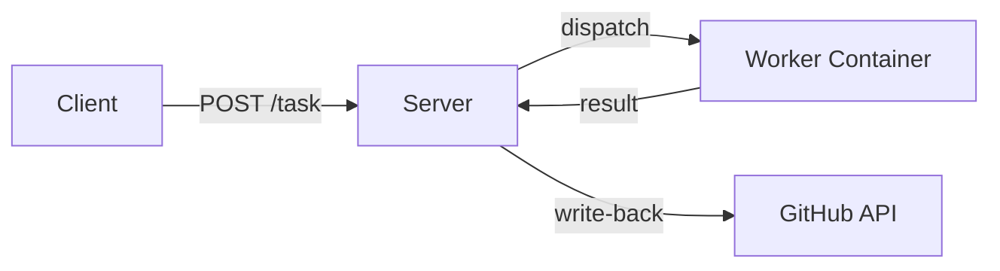

# Server

`mecha serve` starts a long-lived HTTP server that accepts tasks, dispatches them to workers, and writes results back to GitHub.

## Starting the Server

```bash
mecha serve
```

With API key authentication:

```bash
mecha serve --addr 0.0.0.0:21212 --api-key YOUR_SECRET_KEY
```

### Flags

| Flag | Default | Description |
|------|---------|-------------|
| `--addr` | `127.0.0.1:21212` | Listen address |
| `--api-key` | (empty) | API key for Bearer/X-API-Key auth (empty = no auth) |

CLI flags override the config file. The config file overrides compiled defaults.

### Config File

`~/.mecha/config.yml` provides persistent server configuration:

```yaml
addr: 127.0.0.1:21212
api_key: my-secret-key
```

| Field | Default | Description |
|-------|---------|-------------|
| `addr` | `127.0.0.1:21212` | Listen address |
| `api_key` | (empty) | API key for authentication |

The file is optional. Missing file or missing fields use defaults. Both `mecha serve` and `mecha-mcp` read this file.

### Environment Variables

| Variable | Description |
|----------|-------------|
| `MECHA_DB_PATH` | Override database location (default: `~/.mecha/mecha.db`) |

## How It Works



1. Workers are added via `mecha worker add` (CLI) — stored in SQLite
2. Server loads workers on startup and reloads the registry before each webhook match
3. Tasks are queued in a channel (256 buffer), dispatched in parallel (up to 16 concurrent)
4. Results are written back to GitHub if the task originated from a webhook

## Rate Limiting

Each worker has a token bucket rate limiter (2 requests/second, burst of 5). Rate-limited tasks are re-queued automatically, not failed.

## Task Retry

Transport errors (connection refused, timeout, DNS failure) trigger automatic retry with exponential backoff:

| Attempt | Delay |
|---------|-------|
| 1 | 30 seconds |
| 2 | 60 seconds |
| 3 | 120 seconds |

Tasks that exhaust all retries are dead-lettered (permanently failed). Non-transport errors (4xx, invalid response) fail immediately.

## Observability

### Metrics Endpoint

`GET /metrics` returns Prometheus-compatible metrics:

```
mecha_tasks_created 42
mecha_tasks_completed 38
mecha_tasks_failed 2
mecha_tasks_recovered 5
mecha_tasks_retried 3
mecha_tasks_rate_limited 1
mecha_tasks_dedup_skipped 0
mecha_dispatch_latency_ms_avg 4500.000000
mecha_queue_depth 0
mecha_webhooks_received 40
mecha_writeback_ok 35
mecha_writeback_fail 1
mecha_events_dedup_skipped 2
```

The `/metrics` endpoint is public (no API key required) for scraper access.

### Debug Vars

`GET /debug/vars` exposes Go's expvar endpoint with all metrics as JSON.

## Background Loops

The server runs four background loops:

| Loop | Interval | Purpose |
|------|----------|---------|
| Retry scan | 30s | Re-enqueues tasks whose backoff delay has elapsed |
| Pending scan | 60s | Catches orphaned pending tasks not in the dispatch channel |
| Reconciliation | 60s | Detects registry/Docker state drift (health checks) |
| Rate limiter cleanup | 5m | Removes stale per-worker buckets (unused for 10m) |
| Rate limiter cleanup | 5m | Removes stale per-worker buckets |

## Graceful Shutdown

`SIGINT` or `SIGTERM` triggers:
1. HTTP server stops accepting new requests (30s drain)
2. In-flight dispatches complete
3. Workers are NOT stopped (persistent containers keep running)

## Startup Recovery

On startup, `mecha serve` recovers from crashes:

- **Tasks** stuck in `pending` or `dispatched` state are re-queued for dispatch
- **Dedup check**: tasks with a completed duplicate (same event+worker) are skipped
- **Events** stuck in `received` state are re-processed if their source is still registered, or marked `failed` if the source is gone

## SQLite Database

All state (workers, tasks, events) is stored in `~/.mecha/mecha.db`:
- WAL mode for concurrent CLI + server access
- Versioned migrations (V1–V5) via `PRAGMA user_version`
- 5-second busy timeout for cross-process lock contention
