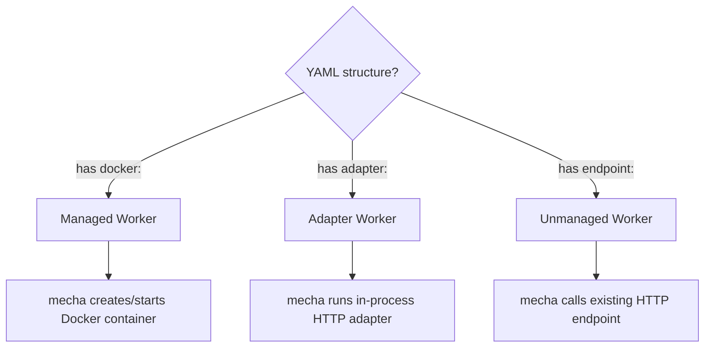
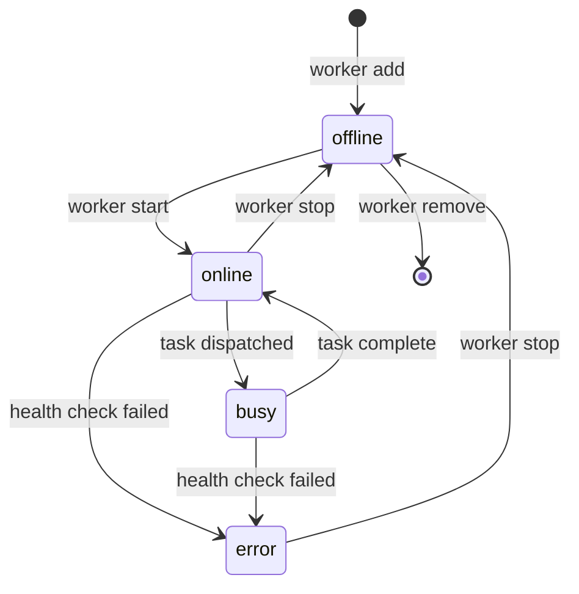

# Worker Configuration

Workers are defined in YAML files. Each file describes one worker.

## Managed vs Unmanaged



- **Managed**: has a `docker:` section. Mecha controls the Docker container lifecycle.
- **Adapter**: has an `adapter:` section. Mecha runs an in-process adapter translating a native LLM API.
- **Unmanaged**: has an `endpoint:` field. Mecha just calls it.

## Managed Worker (Docker)

```yaml
name: claude-reviewer
docker:
  image: mecha-worker:latest     # required
  cwd: /path/to/project                 # host dir → /workspace in container
  resources:
    cpu: 4                              # CPU cores
    memory: 8G                          # memory limit (M or G)
    pids: 256                           # process limit
  lifecycle: persistent                 # "persistent" (default) or "disposable"
  env:                                  # environment variables
    CLAUDE_MODEL: claude-sonnet-4-6
    CLAUDE_SYSTEM_PROMPT: "You review code."
    CLAUDE_ALLOWED_TOOLS: "Read,Grep,Glob,Bash"
    CLAUDE_EFFORT: high
  credentials: [claude]                 # subscription credential mounts (read-only)
  token: claude.xiaolaidev              # from ~/.mecha/secrets.yml (mutually exclusive with credentials)
  plugins:                              # Claude Code plugins installed at start
    - pr-review-toolkit
  labels:                               # custom Docker labels
    team: security
timeout: 30m                            # task timeout
```

### Fields

| Field | Required | Default | Description |
|-------|----------|---------|-------------|
| `name` | Yes | — | Unique worker name. Must match `[a-zA-Z0-9][a-zA-Z0-9_.-]*` |
| `docker.image` | Yes | — | Docker image to run |
| `docker.cwd` | No | — | Host directory mounted read-write to `/workspace` |
| `docker.resources.cpu` | No | unlimited | CPU cores |
| `docker.resources.memory` | No | unlimited | Memory limit (`512M`, `4G`) |
| `docker.resources.pids` | No | `1024` | Max processes. Defaults to 1024 to prevent fork-bomb attacks from a compromised worker image. Raise explicitly if a legitimate worker needs more |
| `docker.lifecycle` | No | `persistent` | `persistent` (reuse container) or `disposable` (new container per task) |
| `docker.host` | No | local socket | Docker daemon URL (e.g. `unix:///var/run/docker.sock`) |
| `docker.env` | No | `{}` | Environment variables passed to container |
| `docker.token` | No | — | Token reference from `~/.mecha/secrets.yml` |
| `docker.expose` | No | `false` | Bind to `0.0.0.0` instead of `127.0.0.1` (network-accessible) |
| `docker.api_key` | No | — | Bearer auth key for `/task` endpoint. **Required** when `expose: true` |
| `docker.credentials` | No | `[]` | CLI credential mounts, read-only (`[claude]`, `[codex]`, or `[claude, codex]`). **Mutually exclusive with `docker.token`** — pick one per worker |
| `docker.plugins` | No | `[]` | Claude Code plugins installed at container start |
| `docker.plugin_marketplaces` | No | `[]` | Plugin marketplace URLs added before plugin install |
| `docker.labels` | No | `{}` | Custom Docker container labels |
| `timeout` | No | `10m` | Max task execution time |

### Workspace Mount

When `docker.cwd` is set, the directory is bind-mounted read-write into the container at `/workspace`. The container runs as your host user (matching UID/GID) to avoid permission issues.

```yaml
docker:
  cwd: /Users/me/projects/my-repo    # must be an existing directory
```

The path is validated:
- Must exist and be a directory (not a file)
- Symlinks are resolved before checking (no traversal)
- Sensitive host paths are blocked:

| Blocked Paths | Reason |
|---------------|--------|
| `/etc`, `/proc`, `/sys`, `/dev`, `/boot` | System directories |
| `$HOME` (home directory itself) | Contains sensitive subdirs |
| `~/.ssh`, `~/.gnupg` | Credential stores |
| `~/.aws`, `~/.config/gcloud` | Cloud credentials |
| `~/.mecha` | Mecha's own config and secrets |
| `~/.claude`, `~/.codex`, `~/.gemini` | CLI credentials (allowed via `docker.credentials`) |

`mecha doctor` re-checks these paths for workers already in the registry.

### Disposable (One-Shot) Containers

Set `lifecycle: disposable` to create a fresh container per task. The container is destroyed after the task completes.

```yaml
name: sandbox-runner
docker:
  image: mecha-worker:latest
  lifecycle: disposable
  token: claude.xiaolaidev
timeout: 10m
```

- **persistent** (default): container stays running, reused across tasks
- **disposable**: new container per task, destroyed after completion

Disposable workers don't need `worker start` — the dispatch loop creates containers on demand.

## Adapter Worker

Adapters translate native LLM APIs (Ollama, vLLM, OpenAI-compatible) into the mecha worker contract. They run in-process — no Docker required.

```yaml
name: local-llm
adapter:
  type: ollama                       # "ollama" or "openai"
  upstream: http://localhost:11434   # base URL of the LLM API
  model: gemma2:9b                   # model name
timeout: 10m
```

### Adapter Types

| Type | Upstream API | Health Check | Task Endpoint |
|------|-------------|--------------|---------------|
| `ollama` | Ollama `/api/chat` | `GET /` | Chat completions |
| `openai` | OpenAI-compatible `/v1/chat/completions` | `GET /v1/models` | Chat completions |

### OpenAI-Compatible Example

Works with vLLM, LiteLLM, llama.cpp server, or any OpenAI-compatible API:

```yaml
name: vllm-worker
adapter:
  type: openai
  upstream: http://gpu-server:8000
  model: meta-llama/Llama-3-70b
  api_key: ${VLLM_API_KEY}          # optional
timeout: 15m
```

### Fields

| Field | Required | Description |
|-------|----------|-------------|
| `adapter.type` | Yes | `ollama` or `openai` |
| `adapter.upstream` | Yes | Base URL of the LLM API |
| `adapter.model` | Yes | Model name passed to the API |
| `adapter.api_key` | No | Inline API key. Kept in memory only (`json:"-"`) — not persisted to SQLite |
| `adapter.token` | No | `~/.mecha/secrets.yml` reference (e.g. `codex.default`). Resolved at adapter start, survives restarts |

Adapters run in-process and are auto-started by `mecha serve` (you do not run
`mecha worker start` on an adapter). The adapter translates the worker contract
(`GET /health`, `POST /task`) into native API calls against `adapter.upstream`.

Prefer `adapter.token` over `adapter.api_key` when you want the secret to
survive a `mecha serve` restart: `api_key` is an in-memory convenience that is
intentionally never written to `mecha.db`.

## Unmanaged Worker

```yaml
name: my-ollama
endpoint: http://100.64.0.3:11434
timeout: 5m
```

Mecha doesn't manage the process. It just marks the worker online on `start`, probes `GET /health`, and calls `POST /task` on the endpoint.

## Worker Image Contract

Every managed worker image must:

| Requirement | Details |
|-------------|---------|
| Port | Expose `8080` |
| Health | `GET /health` → `200` (ready) or `503` (busy) |
| Task | `POST /task` → result contract JSON |
| Healthcheck | Include `HEALTHCHECK` directive in Dockerfile |
| Config | Read all config from environment variables |

### POST /task Request

```json
{
  "id": "task-abc123",
  "prompt": "Review this PR for security issues",
  "context": {
    "repo": "owner/repo",
    "diff": "..."
  }
}
```

### POST /task Response

All fields except `output` are optional. Workers drive write-back by returning
any combination of `comment`, `status`, `labels`, and `commit` — mecha routes
each through the Responder registered for the event's source (GitHub, GitLab,
Slack, etc.), filtered by the worker's `policy` block.

```json
{
  "output": "The PR has a SQL injection vulnerability...",
  "comment": {
    "target": "pr:42",
    "body": "## Security Review\n\nFound 1 issue:\n- main.go:123 — unchecked SQL interpolation"
  },
  "status": {
    "state": "failure",
    "description": "1 security issue found"
  },
  "labels": {
    "add": ["security-review-failed"],
    "remove": ["needs-review"]
  },
  "commit": {
    "message": "fix: parameterize SQL query",
    "diff": "--- a/main.go\n+++ b/main.go\n@@ -123 +123 @@\n-query := \"SELECT * FROM users WHERE id=\" + id\n+query := \"SELECT * FROM users WHERE id=?\""
  },
  "metadata": {
    "model": "claude-sonnet-4-6",
    "duration_ms": 45000,
    "input_tokens": 5000,
    "output_tokens": 2000,
    "exit_code": 0
  }
}
```

See [Events & Webhooks — Write-Back](./events#write-back-responder) for the
full Responder flow and [Policy](./policy) for the filtering rules.

## Backend-Specific Env Vars

### Claude

Claude uses the Agent SDK `query()` directly. Env vars map to SDK options:

| Env Var | SDK Option | Values |
|---------|-----------|--------|
| `CLAUDE_MODEL` | `model` | `claude-sonnet-4-6`, `claude-opus-4-6`, etc. |
| `CLAUDE_SYSTEM_PROMPT` | `systemPrompt` | Any string |
| `CLAUDE_ALLOWED_TOOLS` | `allowedTools` | Comma-separated: `Read,Grep,Glob,Bash` |
| `CLAUDE_DISALLOWED_TOOLS` | `disallowedTools` | Comma-separated |
| `CLAUDE_PERMISSION_MODE` | `permissionMode` | Defaults to `bypassPermissions` (SDK default for non-interactive use) |
| `CLAUDE_EFFORT` | `effort` | `low`, `medium`, `high`, `max` |
| `CLAUDE_MAX_BUDGET_USD` | `maxBudgetUsd` | e.g. `5.00` |
| `CLAUDE_MAX_TURNS` | `maxTurns` | e.g. `50` |

### Codex (MCP Tool)

Codex runs as an MCP child process inside the Claude worker. It is auto-enabled when `~/.codex/auth.json` is mounted via `credentials: [codex]` or when `CODEX_API_KEY` is set. See [Dual-Agent Workers](./dual-agent) for details.

::: tip Gemini
Gemini is not supported as a managed Docker worker — its credential files are encrypted to the host machine. Use Gemini API endpoints as [unmanaged workers](#unmanaged-worker) instead.
:::

## State Machine



- **offline**: definition exists, container stopped or absent
- **online**: container running, health check passing, accepting tasks
- **busy**: executing a task (returns 429 to new requests)
- **error**: health check failed or container exited
